**Routing the Dollar:**

**Gateway Infrastructure, Monetary Policy Transmission, and the Dollar's International Functions in Digital Markets**

\[Author Names\]

\[Institutional Affiliation\]

February 2026

*Prepared for the Fifth Conference on International Roles of the U.S. Dollar*

*Board of Governors of the Federal Reserve System*

*and Federal Reserve Bank of New York*

*June 22 to 23, 2026*

We thank \[discussant name\], participants at \[seminar\], and two anonymous reviewers for helpful comments. \[Research assistant names\] provided excellent research assistance. The views expressed in this paper are those of the authors and do not necessarily reflect those of any affiliated institutions. The authors have no material financial interests in any stablecoin issuer, exchange, or protocol discussed in this paper. All data and code required to reproduce the results in this paper are available at \[URL to be provided upon acceptance\].

Abstract

The dollar's international functions, as a medium of exchange, store of value, and funding instrument, now operate partly through stablecoin infrastructure the Federal Reserve does not monitor. We argue that the policy-relevant unit of analysis is not the stablecoin token but the *gateway*: the institutional infrastructure through which stablecoin value is routed. The same dollar token produces opposite regulatory, monetary, and safe-haven outcomes depending primarily on which gateway processes it.

Three empirical findings support this argument using daily gateway transfer data for 19 Ethereum entities, monthly counterparty network panels across 15 gateways (35 months, 110,000 counterparty relationships), and stress-episode windows for the SVB crisis and BUSD regulatory action. First, stablecoin supply is cointegrated with Fed balance sheet variables, with the yield spread between Treasury bills and on-chain lending rates consistent with the hypothesized transmission mechanism, a relationship that is dollar-specific, absent for Bitcoin or Ethereum, and strongest during active monetary tightening. Second, the long-run equilibrium distributes unevenly across the gateway layer: institutional gateways (both regulated and offshore) trend with Fed assets while permissionless protocols trend in the opposite direction, and the routing infrastructure is hollowing out: volume doubled over three years while unique counterparties declined 25 percent and cross-gateway bridges halved. Third, the dollar's safe-haven function in tokenized markets is gateway-contingent, not currency-inherent: stress events route capital across gateways rather than across currencies, with the FDIC's deposit guarantee (designed for bank depositors) serving as the instrument that stabilized stablecoin routing infrastructure. The fragmentation risk for the dollar in digital finance is not from competing currencies but from within the dollar's own infrastructure.

**Keywords:** stablecoins, international dollar, monetary policy transmission, digital payment infrastructure, gateway regulation, safe haven, financial innovation

**JEL Codes:** E52, E58, F33, G15, G18, G23, G28

I. Introduction

The dollar's preeminence in international finance has traditionally rested on three institutional pillars: deep and liquid Treasury markets that anchor the dollar's store-of-value function, a trusted network of correspondent banks that supports its payment function, and the Federal Reserve's willingness to provide dollar liquidity globally through central bank swap lines and emergency facilities. A fourth pillar is emerging. Dollar-denominated stablecoins, programmable tokens designed to maintain a one-to-one peg with the U.S. dollar, now constitute a \$305 billion infrastructure for moving dollars across borders, protocols, and regulatory jurisdictions. As of January 2026, Tether's USDT commands \$186 billion in market capitalization, followed by Circle's USDC at \$70 billion. Annual on-chain transfer volume across nine blockchains exceeds \$60.6 trillion, and daily transaction volumes regularly surpass \$10 billion. Much of this growth has been driven by non-U.S. demand: remittance corridors, dollarization substitution in emerging markets, and trade settlement in jurisdictions with limited banking access. Whether this infrastructure strengthens or weakens the dollar's international functions depends on how it is governed, and the answer, we argue, lies not in the tokens but in the gateways that route them.

This growth coincided with the most aggressive Federal Reserve tightening cycle since the Volcker era, followed by the onset of policy easing in September 2024. Stablecoin supply expanded by 123 percent during a period in which risk-free rates rose to 5.33 percent, making non-yielding digital dollars comparatively expensive to hold. This growth occurred despite, not because of, Fed policy: the correlation between Fed assets and stablecoin supply effectively decoupled during tightening (r ≈ 0), with non-monetary factors (crypto market recovery, institutional adoption, and demand from dollarization corridors) dominating the signal. Yet once easing began in September 2024, the negative correlation returned with near-perfect strength (r = −0.98), and supply nearly doubled. The question is not simply whether Fed policy affects stablecoins, but how the transmission channel works, what infrastructure it operates through, and what this means for the dollar's international roles.

We make three contributions. First, Federal Reserve monetary policy transmits to a \$305 billion dollar asset class through yield-spread dynamics and money market plumbing, a channel that is dollar-specific, regime-dependent, and invisible at the token level. Stablecoin supply is cointegrated with Fed balance sheet variables, with the yield spread between Treasury bills and on-chain lending rates as the mechanism-consistent channel (Granger F = 11.30, p = 0.001). Neither Bitcoin nor Ethereum exhibits this pattern.[^intro_stats] The relationship is strongest during quantitative tightening, when Fed balance sheet contraction directly constrains the money market infrastructure through which stablecoin reserves are managed; it attenuates during easing as demand-side drivers dominate. The \$2.4 trillion ON RRP drawdown to \$9.6 billion was the specific pipeline. Full details in Section IV.A.

[^intro_stats]: Johansen trace = 30.68, p < 0.05; yield spread Granger F = 11.30, p = 0.001; Bitcoin/Ethereum placebo: 0 of 5 lag specifications each; subsample β stability p > 0.05. Weak exogeneity rejected for all three VECM variables.

Second, the same dollar token produces opposite regulatory, monetary, and safe-haven outcomes depending primarily on which gateway routes it, making the gateway, not the token, the policy-relevant unit of analysis. We introduce the *control layer*, the institutional infrastructure through which stablecoin value enters, exits, and circulates across blockchains, and a Control Layer Intensity Index (CLII) that quantifies the regulatory surface of each gateway entity. On Ethereum, an expanded registry of 51 gateway addresses across 19 entities captures 27.7 percent of combined USDC and USDT volume. Tier 2 offshore exchanges process 55 percent of gross gateway volume (50 percent net of internal rebalancing), while the regulated Tier 1 perimeter (handling 41 percent gross, 47 percent net) is concentrated in an effective duopoly (Coinbase 56 percent of Tier 1, Circle 44 percent). Multi-chain analysis reveals that Tron, handling 27.9 percent of global volume, routes through a structurally distinct gateway ecosystem with zero Tier 1 presence, producing fundamentally different regulatory characteristics for the same dollar token. The bank deposit recycling rate ranges from 3.69 percent (Tether) to 100 percent (Gemini): a 27× difference in monetary impact that token-level regulation cannot see.

Third, the dollar's safe-haven function survives tokenization but becomes gateway-contingent. The March 2023 SVB crisis provides stress-episode evidence: the dollar remained the safe haven (no flight to non-dollar alternatives), but flows routed away from the specific gateway with banking exposure (Circle) toward alternative dollar gateways, including a permissionless smart contract that absorbed 66–69 percent of volume at the crisis peak.[^tc_note] The FDIC's deposit guarantee, designed for bank depositors, was the instrument that stabilized stablecoin routing infrastructure. This finding bears directly on the dollar's international functions during stress: the safe-haven demand that traditionally channels through Treasury markets and central bank swap lines now partly channels through gateway infrastructure that operates 24/7 but concentrates in a small number of entities whose operational continuity determines whether the digital dollar holds its peg.

[^tc_note]: Tornado Cash was included in the initial gateway registry design as a Tier 3 protocol but replaced by 1inch in the final analysis because the OFAC sanctions (August 2022) precede our February 2023 sample start. An earlier version of the paper labeled this address as "0x Exchange"; independent verification confirmed it is the 1inch AggregationRouterV5 contract.

These findings connect to the dollar's international role through a structural parallel: the offshore USDT ecosystem (\$186 billion circulating on Tron through Tier 2 exchanges with no Tier 1 presence) shares defining features with the eurodollar system that emerged in the 1960s (dollar instruments outside U.S. regulatory infrastructure, different monetary transmission properties, attenuated Fed visibility). The analogy is imprecise (stablecoins are fully reserved, not fractional-reserve), but the regulatory challenge is structurally parallel: monitoring dollar usage beyond the supervisory perimeter. Appendix J develops the comparison and its limits.

This paper connects to three literatures. First, the dollar dominance and network effects literature (Gopinath and Stein, 2021; Gourinchas, Rey, and Sauzet, 2019) has documented how dollar invoicing and safe-asset demand create self-reinforcing demand for dollar-denominated instruments; gateway infrastructure provides a new channel through which this dominance extends to digital markets. Second, the global dollar cycle literature (Miranda-Agrippino and Rey, 2020; Bruno and Shin, 2015) has shown how U.S. monetary policy transmits through international funding markets; our yield-spread mechanism suggests stablecoins represent a new node in this transmission network. Third, the growing stablecoin regulation literature (Gorton and Zhang, 2023; d'Avernas, Bourany, and Vandeweyer, 2023) has focused primarily on issuer regulation and reserve design; our contribution is to shift the analytical unit from the token to the routing layer.

The tier-level disaggregation reveals that aggregate co-movement distributes unevenly across the gateway layer: institutional gateway volumes co-trend with Fed assets (Tier 1 r = −0.56, Tier 2 r = −0.45 on levels), while permissionless protocol volumes trend oppositely (Tier 3 r = +0.37). These level correlations reflect shared structural trends over the three-year sample rather than week-to-week policy responsiveness (the ordering does not survive first-differencing), but the persistent composition matters: the cointegrating relationship documented in Section IV.A operates primarily through institutional gateway infrastructure, while permissionless protocols absorb displaced activity.[^corr_freq] And the variation in bank deposit recycling across gateways, ranging from under 4 percent to 100 percent (Section IV.E), means gateway-level oversight is a monetary policy question, not merely a compliance one.

The remainder of the paper proceeds as follows. Section II provides institutional background on stablecoin mechanics and the regulatory landscape. Section III develops the measurement framework (the control layer hypothesis and CLII), describes data sources, and presents the empirical approach. Section IV presents results in five parts: monetary policy transmission (including cointegration analysis, regime-varying correlations, FOMC event study, and use-case decomposition), market structure evolution, control layer dynamics, on-chain activity, and deposit displacement analysis. Section V discusses monitoring implications for the dollar's digital infrastructure, and Section VI concludes.

  -------- ----------------------------------------- ---------------------------------------------------
  Section  Question                                  Key finding
  IV.A.1   Long-run equilibrium?                     Cointegrated; yield spread consistent with mechanism
  IV.A.2   Descriptive patterns?                     r = −0.94; rolling correlations confirm stability
  IV.A.3   Stable across regimes?                    Reverses sign: +0.93 (QE), ≈0 (tightening), −0.98 (easing)
  IV.A.4   Announcement effects?                     Directional but not significant after adjustment
  IV.A.5   What are stablecoins used for?            0.1% merchant payments; 33.2% DeFi; 45.7% P2P
  IV.B     Market structure?                         USDT dominance rising; BUSD eliminated
  IV.C     Who routes the flows?                     Near-parity (T2 55% gross/50% net, T1 41%/47%); Tier 1 duopoly; long-run co-trends T1/T2 negative, T3 positive with Fed assets; SVB entity-specific reallocation
  IV.D     On-chain activity and systemic risk?      DEX volume 3→25B/day; $35.5M Aave liquidations
  IV.E     Displacing deposits?                      No at current scale; 27× recycling difference
  -------- ----------------------------------------- ---------------------------------------------------

*Table 0. Paper roadmap with headline findings.*

II\. Institutional Background

II.A. Stablecoin Mechanics

A fiat-backed stablecoin maintains its dollar peg through a mint-and-redeem mechanism. When a qualified counterparty deposits dollars with an issuer, the issuer mints an equivalent quantity of tokens on one or more blockchains. Redemption reverses the process: tokens are burned and dollars are returned. The issuer holds reserve assets (typically Treasury bills, reverse repurchase agreements, bank deposits, and money market fund shares) intended to back each outstanding token at par.

This basic architecture admits substantial variation across issuers. Circle, the issuer of USDC, holds reserves in segregated accounts at regulated financial institutions and publishes monthly attestations conducted by Deloitte. Tether, the issuer of USDT, publishes quarterly attestations by BDO Italia and holds a portfolio that has historically included commercial paper, secured loans, and other non-government assets, though the company has shifted toward a Treasury-heavy reserve composition since 2023. Paxos, which issues USDP and operates as the mint for PayPal's PYUSD, operates under a New York Department of Financial Services (NYDFS) trust charter and is subject to direct regulatory examination.

The reserve composition matters because it determines the connection between stablecoins and traditional short-term funding markets. As stablecoin issuers collectively hold tens of billions of dollars in Treasury bills and reverse repo agreements, they have become significant participants in money markets: a development that creates both a transmission channel for monetary policy and a potential source of fragility during rapid redemption episodes.

II.B. The Regulatory Landscape

The U.S. regulatory framework for stablecoins remains fragmented. The NYDFS has emerged as the de facto lead regulator for issuers operating under its jurisdiction, including Circle, Paxos, and Gemini. At the federal level, the OCC has issued interpretive letters permitting national banks to hold stablecoin reserves (OCC, 2021), while the SEC has pursued enforcement actions against certain stablecoin arrangements under securities law theories.

Three regulatory events during our sample period illustrate the heterogeneity of the control environment. In February 2023, the NYDFS ordered Paxos to cease minting BUSD (then the third-largest stablecoin at \$16 billion), citing supervisory concerns related to Paxos's relationship with Binance (NYDFS, 2023). In August 2022, OFAC designated Tornado Cash as a sanctioned entity, marking the first time a decentralized smart contract was subjected to sanctions (OFAC, 2022). In March 2023, the failure of Silicon Valley Bank exposed Circle's \$3.3 billion in reserve deposits at the institution, triggering a brief USDC depeg and approximately \$5.1 billion in net USDC redemptions within five days.

II.C. Related Literature

Our work intersects with several strands of the literature. On stablecoin economics, Gorton and Zhang (2023) analyze stablecoins as private money and draw parallels to the Free Banking era. Catalini and de Gortari (2021) model stablecoin issuance as seigniorage extraction. Lyons and Viswanath-Natraj (2023) examine USDT peg stability, Kozhan and Viswanath-Natraj (2021) analyze collateral risk in decentralized stablecoins, and Hoang and Baur (2021) test stability across a broader set. Ante, Fiedler, and Strehle (2023) study the influence of stablecoin issuances on broader cryptocurrency markets. d'Avernas, Bourany, and Vandeweyer (2023) examine whether stablecoins function as safe money, and Jiang et al. (2023) document connections between stablecoin reserves and Treasury market dynamics.

On DeFi infrastructure, Makarov and Schoar (2022) survey decentralized finance broadly, Harvey, Ramachandran, and Santoro (2021) provide an institutional overview, and Gudgeon et al. (2020) and Perez et al. (2021) analyze liquidation cascades in lending protocols. For the money market and reserve management channels, we draw on Afonso et al. (2023) on the overnight reverse repo facility and Anderson and Kandrac (2018) on monetary policy implementation and financial vulnerability.

The regulatory landscape is documented in the President's Working Group Report on Stablecoins (2021), Baughman et al. (2022), Carapella and Flemming (2020), and Aramonte, Huang, and Schrimpf (2022). We shift the unit of analysis from the token to the gateway, the entity that controls access, custody, and compliance, which better matches the actual surface through which regulation operates.

III\. Data, Measurement, and Empirical Approach

III.A. The Control Layer Hypothesis

We propose that the policy-relevant characteristics of a stablecoin transaction depend less on the token being transferred and more on the **gateway** through which the transfer is routed. Whether a stablecoin transaction is subject to anti-money-laundering checks, sanctions screening, and bank reporting depends primarily on which company processes it, not on which token is being moved. A gateway is any institutional or technical intermediary that processes stablecoin flows: issuers (Circle, Tether), custodial exchanges (Coinbase, Kraken), decentralized protocols (Uniswap, Curve), and cross-chain bridges. Throughout this paper, "gateway" refers to the entity that operates a given piece of routing infrastructure; "gateway address" denotes the specific on-chain address through which that entity's flows are measured. The distinction matters because a single entity may operate multiple addresses across chains, and because the regulatory and monetary characteristics we analyze attach to the entity, not to the address.

Consider a \$10 million USDC transfer. If routed through Coinbase's institutional platform, the transfer is subject to KYC/AML verification, transaction monitoring, OFAC screening, and potential reporting to FinCEN. If the same USDC is swapped through Uniswap's automated market maker, none of these controls apply. The token is identical; the control environment is fundamentally different. Multi-chain data confirm this pattern generalizes beyond Ethereum.

III.B. Control Layer Intensity Index (CLII)

To operationalize the control layer hypothesis, we construct a Control Layer Intensity Index (CLII) that scores each gateway on five dimensions of regulatory control.

  ----------------------------- ------------ -------------------------------------------------------------------
  **Dimension**                 **Weight**   **Assessment Criteria**

  Regulatory License            25%          NYDFS BitLicense, state MTLs, trust charter, federal bank charter

  Reserve Transparency          20%          Attestation frequency, auditor tier, asset granularity

  Freeze/Blacklist Capability   20%          Smart contract admin functions, freeze response time

  Compliance Infrastructure     20%          KYC/AML program scope, SAR filing, transaction monitoring

  Geographic Restrictions       15%          OFAC compliance, geo-blocking, jurisdictional reach
  ----------------------------- ------------ -------------------------------------------------------------------

*Table 1. Control Layer Intensity Index: Dimension Weights and Assessment Criteria*

We classify gateways into three tiers based on CLII score rather than volume. **Tier 1** (CLII \> 0.75) encompasses fully regulated gateways: Circle, Coinbase, Paxos, Gemini, BitGo, and PayPal, though only Circle and Coinbase process material USDC/USDT volume (together 99.9 percent of Tier 1). **Tier 2** (CLII 0.30 to 0.75) includes offshore or partially regulated entities: Tether, Binance, Kraken, OKX, and Bybit. **Tier 3** (CLII \< 0.30) covers permissionless protocols: Uniswap, Curve, Aave, 1inch, and Compound.[^tier_inactive]

[^tier_inactive]: Robinhood is included in the gateway registry (Tier 2, CLII 0.38) but processes negligible stablecoin volume on Ethereum ($50 total over the sample period). Gemini (Tier 1, CLII 0.82) processes $21 in USDC/USDT but is the issuer of GUSD (~$45 million market cap). Both are classified by regulatory characteristics, not activity level; their inclusion does not affect tier-level volume shares or concentration metrics.

  -------------------- ---------------- ---------- ---------------------------------------------------------
  **Gateway**          **CLII Score**   **Tier**   **Key Characteristics**

  Circle (USDC)        0.92             Tier 1     NYDFS BitLicense, Deloitte attestations, OFAC compliant

  Paxos (USDP/PYUSD)   0.88             Tier 1     NYDFS trust charter, PayPal partnership

  Coinbase             0.85             Tier 1     BitLicense, state licenses, institutional custody

  Gemini               0.82             Tier 1     NYDFS trust charter, SOC 2 audits

  Kraken               0.58             Tier 2     State MTLs, proof of reserves

  Tether (USDT)        0.45             Tier 2     No U.S. license, quarterly BDO attestations

  Binance (pre-2024)   0.38             Tier 2     No U.S. license, DOJ settlement 2024

  OKX                  0.35             Tier 2     Offshore exchange, variable compliance

  Aave                 0.20             Tier 3     Lending protocol, governance-only controls

  Curve                0.18             Tier 3     Stablecoin-focused AMM, permissionless

  Uniswap              0.15             Tier 3     Decentralized AMM, frontend geo-blocking only

  1inch                0.18             Tier 3     Permissionless DEX aggregator
  -------------------- ---------------- ---------- ---------------------------------------------------------

*Table 2. Gateway CLII Scores and Tier Classification*

The dimension weights (25/20/20/20/15) are not empirically derived, and tier cutoffs reflect judgment about natural breaks. Under equal weights (20/20/20/20/20), no gateway changes tier classification; detailed sensitivity analysis appears in Appendix B.

The CLII is a classification heuristic, not a predictive model; it measures the *intensity of regulatory controls*, not resilience under stress. The SVB flow retention analysis (Section IV.C) provides the most precise validation: three Tier 1 gateways with near-identical CLII scores (0.82–0.92) produced opposite outcomes based on entity-specific banking exposure, confirming that the CLII correctly captures regulatory posture while correctly *not* capturing resilience. This is a desirable property: a compliance index that predicted stress outcomes would conflate two distinct policy questions (who is regulated? and who is fragile?).

**Measurement validity.** CLII captures the *observable compliance surface* of a gateway, the dimensions along which a regulator could, in principle, attach obligations. It does not capture enforcement quality, actual compliance rates, or the effectiveness of screening. Two validation checks support the index's discriminant validity. First, CLII scores are monotonically related to stress flow retention when treated as a continuous variable: higher-CLII gateways show lower flow surges during stress (SVB: r = −0.45, p = 0.27, n = 8; BUSD: r = −0.23, p = 0.66, n = 6; pooled: r = −0.34, p = 0.23, n = 14; Section IV.C and Exhibit C4), consistent with regulated gateways absorbing less speculative rebalancing flow. The gradient is monotonic across alternative groupings: quartile mean retention ratios decline from 6.27 (lowest-CLII quartile) to 0.61 (highest-CLII quartile). Second, CLII does not predict non-regulatory outcomes it should not: gateway volume levels show no significant relationship with CLII scores (r = −0.12, p = 0.65), confirming the index measures regulatory intensity rather than commercial success. The tier thresholds (0.75, 0.30) are set at natural breaks in the CLII distribution rather than optimized for results; alternative cutoffs (terciles, quartiles) do not change the direction or monotonicity of the CLII-retention gradient (Exhibit C4). Under four alternative weighting schemes (equal, license-heavy, compliance-heavy, transparency-heavy), 18 of 19 entities retain their baseline tier assignment; the sole exception (Robinhood, processing \$50 total volume over the sample) moves from Tier 2 to Tier 1 under compliance-heavy and license-heavy weights (Exhibit C7). The qualitative findings are invariant to reasonable weight perturbations.

**Centralization confound.** The freeze/blacklist capability dimension (20 percent weight) partially proxies for centralization rather than regulatory compliance per se: centralized entities *can* freeze assets while permissionless protocols cannot, regardless of regulatory intent. To test whether this conflation drives the tier classification, we recompute CLII scores dropping the freeze dimension entirely and redistributing its weight proportionally across the remaining four dimensions (License 31.25 percent, Transparency 25 percent, Compliance 25 percent, Sanctions 18.75 percent). Zero of 19 entities change tier classification (Exhibit C8). The maximum absolute CLII shift is 0.11 (Tether, whose high freeze score of 0.90 contrasts with low scores on other dimensions); Tier 1 entities shift by less than 0.02. The tier structure reflects licensing, transparency, compliance infrastructure, and sanctions screening, not freeze capability alone. This robustness check does not resolve the deeper question of whether centralization and regulatory compliance are separable concepts in practice (they may not be; the capacity to freeze is what makes compliance enforceable), but it confirms that the CLII's tier boundaries are not an artifact of the freeze dimension's inclusion.

III.C. Data Sources

Our analysis draws on six primary data sources spanning February 1, 2023 through January 31, 2026, combining Federal Reserve economic data with blockchain transaction records.

**Federal Reserve Economic Data (FRED).** Six daily-frequency macroeconomic series including the federal funds rate, Treasury rates, SOFR, ON RRP outstanding, and Fed total assets (1,095 daily observations). For the extended sample (Section IV.A.3), we pull the same series from January 2019. For deposit displacement (Section IV.E), we additionally collect commercial bank deposit series from FRED H.8 data.

**DefiLlama.** Daily market capitalization for ten stablecoins (1,096 observations), DEX trading volumes, and bridge flows. For the extended sample, we supplement with CoinGecko Pro historical data reaching back to January 2019.

**Dune Analytics.** Ethereum blockchain transfer events for USDC and USDT through 51 gateway addresses spanning 19 entities across all three CLII tiers (23,327 daily gateway-token observations), tier-level concentration records, and Aave V3 liquidation events (466). Multi-chain queries cover Tron USDT and Solana USDC/USDT transfers for 14 gateway entities (2 Tier 1, 9 Tier 2, 3 Tier 3) using Nansen-corrected addresses. Our gateway analysis captures 27.7 percent of combined Ethereum USDC and USDT volume (\$7.74 trillion of \$27.95 trillion) through the major institutional gateways; the unmonitored volume consists largely of peer-to-peer and wallet-to-wallet transfers. The expanded registry was constructed through a multi-phase process: initial addresses from Etherscan entity labels, augmented by Dune Analytics label discovery for active hot wallets (particularly for exchanges operating multiple operational addresses), and verified against Arkham Intelligence entity clusters. Address attribution was independently verified through Etherscan page titles; this process identified and corrected one critical mislabeling in an earlier registry version.[^address_note]

**Nansen Blockchain Analytics.** Entity-level data across six chains: a multi-chain gateway registry (3,135 address-level entries, 894 entities), counterparty network data for 19 Ethereum gateways (3,804 counterparty relationships, \$2.16 trillion aggregate volume) with time-windowed panels for the SVB crisis (three windows), BUSD wind-down (three windows), and monthly topology (35 months), plus Layer 2 counterparty data for 21 addresses on Base and Arbitrum, and daily exchange cohort flows (1,444 observations).

**Tronscan and Artemis.** Tronscan TRC20 transfer tags for Tron entity identification (30 addresses). Artemis-filtered stablecoin transfer volume across nine chains for use-case decomposition (\$60.6 trillion adjusted volume).

**Data source integration.** Two data sources measure different aspects of gateway activity. Dune transfer data capture *volume* through gateway addresses (51 addresses, 19 entities, daily frequency, February 2023 through January 2026). Nansen counterparty data capture *network structure*: who transacts with whom through each gateway (15 gateways, 3,804 dyadic relationships, monthly frequency, February 2023 through December 2025). The Nansen dataset covers a shorter window and fewer gateways because counterparty attribution requires entity-level labeling that is only available for the largest participants. Where both sources cover the same gateways and periods, volume rankings are consistent (Spearman ρ = 0.94). We use Dune for market structure and concentration analysis and Nansen for network topology and stress-episode counterparty patterns.

**DeFi Yield Data.** A weekly yield spread constructed as the 3-month T-bill rate minus Aave V3 USDC lending rate (155 weeks), capturing the opportunity cost of holding non-yielding stablecoins.

Table 2a, Appendix C, and the replication package provide complete series codes, observation counts, and access details.

Table 2a. Monitored Gateway Universe (N = 19 entities, 51 addresses, Ethereum)

  -------------------- ---------- --------------------------------- ---------- 
The 19 gateway entities and their CLII tier assignments are summarized in Table 2 (Section III.B); the complete 51-address registry with address-level detail is documented in the project data repository.

The 51-address Ethereum gateway universe is cross-validated against Etherscan entity labels and Arkham Intelligence entity clusters. The expansion from an initial twelve-address registry to 51 addresses tripled coverage from 8.1 to 27.7 percent of combined Ethereum USDC and USDT volume, primarily by identifying active hot wallets for exchanges that were previously represented only by inactive cold-storage addresses (see note [^address_note]). Nansen's multi-chain registry additionally identifies 894 unique entities across 3,135 address-level entries on six chains, providing the counterparty network and Tron identification results reported in Section IV.C.

Because exchanges operating multiple addresses may transfer stablecoins between their own wallets for operational rebalancing, we audit internal transfers, those where both sender and receiver belong to the same entity. Across the four multi-address entities, internal transfers account for 7.3 percent of gross gateway volume ($563 billion of $7.74 trillion), concentrated in Binance (18.3 percent of its gross volume, or $531 billion) and OKX (10.8 percent, $29 billion). Coinbase and Kraken show negligible internal activity (<1 percent each). We report gross volumes as the primary metric throughout the paper, with net-of-internal figures noted where the distinction materially affects interpretation, principally the tier share analysis, where netting shifts Tier 1 from 41 to 47 percent and Tier 2 from 55 to 50 percent, moving the market structure from Tier 2 majority to near-parity.[^internal_note] Separately, bilateral transfers between different gateway entities account for only 0.3 percent of total gateway volume ($21.8 billion), confirming that double-counting from inter-gateway flows is negligible.

[^internal_note]: Internal transfer rates vary by exchange architecture. Binance's 18.3 percent internal share reflects its operational model of distributing assets across multiple hot wallets for security and liquidity management. Coinbase's near-zero internal rate (0.0 percent) is consistent with its use of functionally specialized addresses. Internal transfers are identified as ERC-20 Transfer events where both `from` and `to` addresses are assigned to the same entity in the gateway registry.

[^tier_shares_method]: Tier shares reported throughout (T1: 41 percent, T2: 55 percent, T3: 4 percent gross) are time-averaged daily shares: each trading day contributes equally regardless of absolute volume. Volume-weighted shares (computed from aggregate period totals) are T1: 43.5 percent, T2: 53.4 percent, T3: 3.1 percent. The difference arises because Tier 1 share is slightly higher on high-volume days. Both measures produce the same qualitative finding: near-parity between Tier 1 and Tier 2 once internal transfers are netted, with the regulated perimeter handling close to half of genuine gateway activity.

**DeFi Yield Data.** We construct a weekly yield spread as the 3-month Treasury bill rate (DTB3, from FRED; 749 daily observations) minus the Aave V3 USDC lending rate (from DefiLlama; 1,103 daily observations), resampled to weekly frequency to match the cointegration sample (155 weeks). The T-bill rate reflects the daily closing auction-implied discount rate; the Aave V3 rate is the daily average of DefiLlama's hourly rate snapshots. We acknowledge a timing mismatch: FRED rates reflect U.S. market close, while on-chain rates operate continuously; weekly resampling attenuates but does not eliminate this discrepancy. This spread captures the opportunity cost of holding non-yielding stablecoin balances relative to on-chain lending alternatives.

**Artemis Stablecoin Analytics.** For use-case decomposition, we draw on Artemis-filtered stablecoin transfer volume across nine chains (Ethereum, Solana, Tron, Base, BSC, Arbitrum, Polygon, Avalanche, Optimism), which totals \$60.6 trillion in adjusted volume over the sample period. Application-level categorization (DeFi, CEX, payments) is available for Ethereum, Solana, and Base, representing 64 percent of total volume; peer-to-peer transfer volume is measured across all nine chains.

**Selection bias threat model.** Our labeled set is a sample of gateway addresses, not the universe. The principal threat is that unlabeled volume (72.3 percent of Ethereum USDC/USDT transfers) is systematically gateway-like rather than P2P-like, which would bias tier shares downward for whichever tier the unlabeled gateways belong to. We address this in five ways: (i) bounding exercises showing core conclusions survive plausible contamination rates up to 25 percent of unlabeled volume reclassified as Tier 2 (Exhibit C1); (ii) leave-one-gateway-out jackknife tests demonstrating no single entity drives aggregate results, with dropping any of the 10 non-dominant gateways shifting Tier 1 share by less than 2 percentage points (Exhibit C6; the large mechanical sensitivity to Circle and Binance removal is itself the duopoly concentration finding of Section IV.B, not a fragility of the analytical framework); (iii) cross-validation against independent Nansen entity labels showing consistent volume rankings (Spearman ρ = 0.94); (iv) the Nansen finding that 98 percent of high-value Ethereum addresses are identifiable, indicating coverage is a function of address count rather than observability; and (v) transfer-level behavioral analysis comparing the 51 labeled gateway addresses against the top 500 unlabeled addresses by volume (6-month sample, Jul 2024–Jan 2025): labeled gateway volume is more concentrated in large transfers (\$1 million or above: 84.3 percent of labeled volume versus 66.7 percent of unlabeled, a 17.6 percentage point gap), and labeled gateways exhibit six times the median counterparty degree (261 versus 41), consistent with the unlabeled population being structurally more P2P-like than gateway-like; 39 percent of the top 500 unlabeled addresses do exhibit gateway-like behavioral signatures (flow symmetry ≥ 0.9 and counterparty degree ≥ 100), confirming that some unlabeled volume is exchange-like, but this does not dominate the distribution (Exhibits SB-1, SB-2). The unlabeled share is a limitation, but not one that reverses our qualitative findings under reasonable assumptions.

III.D. Empirical Approach

Our empirical strategy proceeds in three stages. First, we characterize the Fed-stablecoin relationship using pairwise correlations, rolling-window correlations (90-day and 180-day), ADF unit root tests, and pairwise Granger causality tests in first differences. Because all series are I(1), level correlations characterize co-movement in trending series and should not be interpreted causally.

We then conduct Johansen cointegration tests on a three-variable system (log Fed total assets, log ON RRP outstanding, log stablecoin supply) at weekly frequency (T = 155 weeks), with AIC-selected lag order (lag = 8) and restricted constant specification (no deterministic trend). The three-variable specification is motivated by the hypothesis that ON RRP intermediates transmission from the Fed balance sheet to stablecoin supply. Where cointegration is found, we estimate a VECM producing the cointegrating vector β and adjustment speed coefficients α, supplemented by impulse response functions over a 26-week horizon. To test for direct announcement effects, we conduct an event study around 19 FOMC meetings (February 2023 through May 2025), computing both raw and abnormal cumulative supply changes at 1, 3, 5, and 10-day horizons. We extend the sample backward to January 2019 (~370 weekly observations) to assess regime dependence across four monetary policy regimes.

Second, we analyze two in-sample stress events that provide variation in the regulatory environment: the March 2023 SVB failure and the BUSD wind-down. Among these, the BUSD wind-down offers the cleanest stress episode (a pure regulatory intervention) and SVB provides the richest variation (an exogenous shock with identifiable gateway-specific exposure). The Tornado Cash sanctions (August 2022, pre-sample) are included for institutional context.

Third, we construct time-varying concentration measures (HHI across gateway tiers and tier-level volume shares) and examine how concentration evolves during stress versus calm periods.

IV. Results

IV.A. Monetary Policy Transmission

The central empirical question is whether the relationship between Federal Reserve policy and stablecoin supply is structural or coincidental. Two trending series can appear correlated even when no economic mechanism connects them, a well-known pitfall in time-series econometrics. We address this in three ways: a cointegration test that establishes a genuine long-run equilibrium, a yield spread channel that provides mechanism-consistent evidence, and a placebo test that confirms the relationship is specific to dollar-denominated assets.

**IV.A.1. The Long-Run Equilibrium**

A concern with any cointegrating relationship between trending macroeconomic series is spurious regression, the possibility that two unrelated I(1) processes share apparent long-run co-movement by accident. We address this through four channels. First, the Johansen procedure explicitly accounts for deterministic trends via the specification of deterministic components; we use a restricted constant with no deterministic trend (det_order = 0 in the statsmodels implementation), which is conservative for financial series that exhibit stochastic trends but not deterministic time trends; this specification and the no-deterministic alternative (det_order = −1) both produce rank = 1, while the restricted-trend specification fails (see "Regime dependence" below). Second, all variables are confirmed I(1) by joint ADF-KPSS testing (Appendix E, Table E2). Third, the placebo tests (Bitcoin, Ethereum) show that not all trending crypto series cointegrate with Fed assets; the relationship is specific to stablecoins. Fourth, the quadrivariate extensions (Exhibit C5) show the relationship survives the addition of SOFR, ruling out a generic liquidity trend.

A Johansen cointegration test on a three-variable system (log Fed total assets, log ON RRP outstanding, and log total stablecoin supply, at weekly frequency, T = 155 weeks) rejects the null of no shared equilibrium: the trace statistic is 30.68 against a 5 percent critical value of 29.80, and the maximum eigenvalue statistic is 23.71 against a critical value of 21.13 (rank = 1).[^lag_sensitivity] In plain terms: stablecoin supply, Fed balance sheet assets, and the ON RRP facility do not simply trend together by accident. They are bound by a long-run equilibrium: when one variable deviates from the relationship, the others adjust to restore it. A bivariate test on Fed assets and stablecoin supply alone yields a borderline result (τ = −2.92, p = 0.13), consistent with the ON RRP facility mediating the transmission.[^eg_footnote]

[^eg_footnote]: The Johansen procedure is the appropriate test for a three-variable system and has greater power than the two-step Engle-Granger approach when intermediate variables are present. The bivariate Engle-Granger result should not be interpreted as contradicting the Johansen finding.

[^lag_sensitivity]: We select lag = 8 by AIC. The trace statistic clears the 5 percent critical value at three of five tested lag specifications (lags 8, 10, and 12, with trace statistics of 30.68, 40.03, and 32.92 respectively against a critical value of 29.80). The result does not obtain at shorter lags (4 and 6), consistent with the economic interpretation that the Fed-to-stablecoin transmission mechanism requires approximately two months of lagged dynamics to materialize in weekly data. At lag 10, the trace statistic (40.03) exceeds even the 1 percent critical value (35.46).

The estimated VECM produces an economically interpretable adjustment structure. The cointegrating vector is β = \[1.0, −0.108, −0.627\], indicating a long-run equilibrium in which Fed assets, ON RRP, and stablecoin supply move together in a specific ratio. The adjustment speed coefficients (α) characterize how each variable responds to deviations from this equilibrium:

  -------------------------------- --------- -------- ----------- -----------
  Variable                         α         SE       t-stat      p-value
  Fed total assets (WSHOMCB)       0.003     0.0004   6.256       \<0.001\*\*\*
  ON RRP (RRPONTSYD)               −0.157    0.1347   −1.166      0.244
  Stablecoin supply                −0.004    0.0022   −1.589      0.112
  -------------------------------- --------- -------- ----------- -----------

Table 3. VECM Adjustment Speed Coefficients

  -------------------------------- ------------ ------ ----------- -----------
  Restriction                      LR statistic df     p-value     Verdict
  α(Fed Assets) = 0                15.28        1      \<0.001     Reject
  α(ON RRP) = 0                    14.00        1      \<0.001     Reject
  α(Stablecoin Supply) = 0         5.38         1      0.020       Reject at 5%
  -------------------------------- ------------ ------ ----------- -----------

Table 3b. Johansen Weak Exogeneity LR Tests (χ²(1))

A Johansen weak exogeneity test (Table 3b) rejects α = 0 for all three variables: the system is fully endogenous, with all three participating in error correction. This does not imply the Fed responds to stablecoin supply, an economically implausible reading. Rather, the Fed's administrative QT pace creates its own mean-reverting dynamics (α = +0.003, positive), while ON RRP and stablecoin supply carry error-correcting signs (α < 0), absorbing the adjustment. Directional interpretation rests on three complementary pieces: (i) the absence of reverse Granger causality, (ii) the yield spread Granger result, and (iii) the Bitcoin/Ethereum placebo null.

The ON RRP facility's point estimate implies adjustment approximately 52 times faster than Fed assets, consistent with ON RRP serving as the primary transmission channel. Disaggregation by issuer reveals Tether's error correction coefficient is individually significant (α = −0.005, p = 0.005), unlike USDC's (p = 0.389), consistent with Tether's more active reserve management.

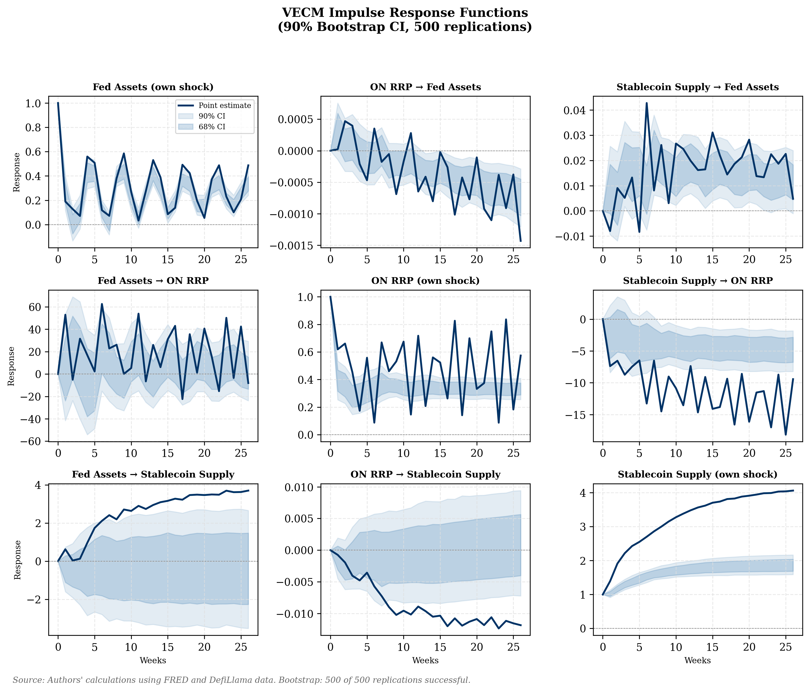{width="6.5in" height="5.0in"}

*Exhibit 11. VECM impulse response functions with 90 percent bootstrap confidence intervals (500 replications), 26-week horizon. Source: Authors' calculations using FRED and DefiLlama data.*

Bootstrap confidence intervals (500 replications) confirm that most cross-variable impulse responses are not individually significant at the 90 percent level; transmission operates through the long-run equilibrium mechanism rather than short-run multipliers.

Forecast error variance decomposition: Fed and ON RRP shocks jointly account for 13.9 percent of stablecoin supply variance at 26 weeks, rising monotonically from 5.6 percent at one week (Exhibit 12). In dollar terms, this implies approximately \$42 billion in supply variation attributable to Fed policy over six months, transmitted through a channel the Fed does not monitor. The monotonically rising profile distinguishes this from announcement effects: policy influences supply through gradual equilibrium adjustment.

  ---------- ----------- ------------ ----------
  Horizon    Fed Share   RRP Share    Combined
  1 week     4.6%        1.0%         5.6%
  26 weeks   8.6%        5.3%         13.9%
  ---------- ----------- ------------ ----------

*Table 3a. FEVD: Share of stablecoin supply variance explained by policy shocks.*

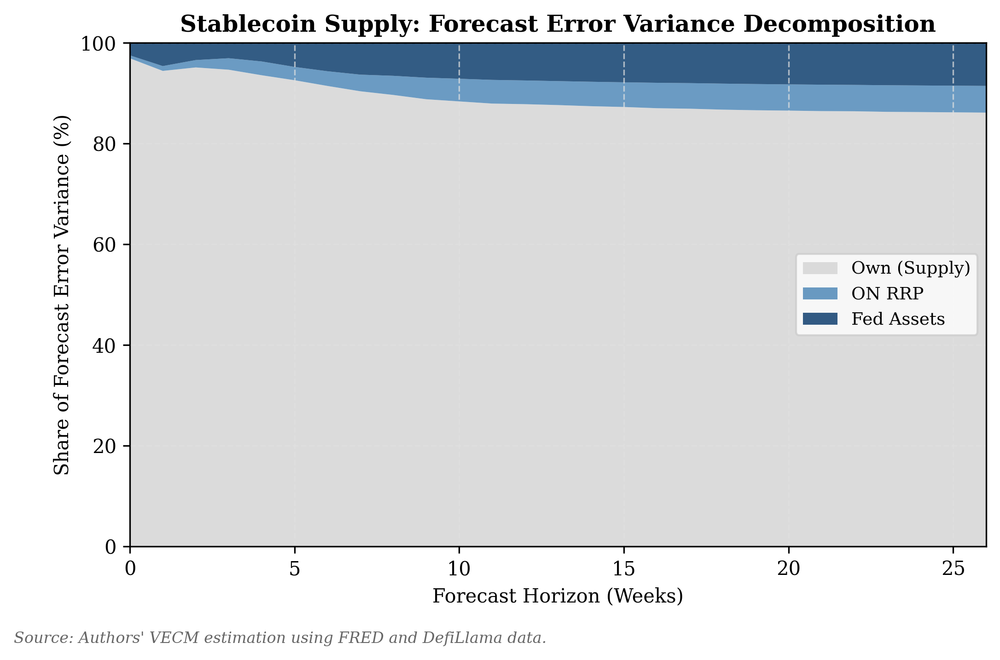{width="6.5in" height="4.0in"}

*Exhibit 12. Forecast error variance decomposition: stablecoin supply.*

**Persistence of Equilibrium Adjustment.** The persistence profile (Pesaran and Shin 1996) shows a smoothed half-life of approximately 5 weeks, with oscillations at a 6–8-week cycle consistent with the FOMC meeting schedule (Exhibit C3). Transmission operates over weeks to months rather than days, explaining why FOMC announcement effects are individually weak while the long-run equilibrium is strong.

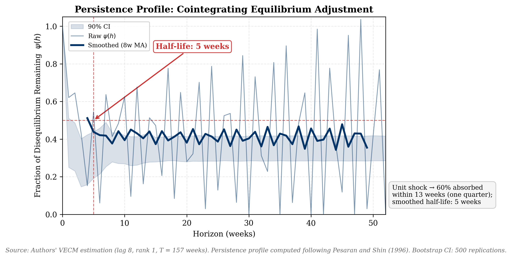{width="6.5in" height="3.5in"}

*Exhibit C3. Persistence profile of the cointegrating equilibrium. Smoothed half-life: 5 weeks.*

**Yield Spread Channel.** Rate cuts predict stablecoin supply growth within one week, consistent with a yield-spread transmission channel. We construct a weekly spread as the 3-month Treasury bill rate minus the Aave V3 USDC lending rate and test whether this spread forecasts stablecoin supply growth. It does: the yield spread Granger-predicts supply growth at lag 1 (F = 11.30, p = 0.001). When Treasury yields decline relative to on-chain lending rates, stablecoin supply expands within a week. The relationship is bidirectional: supply growth also predicts future spread changes, consistent with a feedback loop in which new stablecoin capital expands on-chain lending pools, compressing DeFi yields further.[^yield_details]

[^yield_details]: The spread averages −0.24 percentage points over the sample (r = −0.47 with supply growth, n = 155 weeks). Reverse Granger causality: supply growth predicts spread changes at lag 2 (F = 9.40, p < 0.001).

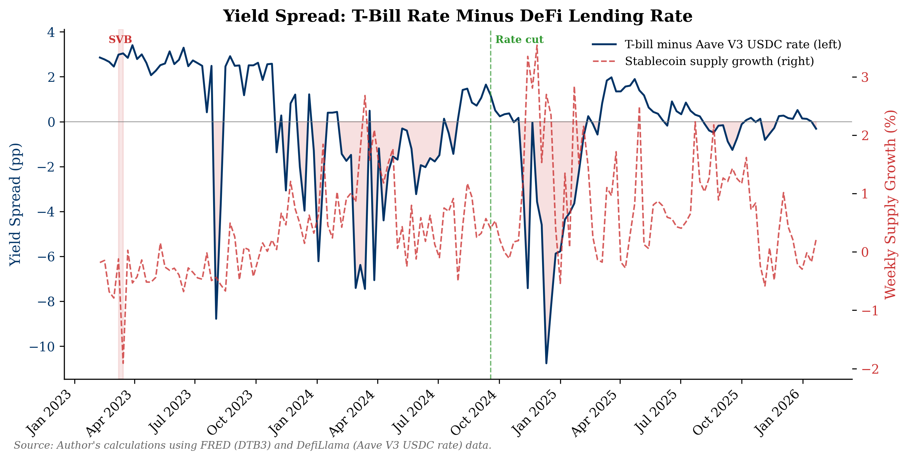{width="6.5in" height="4.0in"}

*Exhibit 13. T-bill minus DeFi lending rate versus stablecoin supply growth. When the spread turns negative (DeFi yields exceed T-bill rates), supply growth accelerates. Source: Authors' calculations using FRED and DefiLlama data.*

The yield spread channel operates through gateway infrastructure: when T-bill yields fall, reserve managers face lower returns on backing assets while DeFi yields become relatively more attractive, pulling capital on-chain through the same gateways that manage the reserve-to-token conversion. The yield spread produces the highest F-statistic and shortest lag of any Granger specification, documenting a concrete opportunity cost mechanism where the FOMC event study found only long-run equilibrium effects.

**Money Market Fund Intermediation.** ON RRP balance changes Granger-predict stablecoin supply changes at lag 2 (F = 3.91, p = 0.022). This is interpretable as money market fund rebalancing, since approximately 80 percent of ON RRP usage is attributable to money market funds (Federal Reserve Bank of New York, 2024). The reverse direction obtains at a longer lag (lag 5, F = 4.13, p = 0.002), suggesting capital flows into stablecoins relatively quickly when ON RRP drains but the reverse adjustment (stablecoin redemptions flowing back into money market instruments) takes longer. The asymmetric timing is economically intuitive: money market rebalancing into stablecoins follows portfolio optimization logic with a two-week horizon, while the reverse flow requires redemption processing and re-allocation decisions that operate on a five-week cycle.

**Robustness and Falsification.** Several additional tests support the cointegration finding. First, a subsample stability test splitting at the September 18, 2024 rate cut (pre: 86 weeks, post: 71 weeks) finds no statistically significant shift in the cointegrating *vector* (bootstrap p = 0.126 for the ON RRP element, p = 0.086 for the supply element; both above the 0.05 threshold). The form of the equilibrium relationship (the relative loadings on Fed assets, ON RRP, and supply) does not change across regimes, even though the *detectability* of the equilibrium weakens substantially in the easing subsample (see "Regime dependence" below).[^beta_note] Second, a Gregory-Hansen test allowing for an endogenous structural break does not improve on the standard Johansen specification (best ADF* = −4.28 under the regime-shift model, well short of the 5 percent critical value of −5.96), suggesting the relationship evolves gradually rather than shifting discretely.

[^beta_note]: The supply element p-value of 0.086 does not reject at the 5 percent level but clears the 10 percent threshold; the ON RRP element (p = 0.126) is weaker still. Neither element individually rejects stability, and the joint test does not reject, consistent with the Gregory-Hansen finding that the relationship evolves gradually rather than breaking discretely.

As a falsification check, we repeat the Johansen procedure replacing stablecoin supply with Bitcoin and Ethereum market capitalization. Neither crypto asset cointegrates with Federal Reserve balance sheet variables at any tested lag specification (0 of 5 lags each), indicating that the cointegrating relationship is specific to dollar-denominated stablecoins. The same test applied to non-dollar crypto assets returns a null, consistent with the reserve management channel rather than correlated trends in speculative crypto markets.

Both USDT and USDC individually cointegrate with Fed variables, but at complementary lag structures: USDT at longer lags (10, 12 weeks) consistent with reserve portfolio rebalancing through Treasury bills, and USDC at shorter lags (4, 6 weeks) consistent with direct banking-channel transmission through deposit-heavy reserves. Tether's individual error correction coefficient is statistically significant (α = −0.005, p = 0.005), unlike USDC's (p = 0.389), consistent with Tether's more active reserve management in response to money market conditions. The complementary lag structures rule out a compositional artifact: the aggregate cointegration is not driven by a single issuer.

**System robustness.** A concern with the trivariate cointegration is that the Fed-stablecoin relationship might be a generic liquidity proxy rather than a stablecoin-specific phenomenon. We test this by adding competing macro variables to the system one at a time, forming quadrivariate specifications. Adding SOFR, the repo market rate most directly linked to stablecoin reserve yields, strengthens rather than subsumes the cointegrating relationship (trace = 49.76 > cv95 = 47.85, rank = 1; Exhibit C5). Adding the effective federal funds rate produces a borderline result (trace = 46.57, just 1.28 below the 95 percent critical value of 47.85). Adding the 10-year Treasury yield fails (trace = 43.56 < cv95 = 47.85). The pattern is interpretable: the relationship survives the addition of the short-term rate most connected to money market plumbing (SOFR) but weakens when longer-term rates that capture broader macroeconomic conditions are included. The SOFR result is the most informative: if the Fed-stablecoin cointegration were merely tracking generic liquidity conditions, adding the repo rate that directly prices those conditions should subsume it. Instead, SOFR's inclusion strengthens the trace statistic, consistent with SOFR and stablecoin supply sharing an equilibrium that operates through reserve management rather than capturing the same variation.

**Regime dependence.** Splitting the sample at September 2024 (the first rate cut) reveals that the cointegrating relationship is regime-dependent. In the tightening subsample (February 2023 through August 2024, T = 83 weeks), the Johansen trace statistic rejects strongly (trace = 48.18 >> cv95 = 29.80); in the easing subsample (September 2024 through January 2026, T = 74 weeks), it fails (trace = 17.71 < cv95 = 29.80). A rolling 52-week window confirms this pattern: the trace statistic exceeds the critical value in 15 of 105 windows (14.3 percent), concentrated in windows that straddle the tightening-to-easing transition rather than in the pure easing period (Exhibit C3b). The tightening subsample's selected rank of 3 in a three-variable system indicates full rank, consistent with the series being closer to trend-stationary during QT, a regime in which the Johansen I(1) framework becomes less informative.[^rank3_caveat] We therefore weight the rolling-window evidence over the subsample rank selection: the trace statistic's systematic variation across monetary policy regimes is robust to this diagnostic ambiguity.

The regime dependence is theoretically consistent with the hypothesized transmission channel. During quantitative tightening, Fed balance sheet contraction directly constrains the money market plumbing through which stablecoin reserves are managed, making the equilibrium relationship observable. During easing, demand-side drivers (DeFi yield opportunities, institutional adoption, regulatory clarity from the GENIUS Act) dominate supply dynamics, attenuating the Fed-supply equilibrium without eliminating the underlying channel. The specification is robust to deterministic assumptions: both the baseline (det_order = 0, restricted constant) and the no-deterministic specification (det_order = −1) produce rank = 1; only the restricted-trend specification (det_order = 1) fails, confirming the relationship is not driven by deterministic trends. We interpret the cointegrating relationship as a feature of active monetary tightening (the policy regime where the transmission channel is most relevant for Fed monitoring) rather than a permanent structural feature of stablecoin markets.

[^rank3_caveat]: Full rank in the Johansen framework implies the series are I(0), meaning the cointegration framework is not the appropriate tool for the subsample. Subsample rank selection with T = 83 weekly observations should be treated as diagnostic rather than structural; the full-sample result (rank = 1 with T = 157) and the rolling-window trace variation provide more reliable inference.

**Summary of Empirical Strategy.** Three independent tests, taken together, establish that the Fed-stablecoin relationship is systematic rather than coincidental:

  ------------------------------------------------- ------------------------------------------------------------ --------------------------------------- ------------------------------------------
  Question we asked                                  How we tested it                                             What we found                           What it rules out
 Do Fed policy and stablecoin supply move together Statistical test for shared equilibrium (Johansen cointegration) Yes: trace = 30.68\* (tightening regime); fails in easing The correlation is a coincidence
  long-term?
 *How* does Fed policy reach stablecoins? Does the yield gap between T-bills and DeFi predict supply? Yes: F = 11.30\*\*\* Some hidden third factor drives both
                                                      (Granger causality)
  Is this about dollars specifically, or all crypto?  Run the same test on Bitcoin and Ethereum                     Neither shows the pattern (0/5 lags)    Stablecoins just follow the crypto cycle
  ------------------------------------------------- ------------------------------------------------------------ --------------------------------------- ------------------------------------------

*Table 3c. Empirical strategy summary.*

Of these three tests, the yield spread forecasting result is the most robust mechanism-consistency test: it obtains at lag 1 with the highest F-statistic in any specification (F = 11.30, p = 0.001) and identifies a concrete economic mechanism (the T-bill/DeFi yield gap) rather than relying on a system-level statistical test. The Johansen cointegration is strongest during quantitative tightening (trace = 48.18 in the tightening subsample) but does not survive the transition to easing, a regime sensitivity consistent with the transmission mechanism but limiting the generalizability of the equilibrium claim (see "Regime dependence" above). The placebo null (Bitcoin and Ethereum fail the cointegration test at all lags) provides the dollar-specificity that distinguishes the relationship from general crypto-market trends. Together, the three tests are complementary: the yield spread Granger test identifies the mechanism-consistent channel, the cointegration confirms the equilibrium during the policy regime where transmission is most active, and the placebo rules out the crypto confound.

The yield spread is not an instrument: Aave utilization rates respond to stablecoin inflows, creating mechanical feedback. We interpret the Granger result as a mechanism-consistency test: the yield spread predicts supply growth in the direction the opportunity-cost channel implies, rather than a causal identification. Causal identification would require an exogenous instrument for Treasury bill supply or on-chain lending rates, which we leave to future work. The bidirectional Granger result (supply growth also predicts spread changes at lag 2) is consistent with this feedback interpretation and does not invalidate the mechanism-consistency finding. Accordingly, we treat all Granger results as directional evidence consistent with opportunity-cost channels, not as causal estimates of policy transmission.

**IV.A.2. Descriptive Patterns**

Fed total assets and stablecoin supply are strongly negatively correlated (r = −0.94, n = 157), the strongest pairwise relationship in our dataset, with the federal funds rate at r = −0.89 and SOFR at r = −0.87 (Exhibit 1). All principal series are I(1) by ADF tests, confirmed by KPSS; these correlations therefore characterize co-movement of stochastic trends rather than regression coefficients.[^adf_fed]

[^adf_fed]: ADF and KPSS results for all variables are reported in Appendix E, Table E2. The ADF test on differenced Fed total assets is borderline (p = 0.19), but KPSS confirms stationarity (0.386, p = 0.083).

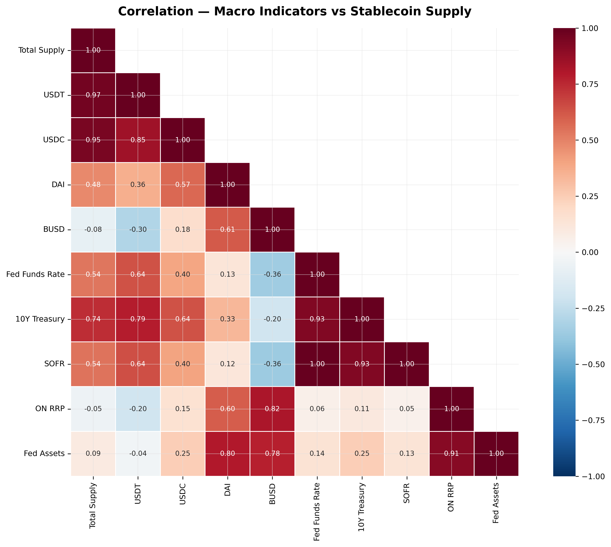{width="6.5in" height="5.0in"}

*Exhibit 1. Correlation matrix: macroeconomic indicators versus stablecoin supply.*

Rolling 180-day correlations (Exhibit 2) averaged −0.95 after the September 2024 rate cut versus −0.29 before it; the negative co-movement is strongest during easing, precisely when the yield spread channel predicts maximum effect. (This bivariate correlation measures co-trending between Fed assets and supply; it is distinct from the Johansen trivariate cointegration test, which additionally requires error-correcting dynamics and weakens in the easing subsample; see "Regime dependence" in Section IV.A.1.) Bivariate Granger tests confirm that ON RRP changes predict stablecoin supply at lags 1–10 (F = 4.83, p = 0.028 at lag 1), with no reverse causality, consistent with the ON RRP facility mediating money market rebalancing into stablecoin venues.

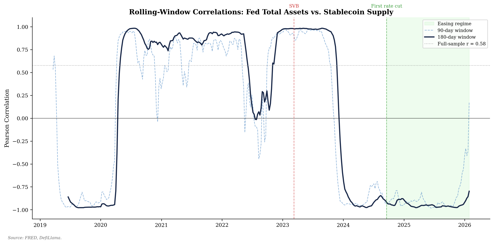{width="6.5in" height="3.5in"}

*Exhibit 2. Rolling-window correlations between Fed total assets and stablecoin supply.*

The supply dynamics illustrate the puzzle and its resolution. During the rate plateau at 5.25–5.50 percent, supply grew modestly (\$122B to \$162B); after the September 2024 cut, it nearly doubled to \$305 billion (Exhibit 3). The opportunity cost channel operates primarily on the issuer side: issuers earn the spread between reserve yields and their zero-coupon liabilities, making issuance more profitable at higher rates. The GENIUS Act's yield prohibition institutionalizes this dynamic. The ON RRP drawdown (from \$2.4 trillion to \$9.6 billion, Exhibit 4) provides the clearest visual evidence of the money market rebalancing channel.

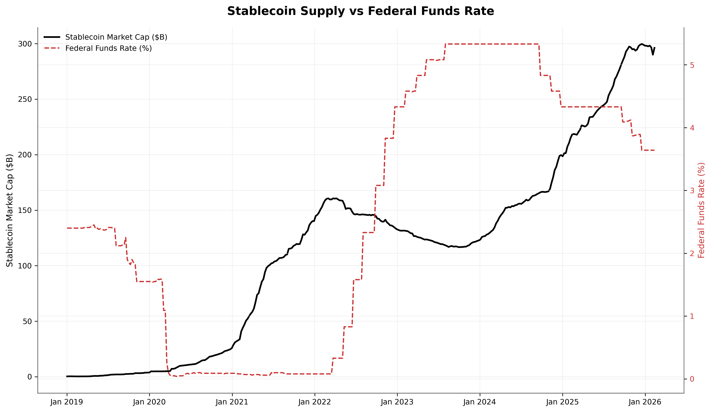{width="6.5in" height="3.5in"}

*Exhibit 3. Total stablecoin supply versus the effective federal funds rate.*

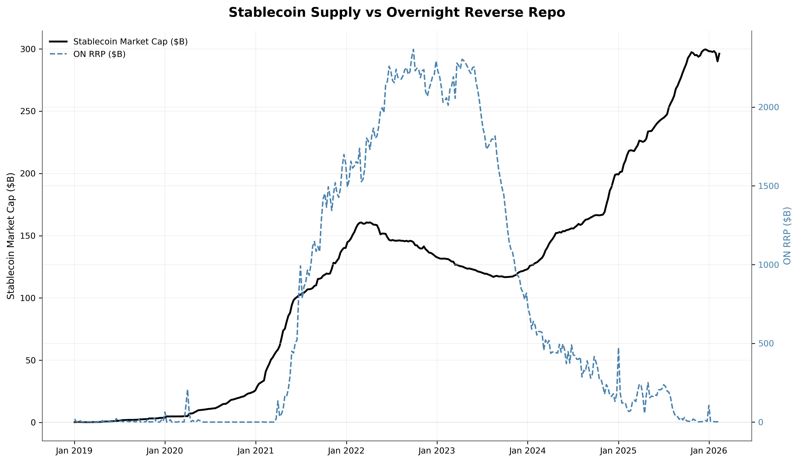{width="6.5in" height="3.5in"}

*Exhibit 4. Stablecoin supply versus ON RRP outstanding.*

The Fed-stablecoin relationship is not regime-specific; it is structural. Extending the sample backward to January 2019 across five distinct monetary regimes, the correlation reverses sign between easing and tightening cycles but persists in every regime with sufficient duration.

**IV.A.3. Extended Sample and Regime Analysis**

A single correlation number between Fed policy and stablecoin supply is meaningless. Extending the sample to January 2019 reveals why: the full-sample correlation is +0.576, apparently contradicting the strong negative primary-sample relationship. The resolution is a Simpson's paradox: within-regime correlations range from −0.977 to +0.927, and the positive aggregate simply averages across regimes with opposite signs.

  -------------------------------- --------- -------- ----------------------------------
  Regime                           Dates     r        Interpretation
  Pre-COVID                        Jan 2019 to Feb 2020   −0.977   Fed steady, stablecoins growing
  COVID QE                         Mar 2020 to Mar 2022   +0.927   Both expanding rapidly
  Tightening                       Apr 2022 to Aug 2024   +0.039   Decoupled
  Easing                           Sep 2024 to Jan 2026   −0.984   Inverse relationship restored
  Full sample                      Jan 2019 to Jan 2026   +0.576   Simpson's paradox average
  -------------------------------- --------- -------- ----------------------------------

Table 4. Regime-Specific Correlations Between Fed Assets and Stablecoin Supply

The sign-switching pattern across regimes is the central feature of the extended sample. During quantitative easing (2020 to 2022), both Fed assets and stablecoin supply expanded rapidly, producing a strong positive correlation. During tightening, the relationship effectively decoupled (r ≈ 0): stablecoin supply grew 123 percent even as the Fed drained reserves. Non-monetary factors dominated: crypto market recovery from the 2022 drawdown, institutional adoption (PayPal's PYUSD, BlackRock's BUIDL fund), and demand from emerging-market dollarization corridors where Tron-based USDT serves as a dollar substitute. These forces overwhelmed the contractionary Fed signal, producing near-zero co-movement despite historically tight policy. During the easing regime beginning September 2024, the negative correlation returned with near-perfect strength (r = −0.984), consistent with the yield spread channel reactivating as rate cuts compressed the gap between T-bill and DeFi returns. A single correlation number between Fed policy and stablecoin supply is therefore meaningless: the full-sample figure of +0.576 averages across regimes where the within-regime correlation ranges from −0.977 to +0.927. The relationship reverses direction depending on whether the Fed is expanding or contracting its balance sheet, and strengthens as the yield spread between risk-free and on-chain rates compresses during easing cycles. Regime boundaries are defined by FOMC action dates; the rolling correlation chart (Exhibit 14) shows the continuous evolution, reducing sensitivity to precise boundary choice.

{width="6.5in" height="4.0in"}

*Exhibit 14. Rolling 90-day and 180-day correlations between Fed total assets and stablecoin supply, January 2019 through January 2026, with regime shading. Source: Authors' calculations using FRED and DefiLlama data.*

If the transmission operates through a slow equilibrium channel rather than through rapid market reactions, we would expect FOMC announcement effects to be modest. That is what we find.

**IV.A.4. FOMC Event Study**

An event study of 19 FOMC announcements (February 2023 through May 2025) finds that discrete announcement effects are weaker than the long-run cointegrating channel. Table 5 summarizes.

  -------------------------------- --------- ----------- ------------- -------------- -----
  Classification                   t+5 raw   t+10 raw    t+5 abnormal  t+10 abnormal  n
  Dovish                           +0.63%    +1.66%†     +0.13%        +0.65%          5
  Neutral                          +0.33%\*\*  +0.93%†   −0.29%†       −0.31%          9
  Hawkish                          −0.07%    −0.48%†     +0.19%        +0.04%          5
  -------------------------------- --------- ----------- ------------- -------------- -----

†p \< 0.10 \*\*p \< 0.01. Abnormal returns subtract the trailing 10-day average daily supply growth multiplied by the horizon.

Table 5. Stablecoin Supply Response to FOMC Announcements (Raw and Baseline-Adjusted)

The most statistically significant raw result is neutral holds at t+5 (+0.33%, p = 0.008), which weakens to −0.29 percent (p = 0.098) after baseline adjustment, with the sign reversal indicating that the raw result largely reflected the pre-existing supply trend. Dovish and hawkish raw results are directionally consistent with theory but neither survives baseline adjustment. No result survives Bonferroni correction for the 12 hypothesis tests across three classifications and four horizons (adjusted α = 0.004).[^fomc_caveats] Detailed analysis of individual classifications, FOMC-day volume effects, and outlier sensitivity appears in Appendix E.

[^fomc_caveats]: FOMC classifications are researcher-assigned based on rate action and the tenor of the post-meeting statement and press conference.

Empirical support rests on the cointegration results, yield-spread forecasting tests, and placebo falsification documented in Section IV.A.1, rather than on high-frequency announcement effects.

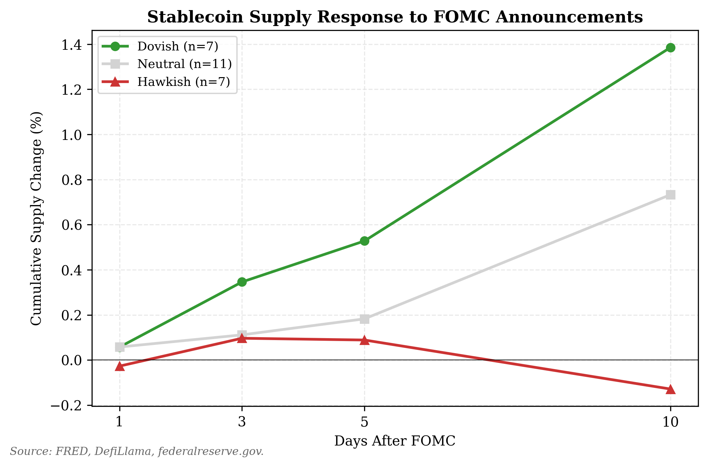{width="6.5in" height="4.0in"}

*Exhibit 15. Stablecoin supply response to FOMC announcements by classification. Source: Authors' calculations using FRED, DefiLlama, and federalreserve.gov data.*

If the transmission operates through long-run equilibrium rather than announcement shocks, the composition of stablecoin activity matters: which use cases are sensitive to the yield spread channel, and which are not?

**IV.A.5. Use-Case Decomposition**

Identified merchant payments account for just 0.1 percent of on-chain stablecoin volume, a lower bound that excludes off-chain netting, unlabeled merchant endpoints, and payment-channel settlements. The broader payments function, including person-to-person value transfer (45.7 percent) and exchange settlement (8.3 percent), is substantially larger. The dominant functions are DeFi liquidity provisioning (33.2 percent) and person-to-person value transfer (45.7 percent), both of which flow through the control layer.

Artemis-filtered stablecoin transfer volume across nine chains (Ethereum, Solana, Tron, Base, BSC, Arbitrum, Polygon, Avalanche, Optimism) totals \$60.6 trillion in adjusted volume over the sample period. On the three chains with application-level categorization (Ethereum, Solana, Base; representing 64 percent of total volume), DeFi protocols account for 33.2 percent, centralized exchanges for 8.3 percent, and identified merchant payments for 0.1 percent of adjusted transfer volume. This figure represents a lower bound on payment activity: off-chain netting within custodial wallets, unlabeled merchant endpoints, and payment-channel settlements that clear without individual on-chain transactions are excluded from the Artemis categorization. Peer-to-peer transfers, measured across all nine chains, constitute 45.7 percent of total adjusted volume, with Tron (26.2 percent of chain volume) dominated by P2P activity.

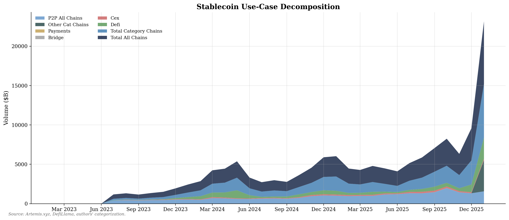{width="6.5in" height="3.5in"}

*Exhibit 16. Stablecoin transaction volume by use case. Of \$60.6 trillion in adjusted transfer volume across nine chains, P2P transfers constitute 45.7 percent, DeFi 33.2 percent, CEX 8.3 percent, and identified merchant payments 0.1 percent (lower bound; excludes off-chain netting and unlabeled endpoints). Source: Artemis (2026). Application categories available for ETH, SOL, BASE (64 percent of volume); P2P measured across all nine chains.*

The merchant payments finding is notable: at 0.1 percent of on-chain labeled volume, identifiable payment use cases remain nascent. The dominant use cases, DeFi liquidity provisioning and person-to-person transfers, are routed through the same gateway infrastructure that concentrates monetary policy transmission.

These estimates align with the Visa Onchain Analytics Dashboard (which found retail-sized transactions under \$100 representing less than one percent of adjusted volume) and a Castle Island Ventures/Brevan Howard survey of 2,541 users across five emerging markets, in which dollar-denominated savings (47 percent of respondents) and DeFi yield (44 percent) were nearly as prevalent as crypto trading (50 percent), suggesting that stablecoins function as much as a savings technology and dollar-access vehicle as a trading instrument.

This use-case heterogeneity has implications for the monetary policy channel. The cointegrating relationship (Section IV.A.1) reflects primarily exchange-settlement and reserve-management flows, which dominate volume and are directly sensitive to Fed policy through the yield spread mechanism. The payments and dollar-savings channels may exhibit different sensitivities, particularly in emerging markets where the alternative is a depreciating local currency rather than a Fed-influenced bank deposit. As the payments share grows, the aggregate Fed-stablecoin correlation may weaken.

Monetary policy shapes aggregate stablecoin supply, but the same dollar of supply produces different regulatory, monetary, and safe-haven outcomes depending on which gateway distributes it.

IV.B. Market Structure Evolution

The stablecoin market underwent a substantial consolidation during our sample period: one major stablecoin was forcibly shut down by regulators, another lost a third of its market share in a single crisis, and a single issuer, Tether, emerged holding over 60 percent of the entire market.

Total stablecoin supply declined from \$137 billion in February 2023 to a trough of approximately \$122 billion in October 2023, then embarked on sustained expansion to \$305 billion by January 2026 (Exhibit 5).

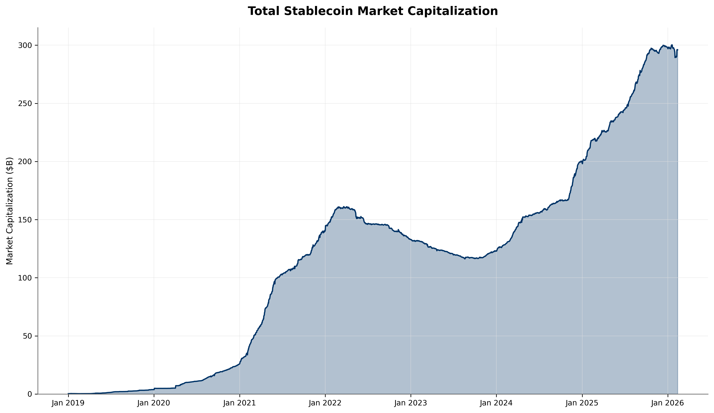{width="6.5in" height="3.5in"}

*Exhibit 5. Total stablecoin market capitalization, February 2023 through January 2026.*

The market consolidated around USDT, whose share rose from 49.5 to 60.8 percent, with the sharpest gain in March 2023 when the SVB crisis triggered a flight from USDC (Exhibit 6). USDC's share fell from 30.6 percent to approximately 23 percent. The BUSD wind-down removed a 12 percent market share entirely, absorbed primarily by USDT and, to a lesser extent, new entrants including Ethena's USDe (\$6.6B) and PayPal's PYUSD (\$3.6B).

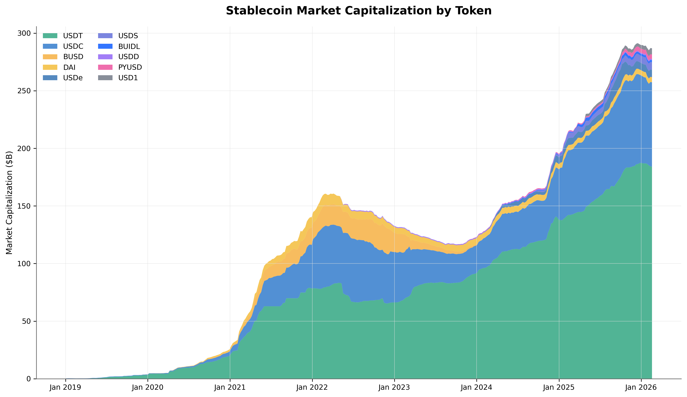{width="6.5in" height="3.5in"}

*Exhibit 6. Stablecoin market capitalization by token. USDT dominance increased from \~50% to \~61%. BUSD wound down entirely following the February 2023 NYDFS action.*

The March 2023 USDC outflow, the largest single-month redemption in our sample, was matched nearly dollar-for-dollar by USDT inflow that captured the displaced demand (Exhibit 7). USDT's consistent net inflows throughout the period underscore a "flight to familiarity" dynamic under stress.

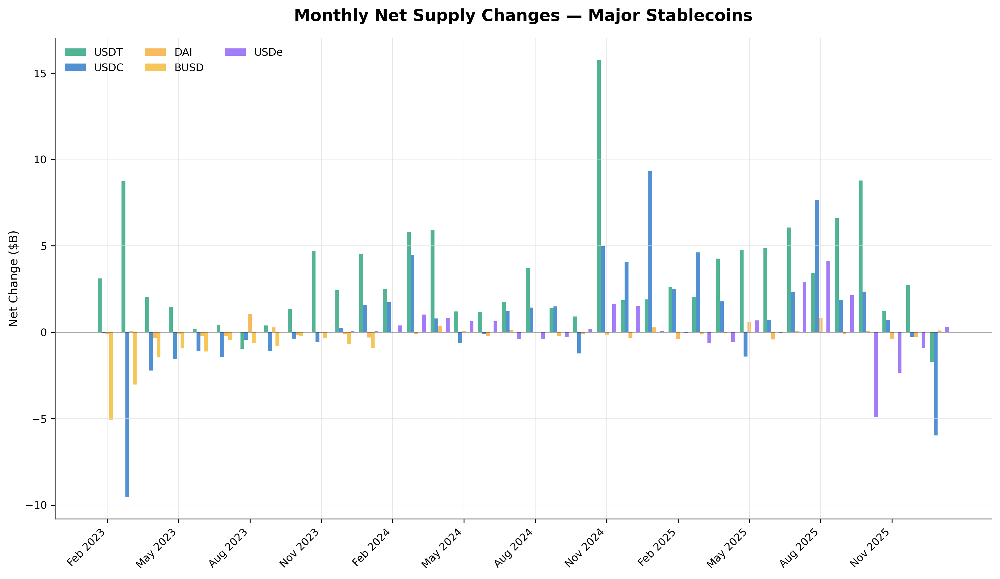{width="6.5in" height="3.5in"}

*Exhibit 7. Monthly net supply changes by stablecoin token.*

The BUSD Stress Episode

The BUSD wind-down provides the cleanest stress episode in our analysis. In February 2023, the NYDFS ordered Paxos to cease minting new BUSD tokens. Unlike SVB (a market-driven shock with complex feedback loops), the BUSD action was a pure regulatory intervention. The token's decline from \$16.1 billion to \$0.04 billion was mechanically driven by the inability to mint new supply.

The reallocation data show that displaced BUSD capital migrated predominantly to USDT, with a smaller share flowing to FDUSD (a Binance-affiliated alternative): a movement **down** the control layer, from Paxos (CLII: 0.88) to Tether (CLII: 0.45). BUSD users prioritized exchange continuity over regulatory protection, the opposite of what a flight-to-quality model predicts. Nansen counterparty data across three BUSD time windows (pre-action, early wind-down, late wind-down) reveal the mechanism: Wintermute's aggregate counterparty volume surged from \$4.7 billion pre-action to \$24.4 billion in the late wind-down, a fivefold increase concentrated on the Binance gateway, where Wintermute mediated the BUSD-to-USDT migration as the primary market-making intermediary. Simultaneously, Paxos's volume as a Binance counterparty dropped 88 percent (\$6.8 billion to \$0.8 billion), confirming cessation of BUSD flows. Notably, Tether Treasury's counterparty count expanded from 15 to 500 over the wind-down period, consistent with a broadening of USDT minting relationships as the system absorbed displaced BUSD capital.

The BUSD finding is more informative than it may first appear. Unlike SVB, where the confound between entity-specific exposure and peg deviation cannot be cleanly separated (Section IV.C), the BUSD wind-down involves no peg pressure: Paxos guaranteed 1:1 redemption throughout the wind-down, and users chose voluntarily to migrate to USDT rather than to higher-CLII alternatives. The revealed preference is clear: when given a clean choice between regulatory protection and gateway-ecosystem continuity, users chose the gateway. The flow retention correlation between CLII score and crisis-period volume gain is directionally stronger for BUSD (r = −0.47, p = 0.13, n = 12) than for SVB (r = −0.34, p = 0.27, n = 12), though neither reaches statistical significance at the 12-entity sample size (Table E2, Appendix E).

The two events together bracket the range of gateway-level reallocation dynamics. SVB demonstrates entity-specific exposure driving reallocation during market stress: flows moved away from the gateway with banking exposure, regardless of tier. BUSD demonstrates gateway-ecosystem preference driving reallocation during regulatory intervention: flows moved toward the gateway offering exchange continuity, regardless of CLII score. In both cases, the determinant was entity-level rather than tier-level, and in both cases capital moved in directions that token-level or tier-level frameworks would not have predicted.

Market share tells us who issues stablecoins. The next question is who routes them.

IV.C. Control Layer Dynamics

If the gateway matters more than the token, the data should show three things: that regulated gateways dominate routing volume (making them the actual control points), that stress responses vary by gateway rather than by tier (confirming entity-level rather than category-level risk), and that the same token produces different regulatory characteristics on different chains (proving routing infrastructure determines outcomes). All three patterns appear in the data.

Gateway Routing Volume and Tier Structure

Tier 2 offshore exchanges process 55 percent of monitored Ethereum gateway volume in gross terms, with Binance alone at 37 percent, making the offshore perimeter, not the regulated one, the primary routing layer for dollar stablecoins (Exhibit 8, expanded 51-address registry). Tier 2 entities (Binance, Kraken, OKX, Bybit, Tether) account for this share. Tier 1 regulated gateways (Circle, Coinbase, Paxos, Gemini, BitGo, PayPal) handle 41 percent, and Tier 3 permissionless protocols (Uniswap, Curve, 1inch, Compound, Aave) contribute approximately 4 percent.[^tier_shares_method] However, netting out internal rebalancing transfers (Section III.C) shifts Tier 2 to 50 percent and Tier 1 to 47 percent, near-parity rather than Tier 2 dominance. The difference is driven almost entirely by Binance, whose 18 percent internal transfer rate inflates Tier 2's gross share. On a net basis, the Ethereum gateway market is roughly evenly split between regulated and offshore infrastructure, with the regulated Tier 1 perimeter, still concentrated in two regulated entities, handling close to half of genuine gateway activity. The absolute volume is substantial: on a typical day, Coinbase processes over \$1.7 billion and Circle over \$1.3 billion in USDC and USDT transfers. The 51-address registry captures 27.7 percent of combined Ethereum USDC and USDT volume (\$7.74 trillion of \$27.95 trillion gross), tripling the coverage of the initial twelve-address set.[^zero_vol]

[^zero_vol]: The initial twelve-address registry included only a single address per entity, several of which proved to be cold-storage or archival addresses with negligible stablecoin transfer volume (notably Coinbase Custody and Kraken's primary labeled addresses). The expanded 51-address registry, constructed through systematic label discovery, identified active operational wallets for these entities: Coinbase operates through six addresses processing \$1.9 trillion, Kraken through five addresses processing \$391 billion, and OKX through fifteen addresses processing \$268 billion. Aave V3 Pool remains the only monitored address with near-zero volume.

[^address_note]: An earlier version of the gateway registry attributed address `0x21a31Ee1afC51d94C2eFcCAa2092aD1028285549` to Gemini based on a third-party data source. Independent verification via Etherscan confirmed this address is labeled "Binance 15" with 13.5 million transactions and \$381 million in cross-chain holdings. The corrected attribution reassigns \$421 billion in transfer volume from Tier 1 (Gemini) to Tier 2 (Binance). Verified Gemini addresses (`0xd24400ae...` and `0x07Ee55aA...`) show combined USDC/USDT volume of approximately \$21 over the full sample period. All results in this paper reflect the corrected registry.

Within Tier 1, concentration is more extreme than the six-entity label suggests. Coinbase accounts for 56 percent of Tier 1 volume and Circle for 44 percent; the remaining Tier 1 entities (Paxos, BitGo, PayPal, Gemini) collectively contribute less than 0.1 percent. The effective Tier 1 is a Coinbase-Circle duopoly, processing 99.9 percent of regulated gateway volume, a structural feature with implications for the fragility analysis in Section IV.C. Gemini, which holds a NYDFS trust charter and operates as both an exchange and the issuer of GUSD, processes negligible USDC/USDT gateway volume on Ethereum (\$21 over the full sample period), consistent with its small stablecoin market share relative to its custodial and exchange operations.

**Token-Level Routing Patterns.** Disaggregating gateway volumes by token reveals the clearest evidence for the "regulate the router, not the token" thesis. USDC routes the vast majority of its monitored gateway volume through Tier 1; unsurprisingly, since Circle is the USDC issuer and Coinbase is its primary distribution partner. But USDT, the token most frequently characterized as beyond U.S. regulatory reach, routes 10.8 percent of its Ethereum gateway volume through Tier 1, with the bulk flowing through Tether Treasury and offshore exchanges in Tier 2. The 10.8 percent figure is substantially lower than earlier estimates based on incomplete address attribution, but it still represents meaningful compliance intermediation: U.S.-regulated gateways process billions of dollars in USDT transfers annually, performing de facto compliance screening for a token that is neither issued nor primarily governed under U.S. law. The pattern extends even to issuer-token pairs: GUSD, issued by Gemini under an NYDFS trust charter, routes less than 0.04 percent of its \$14 billion Ethereum transfer volume through Gemini's own gateway addresses, confirming that issuance and routing are functionally independent even for an issuer's own token. The question is whether supervisors are utilizing this existing regulatory surface area.

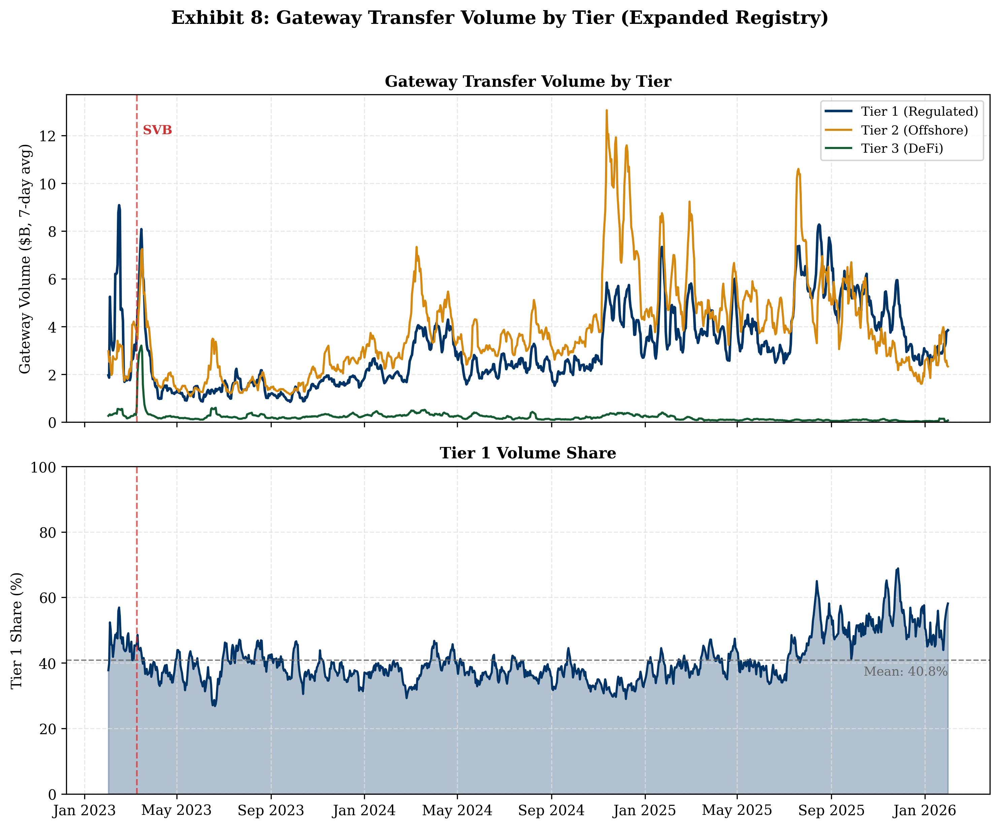{width="6.5in" height="4.5in"}

*Exhibit 8. Gateway transfer volume by tier (top) and Tier 1 volume share (bottom), Ethereum only. Tier 1 processes 41 percent of gross monitored volume (47 percent net of internal rebalancing) on average. The SVB crisis (red dashed line) produced a visible reallocation: Tier 1 spiked to 63 percent on March 10, collapsed to 13 percent during the weekend gap, and recovered to 57 percent after the FDIC backstop. Source: Dune Analytics, 51 gateway addresses, 19 entities. February 2023–January 2026.*

> **Metric definition.** Tier 1 volume share = (sum of daily USDC + USDT transfer volume through Tier 1 gateway addresses) / (sum across all three tiers), computed daily. The bottom panel plots this daily share; reported summary statistics (41 percent mean) are time-averaged (each trading day weighted equally). Volume-weighted shares (where high-volume days contribute more) are T1: 43.5 percent, T2: 53.4 percent, T3: 3.1 percent. SVB daily values (63%, 13%, 57%) are single-day observations, not rolling averages.

The 51 gateway addresses capture 27.7 percent of combined Ethereum USDC and USDT volume (\$7.74 trillion of \$27.95 trillion), with the unmonitored 72.3 percent consisting largely of peer-to-peer transfers and wallet-to-wallet movements. Nansen entity labeling confirms that 98 percent of high-value Ethereum addresses are identifiable; coverage is a function of address count, not observability, indicating the institutional gateway universe is nearly complete for flows relevant to regulatory and monetary analysis. A sensitivity analysis (Exhibits C1, C12) bounds the impact of unlabeled volume: even under the extreme assumption that 25 percent of all unlabeled volume flows through unidentified Tier 2 gateways, Tier 1's volume-weighted share declines from 43.5 percent to 26.3 percent while tier-level HHI remains above 4,756, well above the DOJ/FTC "highly concentrated" threshold of 2,500. The qualitative finding that a small number of institutional gateways dominate the control layer is robust to coverage assumptions.

The Dollar's Safe-Haven Function in Tokenized Markets: The SVB Stress Episode

The March 2023 SVB crisis provides the primary stress-episode test for the control layer hypothesis, though the findings challenge the simple "flight to quality" narrative. When SVB failed on March 10, Circle disclosed \$3.3 billion in USDC reserves at the institution. Exhibit 9 details the consequences: USDC market capitalization fell from \$43.2 billion to \$38.1 billion in five days, a \$5.1 billion net redemption. Meanwhile, USDT gained approximately \$3 billion over the same window, and the fed funds rate stepped up 25 basis points to 4.83 percent on March 23 as the FOMC maintained its tightening trajectory despite the banking stress.

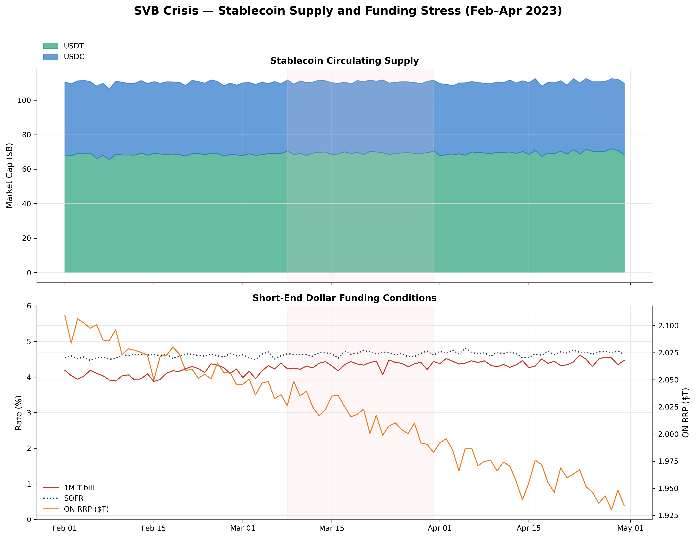{width="6.5in" height="5.0in"}

*Exhibit 9. SVB crisis: stablecoin supply dynamics (top), daily USDC net change (middle), and policy rates (bottom), February to April 2023.*

The gateway-level data in Exhibit 8 reveal the mechanism at daily frequency. On March 10, as the FDIC seized SVB, Tier 1 share spiked to 63 percent as institutional users rushed to regulated off-ramps, an initial "flight to regulation" that the expanded data make visible for the first time. By March 11 to 12 (the weekend), the pattern inverted: Tier 1 collapsed to 13 percent as Circle's operations slowed and Curve 3pool, a permissionless smart contract with no human operator, no KYC, and CLII of 0.12, absorbed the majority of displaced flows. Nansen counterparty data confirm the mechanism: institutional market makers (Cumberland, Galaxy) withdrew entirely from Curve during the stress window, and MEV bots (algorithmic arbitrageurs exploiting the USDC depeg) filled the void, rising from 24 to 51 percent of Curve's counterparty volume. The FDIC's March 12 announcement of full SVB deposit coverage triggered an immediate reversal: Tier 1 recovered to 57 percent by March 13, and stabilized within its normal range by March 17. The precision of this recovery (one FDIC announcement, one trading day) provides the most direct evidence that stablecoin routing infrastructure is already enmeshed with the banking safety net through the reserve-deposit channel, even without formal designation. The weekend gap, a roughly 48-hour period during which the regulated perimeter's share dropped to 13 percent because Tier 1 entities do not operate 24/7, reveals an infrastructure vulnerability specific to the gateway model: during acute stress, the dollar's digital routing reverts to whatever infrastructure remains online, regardless of regulatory status.

The SVB episode is consistent with a gateway-contingent safe-haven dynamic in the dollar's tokenized markets. The dollar itself remained the safe haven: capital did not flee to bitcoin, ethereum, or euro-denominated alternatives but remained entirely within dollar-denominated stablecoins. But the *routing* of safe-haven demand was gateway-contingent: users fleeing Circle did not flee the dollar; they fled to alternative dollar gateways (Binance, Coinbase, Curve). The dollar's safe-haven status held at the currency level but fragmented at the infrastructure level, with a permissionless smart contract temporarily becoming the primary routing mechanism for dollar safe-haven flows. This has no analog in traditional foreign exchange markets, where the dollar's safe-haven status is a property of the currency and its backing sovereign, not of specific intermediaries. In tokenized markets, the safe-haven function depends on gateway resilience, a dependency that creates the liquidity provision question the SVB episode exposed.

The expanded registry data contradict a simple "flight to Tier 1" or "flight from Tier 1." Total gateway volume surged across all entities during SVB week; every major gateway processed more volume than its pre-crisis baseline, reflecting system-wide stress activity rather than zero-sum reallocation. Live depeg data from CoinGecko Pro confirm the token-level pattern: during the SVB event, USDC depegged by 12.1 percent, DAI (which held USDC as collateral) depegged by 11.4 percent, while USDT, issued by the gateway with the lowest CLII among major issuers (0.45), experienced a 2.8 percent *premium* as capital rotated into the perceived safe haven. To quantify the reallocation pattern, we compute flow retention ratios for each gateway during the SVB stress window (March 9 to 15, 2023) relative to a 28-day pre-crisis baseline.

  -------------------- ---------- -------------- -----------
  Gateway              Tier       Daily Avg ($B) Retention
  Curve 3pool          Tier 3     2.33           12.35×
  BitGo                Tier 1     0.09           6.80×
  1inch                Tier 3     0.72           5.57×
  OKX                  Tier 2     0.43           3.44×
  Bybit                Tier 2     0.14           3.39×
  Coinbase             Tier 1     4.03           2.63×
  Binance              Tier 2     4.39           2.20×
  Kraken               Tier 2     0.82           2.14×
  Tether               Tier 2     0.45           1.77×
  Circle               Tier 1     3.42           1.39×
  -------------------- ---------- -------------- -----------

Table 6. Gateway Flow Retention During SVB Crisis (March 9 to 15, 2023). Retention = stress-period daily average / 28-day pre-crisis daily average. All entities gained absolute volume; retention ratios above 1.0× reflect the system-wide surge in stress activity. The gradient, Circle gaining least (1.39×) while Curve 3pool gained most (12.35×), reveals the reallocation pattern.

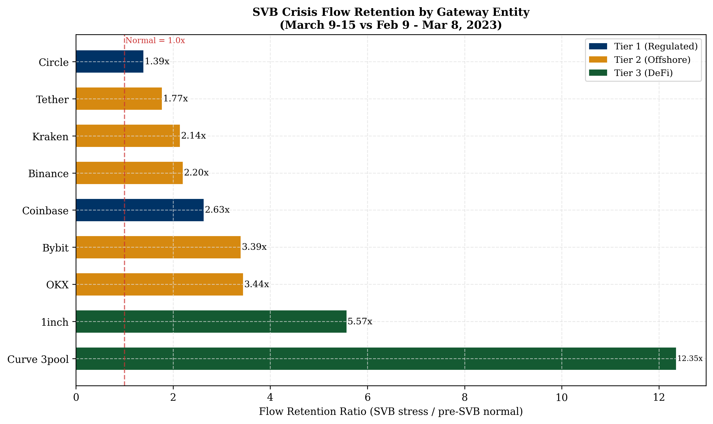{width="6.5in" height="3.5in"}

*Exhibit 9b. Gateway flow retention during SVB crisis. All entities gained absolute volume; bars show retention ratio (stress-period daily average / 28-day pre-crisis baseline). Gradient runs from Tier 3 protocols (highest retention) through Tier 2 exchanges to the SVB-exposed Tier 1 gateway (lowest). Source: Dune Analytics, 51 gateway addresses, 19 entities.*

The sharpest finding comes from within Tier 1. Coinbase (2.63×) and Circle (1.39×), both U.S.-regulated, both high-CLII entities, showed materially different retention during SVB. Circle, the gateway with direct SVB exposure, gained the least of any major entity; Coinbase, without SVB exposure, nearly tripled its daily volume. The divergence was not between tiers but between entities within the same tier, determined by specific banking relationships. Across the full control layer, the gradient runs from Tier 3 protocols (Curve 3pool: 12.35×, absorbing the displaced volume as a permissionless escape valve) through Tier 2 exchanges (Binance: 2.20×, Kraken: 2.14×) to the SVB-exposed gateway at the bottom (Circle: 1.39×). The implication is that CLII measures compliance posture rather than resilience: regulated gateways serve as the channel through which entity-specific banking shocks transmit to stablecoin markets, while permissionless protocols function as a pressure-release valve during stress.

> *During the SVB crisis, capital did not flow from lower-tier gateways to higher-tier ones; it flowed away from the specific gateway with SVB deposit exposure. Entity-level banking relationships determined flow direction more than regulatory tier classification.*

Three caveats apply to this interpretation. First, the SVB episode is a single event, and the gateway-specific explanation cannot be statistically distinguished from the alternative hypothesis that users fled USDC's peg deviation itself rather than Circle's counterparty exposure; without additional stress episodes, we cannot disentangle entity risk from token risk. Second, every entity gained absolute volume during the stress window; the retention ratios measure relative intensity rather than absolute reallocation, making it difficult to distinguish genuine capital reallocation from amplified trading activity during a high-volatility period. Third, the retention ratios use gross volumes; Binance's 18 percent internal transfer rate (Section III.C) may inflate its retention ratio relative to entities with lower internal activity.

**Identification discipline.** Three additional checks discipline the daily Tier 1 share movements during stress. First, the daily trajectory itself: the expanded 51-address registry reveals a structural 13.9 percentage point weekend dip in Tier 1 share (weekday mean 44.8 percent, weekend mean 30.9 percent), driven primarily by Binance's 24/7 operations increasing Tier 2's weekend share (Exhibit C9). This structural pattern means that the SVB weekend nadir of 13.2 percent (March 12) cannot be evaluated against weekday baselines; the relevant comparison is against normal weekend variation. At the weekend level, the SVB dip falls 0.85 standard deviations below the normal weekend mean, not statistically exceptional.[^weekend_structural] The identification therefore rests on the daily trajectory and placebo analysis rather than the weekend level. Second, placebo windows: we compute event-time-aligned Tier 1 share trajectories for 50 randomly selected non-event windows over a [−7, +7] day horizon centered on each placebo date; the SVB trajectory's 15-day swing of 51.8 percentage points ranks at the 94th percentile of placebo swings, its nadir falls 2.7 standard deviations below the placebo mean, and the trajectory remains below the 5th percentile band for 2 of 15 event-time days (Exhibit C2, Exhibit C10). Third, the CLII-retention gradient holds when CLII is treated as a continuous variable rather than discretized into tiers: the negative relationship between CLII score and stress flow retention obtains for both SVB (r = −0.45) and BUSD (r = −0.23) events, with monotonically declining retention across quartiles (Q1 lowest-CLII: 6.27× mean retention; Q4 highest-CLII: 0.61×; Exhibit C4). The SVB findings are robust to the measurement choices most likely to affect them.

[^weekend_structural]: The structural weekend dip reflects Binance (7 addresses, 37 percent of monitored volume) operating continuously while Tier 1 entities reduce weekend activity. Day-over-day changes provide additional signal: the SVB Friday-to-Saturday drop (−32.7 pp) exceeds the normal Friday-to-Saturday mean (−14.9 pp) by 1.4σ, and the Saturday-to-Sunday continuation (−16.6 pp) exceeds its normal mean (−0.2 pp) by 1.3σ. Neither is individually significant; the combined two-day trajectory from 62.5 to 13.2 percent is what the placebo analysis identifies as exceptional.

What the SVB episode reveals most directly for the dollar's international role is how central bank facilities interact with digital dollar markets during stress, a question the Federal Reserve has not previously confronted in this form. The Bank Term Funding Program (BTFP), designed to stabilize bank funding, interacted with stablecoin routing infrastructure through an indirect chain: BTFP supported banks → banks held stablecoin issuer deposits → deposit stability supported the peg → peg stability re-routed flows through Tier 1 gateways. The FDIC's full-deposit-coverage announcement operated through the same chain but more directly: one announcement, one trading day, and Tier 1 share recovered from 13 percent to 57 percent. The Fed's existing toolkit stabilized digital dollar markets, but through an unintended transmission surface that current monitoring frameworks do not cover.

This interaction suggests a framework for thinking about dollar liquidity provision in digital financial markets at three levels of increasing engagement. At the minimum, the Federal Reserve could incorporate gateway-level stablecoin flow data into its regular monitoring of monetary conditions, providing visibility into a transmission channel that currently operates outside its surveillance framework. At an intermediate level, structured stress testing of gateway reserve exposures, calibrated to the entity-level variation in banking relationships and reserve composition that our data document, would provide early warning of the kind of gateway-specific vulnerability the SVB episode exposed. At the most engaged level, conditional access to Fed facilities for gateway operators meeting resilience standards (analogous to how primary dealers access the standing repo facility) would formalize the liquidity provision function that the FDIC and BTFP performed informally during the SVB crisis. We do not advocate for any particular level of engagement, but note that the data document a transmission surface that already exists; the question is whether the Fed monitors and manages it proactively or discovers it again during the next stress event.

**Multi-Chain Analysis.** Gateway concentration is strongly chain-dependent, reflecting the joint outcome of chain design, exchange platform choices, and regulatory posture. Extending across four blockchains with cross-validation against 3,135 Nansen entity-labeled addresses, Tier 1 presence ranges from 41 percent on Ethereum to 11 percent on Solana to zero on Tron. Tron handles 27.9 percent of global stablecoin volume through an entirely Tier 2/exchange-dominated gateway ecosystem; Solana's Tier 1 is limited to Coinbase and Circle (\$49.8 billion combined) against Tier 2's 89 percent (Binance alone at \$278 billion). Even on Ethereum-derived Layer 2 chains (Base, Arbitrum), gateway tier structure does not inherit from the parent chain; both show zero Tier 1 presence despite sharing Ethereum's smart contract architecture. The cross-chain Tier 1 share falls well below the Ethereum-only figure of 41 percent. Appendix K provides the full entity-by-entity breakdown, Solana estimation methodology, and Layer 2 counterparty analysis.[^solana_t3]

[^solana_t3]: Solana Tier 3 DEX volumes (Jupiter, Raydium, Orca: \$4.2 trillion aggregate) are Artemis synthetic estimates representing total swap volume, not stablecoin-specific gateway transfers, and are not directly comparable to Tier 1/Tier 2 transfer volumes. The 11 percent Tier 1 share is computed on institutional gateway transfers only (Tier 1 + Tier 2 = \$447 billion). Circle's volume is a balance-weighted proxy calibrated to Coinbase's observed 23× annual turnover ratio; the Dune query for Circle's full monthly transfer history did not complete within the Solana query execution window. We report Ethereum-only tier shares as the primary finding and treat the cross-chain HHI of approximately 2,538, still above the DOJ/FTC "highly concentrated" threshold but far below the Ethereum-only figure, as indicative of the dilution that multi-chain expansion introduces. The same dollar token routes through fundamentally different gateway ecosystems depending on which blockchain it travels.

Market Concentration: HHI Analysis

The Ethereum stablecoin routing market is concentrated, though less extremely than narrower address samples suggest (Exhibit 10). The tier-level HHI averages 5,021, roughly double the DOJ/FTC "highly concentrated" threshold of 2,500, reflecting the two-tier structure (Tier 2: 55 percent gross/50 percent net, Tier 1: 41 percent gross/47 percent net). The expanded registry reveals a near-parity structure once internal rebalancing is netted out; the concentration is driven by the two-tier split itself rather than single-tier dominance. The cross-chain HHI of 2,538 indicates the market remains concentrated globally.

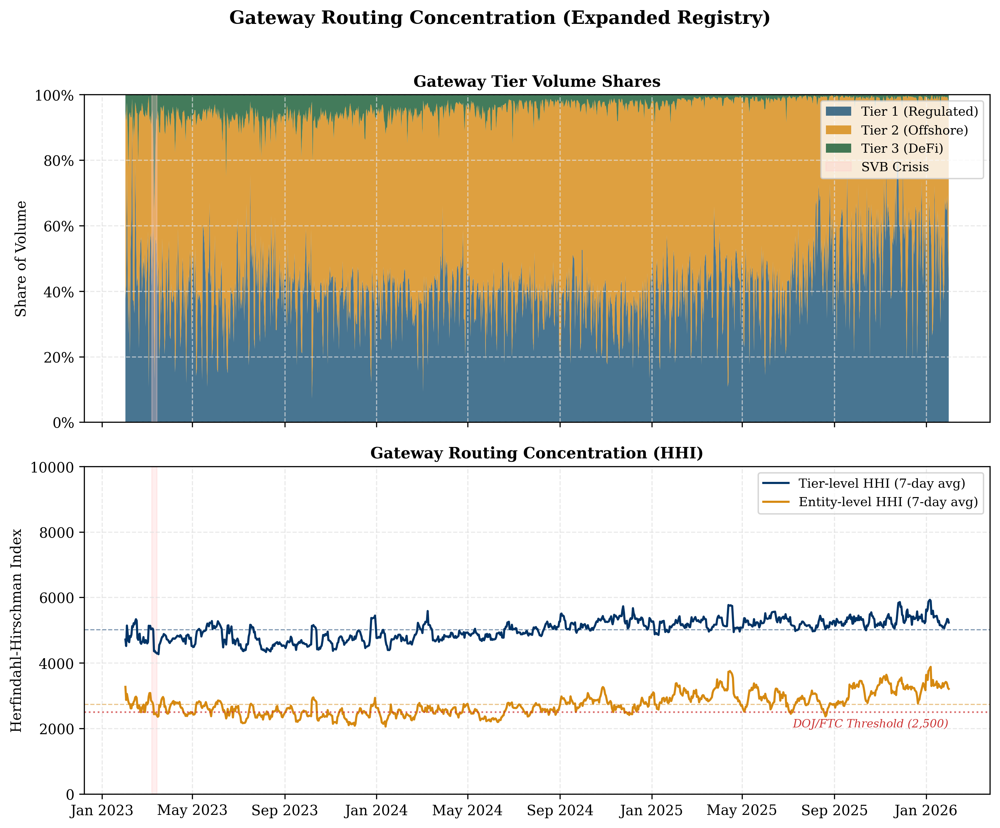{width="6.5in" height="4.5in"}

*Exhibit 10. Gateway routing concentration by tier (top) and HHI (bottom), Ethereum only.*

The entity-level HHI, computed across all 19 monitored entities, averages 2,742, above the DOJ/FTC threshold but oscillating around it, with periods both above and below 2,500 (above threshold on 62 percent of sample days).[^hhi_robust] This is materially lower than the tier-level figure because entity-level measurement captures the within-tier fragmentation: Tier 2's gross 55 percent share is distributed across Binance (37 percent gross, 33 percent net), Kraken (6 percent), OKX (3.5 percent), and others, rather than concentrated in a single entity. Binance alone accounts for the largest single-entity share of monitored volume, larger than either Circle or Coinbase individually, a finding with implications for the regulatory gap analysis in Section V. The entity-level HHI straddling the DOJ threshold is itself policy-relevant: the gateway market is concentrated enough to warrant monitoring but not so concentrated that single-entity disruption would necessarily eliminate an entire regulatory tier.

[^hhi_robust]: As a robustness check, we recompute entity-level HHI excluding Binance (the largest single entity at 33 percent net share). Removing Binance *increases* the mean HHI from 2,742 to 2,906 (+164 points), indicating that Binance moderates concentration by dispersing volume that would otherwise flow through the two dominant Tier 1 entities. Concentration is structural rather than driven by any single entity's dominance. The tier-level HHI similarly rises from 5,021 to 5,577 without Binance. A second robustness check nets intra-entity wallet rebalancing (Binance 18.3 percent, OKX 10.8 percent internal transfer rates): net entity-level HHI averages 2,583 (−159 points from gross), with the share of days above the DOJ threshold falling from 62 to 48 percent. The concentration finding is robust to both adjustments.

The cointegrating relationship identified in Section IV.A operates at the aggregate level. The tier-level decomposition provides a *persistent state decomposition* of aggregate co-movement, describing where gateway-level activity co-trends with Fed conditions. These patterns do not survive first-differencing and reflect the persistent composition of activity across gateway regimes rather than differential short-run policy responsiveness. At weekly frequency (matching the cointegration sample), Tier 1 regulated gateway volumes exhibit a strong negative level correlation with Fed total assets (r = −0.56, p < 0.001), Tier 2 offshore exchange volumes a moderate negative correlation (r = −0.45, p < 0.001), and Tier 3 permissionless protocol volumes a positive correlation (r = +0.37, p < 0.001).[^corr_freq] These level correlations capture long-run co-trending between non-stationary series rather than week-to-week policy responsiveness. First-differenced correlations are near zero and statistically insignificant for all three tiers (T1: r = +0.05, T2: r = +0.12, T3: r = +0.07; all p > 0.14). The correct interpretation is structural, not causal at business-cycle frequency: over three years, institutional gateway volumes and Fed assets share common downward trends (consistent with the yield spread and reserve-deposit channels operating at the long horizons the VECM identifies), while permissionless protocol volumes trend upward as DeFi usage grows. The compositional finding remains policy-relevant: the long-run equilibrium documented in Section IV.A concentrates in institutional infrastructure (Tiers 1 and 2), while permissionless protocols absorb activity that shifts away from institutional channels, a pattern the SVB episode confirms in real time.

This decomposition identifies four channels through which the aggregate equilibrium distributes: Tier 1 regulated gateways (r = −0.56 on levels), Tier 2 offshore exchanges (r = −0.45), Tether Treasury as the direct issuance channel, and Tier 3 permissionless protocols (r = +0.37, trending opposite). The absence of short-run correlations in first differences means these patterns describe the structural composition of a long-run equilibrium rather than differential weekly policy responsiveness.

We emphasize that these tier-level patterns are descriptive co-trends, not causal decompositions. A formal test would require tier-share cointegration with appropriate small-sample corrections for the three-tier system. The stress-episode sections provide the identifying variation; the tier-level correlations on levels are descriptive context.

**Gateway Interaction Topology**

The gateway volume data above reveal *who processes flows*; they do not reveal *who connects gateways to each other*. A hidden intermediary layer, invisible in on-chain transfer data but exposed by Nansen counterparty analysis across all 19 Ethereum gateways (3,804 relationships, \$2.16 trillion aggregate), shows that a small number of market-making firms provide the cross-gateway connectivity on which the entire network depends, connectivity that gateway-level monitoring alone would miss (Exhibit 21).

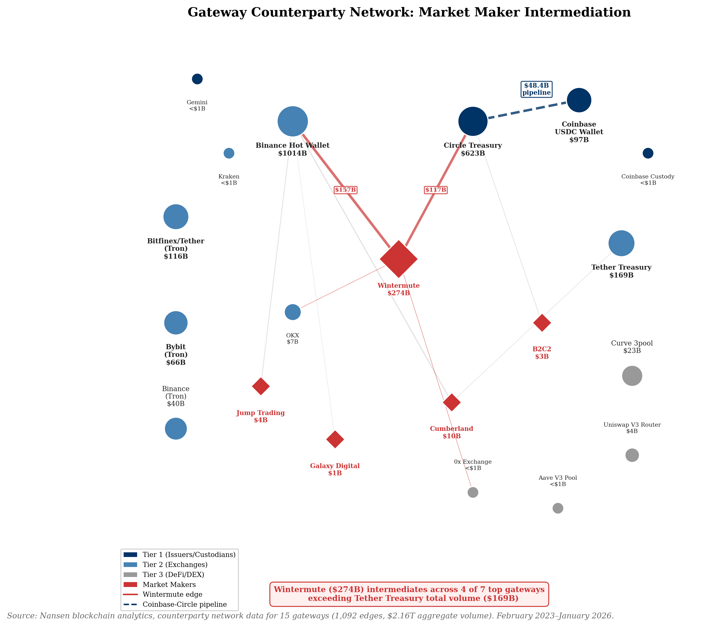{width="6.5in" height="5.5in"}

*Exhibit 21. Gateway counterparty network: 15 highest-volume gateways (circles, colored by tier) and 5 market maker intermediaries (red diamonds). The full dataset covers all 19 monitored gateways (3,804 counterparty relationships); the four additional gateways (Compound, BitGo, Robinhood, PayPal) are omitted from the visualization for clarity. Edge width proportional to log volume; red edges highlight Wintermute's cross-gateway connectivity ($274 billion across four gateways). Dashed line: Coinbase-Circle $48.4 billion bilateral mint/redeem pipeline. Source: Nansen blockchain analytics. February 2023–January 2026.*

*Concentrated core triangle.* Within the Nansen counterparty dataset, the three highest-volume gateways (Binance, $1.01 trillion; Circle, $623 billion; and Tether Treasury, $169 billion) form a densely interconnected core, with each maintaining bilateral flows with the other two and with overlapping sets of institutional counterparties. Together, these three gateways account for 84 percent of total Nansen-identified network volume.[^nansen_dune_note]

[^nansen_dune_note]: Nansen counterparty volumes ($2.16 trillion aggregate across 19 gateways) are lower than Dune gateway transfer volumes ($7.74 trillion across the same 19 entities) because the Nansen dataset captures only bilateral flows where *both* counterparties are entity-labeled, while the Dune dataset captures all ERC-20 transfers involving any gateway address regardless of counterparty identification. The two datasets measure different aspects of gateway activity: Nansen reveals *who transacts with whom*, while Dune measures *total throughput*.

[^corr_freq]: Tier-level correlations are computed at weekly frequency (T = 158 weeks, Wednesday-to-Tuesday), matching the WSHOMCB reporting schedule and the cointegration sample. These are descriptive correlations on levels of non-stationary series and reflect long-run co-trending rather than short-run policy responsiveness. First-differenced correlations (ΔTier volume vs. ΔFed assets) are near zero and statistically insignificant for all three tiers (T1: r = +0.05, p = 0.49; T2: r = +0.12, p = 0.14; T3: r = +0.07, p = 0.40; n = 157), confirming that the level correlations capture shared structural trends over three years rather than week-to-week co-movement. The appropriate framework for the transmission mechanism is the VECM cointegration analysis in Section IV.A, which explicitly models long-run equilibrium between integrated series; the tier decomposition describes where that equilibrium concentrates structurally. Netting internal transfers produces negligibly different level correlations (T2 net: r = −0.44 vs. gross: r = −0.45).

*Market maker intermediary layer.* A notable structural feature is the role of market-making firms as cross-gateway intermediaries. Wintermute, a proprietary trading firm, transacts with four of the seven highest-volume gateways (Binance, Circle, OKX, and 1inch) with an aggregate volume of $274 billion, exceeding the total volume of the Tether Treasury gateway ($169 billion) and ranking as the single largest non-issuer, non-exchange counterparty in the entire network. Counterparty volume measures bilateral activity, not net exposure; Wintermute's actual risk position at any moment is substantially smaller than aggregate volume suggests. The concentration finding is structural (a single intermediary connecting four major gateways) rather than a claim about the magnitude of potential loss. Counterparty volume reflects connectivity and routing centrality, not net exposure; the risk implication is concentration of routing dependence, not balance-sheet insolvency risk per se. Cumberland ($10.2 billion across Binance, OKX, and Tether Treasury), B2C2 ($3.0 billion across Circle, OKX, and Tether Treasury), and Jump Trading ($4.3 billion with Binance) form a secondary intermediary tier. These firms do not appear in the Dune gateway analysis because they are not issuers, exchanges, or protocols; they are counterparties that connect gateways to each other and to the broader market. Their intermediary role means that the effective connectivity of the gateway network depends on a small number of market-making firms whose operational disruption could fragment the control layer even if the gateways themselves remain functional. Monthly counterparty data reveal this dependency is intensifying: Wintermute's monthly cross-gateway volume grew from \$2.2 billion (February 2023) to a peak of \$51.8 billion (August 2025), a trajectory that outpaced total network growth and raised Wintermute's share of monitored counterparty volume from 1.4 to 19.9 percent. Over the same period, Cumberland's monthly volume declined from \$5.2 billion to \$0.2 billion. The market-maker intermediary layer is not only concentrated but concentrating further, with a single firm increasingly dominating the cross-gateway connectivity that the network depends on. The composition of Wintermute's activity also shifted: its monthly volume through Circle Treasury grew from \$0.4 billion (2023 average) to \$9.9 billion (2025 average), a 23-fold increase, while Binance volume grew fivefold to \$14.2 billion. By 2025, Wintermute operates as the primary arbitrage bridge between the USDC issuer and the largest exchange, a structural role that makes its operational continuity directly relevant to USDC peg stability.[^wintermute_caveat]

The concentration extends beyond individual market makers to the network's connective tissue. Unique counterparties interacting with monitored gateways declined 25 percent over the sample period (from approximately 3,340 monthly in 2023 to 2,520 in 2025), even as total network volume more than doubled. More notably, the share of counterparties spanning two or more gateways, entities that bridge the network, fell from 5.8 percent (February 2023) to 2.6 percent (December 2025). The network is hollowing out: more volume flowing through fewer intermediaries with fewer cross-gateway connections (Exhibit 21b). This trajectory makes the remaining bridge entities (Wintermute above all) increasingly load-bearing for network connectivity, and it means that the fragmentation risk identified during SVB (Sections IV.C and V) is growing rather than dissipating.

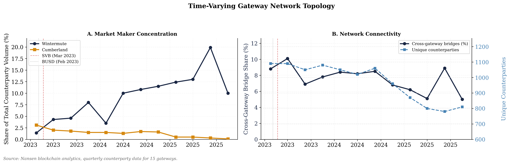{width="6.5in" height="2.6in"}

*Exhibit 21b. Time-varying gateway network topology, February 2023–December 2025. Panel A: Wintermute's share of total counterparty volume rose from 1.4 to 19.9 percent (peaking in August 2025) while Cumberland declined from 3.3 to 0.1 percent. Panel B: the share of counterparties spanning two or more gateways declined from 5.8 to 2.6 percent; total unique counterparties fell 25 percent even as network volume doubled. Vertical dashed lines mark SVB (March 2023) and BUSD (February 2023) events. Source: Nansen blockchain analytics, monthly counterparty data for 15 gateways.*

[^wintermute_caveat]: Wintermute's $274 billion aggregate volume reflects bilateral trading flows with the four gateways over the sample period and includes round-trip transactions (e.g., acquiring USDC from Circle and depositing to Binance). This figure measures *activity* rather than *exposure*; Wintermute's net position at any point is substantially smaller. The concentration finding is that a single intermediary connects the major gateways, creating a structural dependency that gateway-level monitoring alone would miss.

*Coinbase-Circle mint/redeem pipeline.* A dedicated Coinbase USDC operational wallet reveals the mechanical structure of USDC issuance. This wallet transacts exclusively with two counterparties: Circle ($48.4 billion inbound) and Coinbase ($48.4 billion outbound), forming a perfect bilateral pipeline. Circle sends newly minted USDC to this wallet, which routes it to Coinbase for distribution. The perfect symmetry ($48.4 billion in each direction, split 50/50 between the two counterparties) provides direct on-chain evidence that the USDC mint-and-redeem process operates through a dedicated control-layer pathway, with Coinbase functioning as Circle's primary distribution gateway rather than as an independent custodian.

*Tron gateway structure.* Tron confirms the control layer thesis through structural contrast with Ethereum. Where Ethereum mixes issuers, exchanges, and DeFi protocols across three tiers, Tron operates almost entirely through Tier 2 custodial exchange infrastructure. Three principal gateways dominate: Bitfinex/Tether (\$116 billion), Bybit (\$66 billion), and Binance (\$40 billion). DeFi routing is minimal (Sun/SunSwap: \$85 million versus Curve 3pool's \$23 billion on Ethereum). Of 30 high-value Tron addresses analyzed, 40 percent of value remains unidentifiable across all data sources, a structural opacity absent on Ethereum, where 98 percent of high-value addresses are labeled. The Coins.ph discovery among identified addresses provides direct evidence of emerging-market remittance corridors operating through a wholesale OKX distribution model, a digital parallel to correspondent banking that routes entirely outside Federal Reserve monitoring (Appendix K).

The same token (USDT) produces fundamentally different control-layer characteristics depending on which blockchain it routes through: on Ethereum, 41 percent of monitored volume flows through regulated Tier 1 gateways with 98 percent address observability; on Tron, zero Tier 1 gateways are present and 40 percent of high-value volume remains in a dark layer consistent with peer-to-peer usage (Exhibit 22). This divergence is the core evidence that the routing gateway, not the token, determines regulatory exposure.

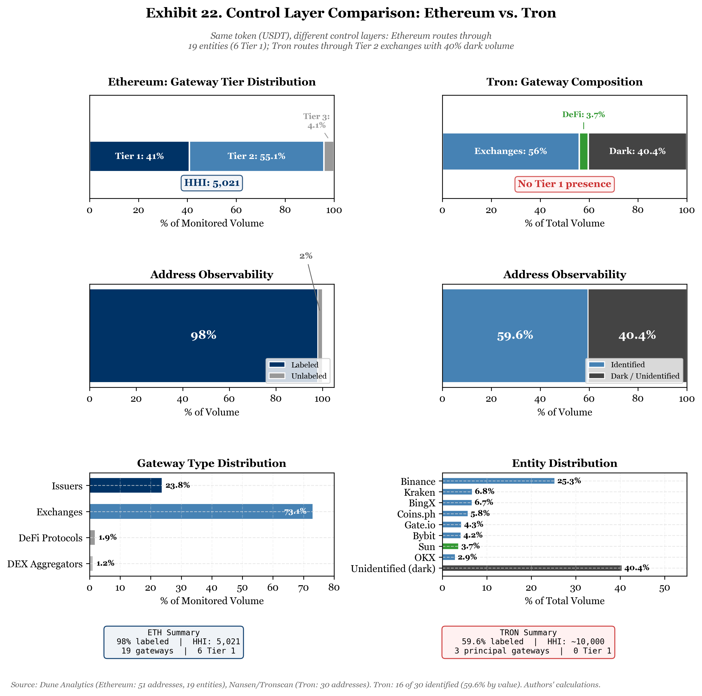{width="6.5in" height="4.0in"}

*Exhibit 22. Control layer comparison: Ethereum vs. Tron. Top: gateway tier composition (ETH near-parity T1/T2 with concentrated Tier 1 perimeter, HHI 5,021; Tron Tier 2 only, no Tier 1 presence). Middle: address observability (ETH 98% labeled via Nansen; Tron 59.6% identified post-identification, 40.4% dark). Bottom: entity type distribution (ETH mix of issuers, exchanges, DeFi; Tron exchange-dominated with 40% unidentified). Source: Dune Analytics (Ethereum gateway transfers), Nansen/Tronscan (Tron entity identification, 30 addresses). Authors' calculations.*

*DeFi institutional lending gateways.* Resolution of high-value mystery addresses in the Nansen data reveals a gateway category absent from our tier taxonomy: institutional DeFi lending vaults. Two addresses collectively routing $3.8 billion are identified as Galaxy Digital/Maple Finance ($2.0 billion, a lending vault through which Galaxy Digital channels institutional capital into DeFi lending markets) and Hourglass Finance ($1.8 billion, a structured pre-iUSDT vault). Additionally, a MakerDAO/Sky vault holding $522 million in sUSDS represents a similar hybrid: a DeFi protocol interface through which institutional-scale capital enters the stablecoin ecosystem. These entities occupy an ambiguous position in the control layer: they are Tier 3 in protocol structure (smart contract governance, permissionless access) but serve Tier 2 institutional counterparties (Galaxy Digital, professional DeFi allocators). The regulatory implication is that gateway-level oversight must account for protocol-level intermediation where the economic actor is an institution but the operational infrastructure is a smart contract, a category that the GENIUS Act's issuer-centric framework does not address.

IV.D. On-Chain Activity and Systemic Risk Implications

The control layer's significance amplifies as on-chain activity grows; each additional dollar of DEX settlement volume must route through some combination of gateway infrastructure, and the tier through which it flows determines whether the transaction is subject to AML screening, sanctions compliance, or reserve-backed settlement.

DEX daily volumes grew from approximately \$3 billion to peaks exceeding \$25 billion, with stablecoins serving as the primary settlement asset (Appendix D).[^exhibit_convention]

[^exhibit_convention]: Main-body exhibits are numbered sequentially (Exhibits 1 through 20). Appendix exhibits use the appendix letter as a prefix (D1 through D3, E1 through E3) to distinguish supplementary from primary analysis.

Stablecoin-collateral liquidations in Aave V3 totaled \$35.5 million across 466 events, modest by traditional finance standards but illustrative of the leverage channel through which a sustained depeg could cascade through decentralized lending. USDT-collateralized positions accounted for the largest share (\$22.4 million), underscoring the systemic importance of Tether's peg stability for DeFi infrastructure. A depeg of the magnitude observed during the SVB crisis (USDC: 12.1 percent) applied to the current collateral base could trigger liquidations an order of magnitude larger, with cascading effects on DeFi lending rates that would feed back through the yield spread channel into stablecoin supply dynamics.

**The Dollar's Cross-Border Payment Function.** The Ethereum/Tron structural divergence (Section IV.C) maps directly onto the dollar's evolving payment function. On Ethereum, the dollar serves institutional settlement through concentrated, regulated infrastructure. On Tron, it serves dollarization substitution and cross-border remittances in emerging markets. The Coins.ph finding and the \$930 million in unidentified peer-to-peer addresses represent dollar liquidity flowing through channels invisible to both the Federal Reserve and foreign central banks. This is the dollar's payment function operating outside the correspondent banking network, extending dollar access to underserved populations while creating an unmonitored shadow channel with different monetary transmission properties.

IV.E. Deposit Displacement Analysis

Does stablecoin growth come at the expense of commercial bank deposits? At current scale, the answer is no. The first-differenced correlation between weekly stablecoin supply growth and commercial bank deposit growth (FRED H.8 data) is weakly positive (r = 0.12, p = 0.024), inconsistent with a substitution hypothesis. The retail deposit share declined modestly from 86.3 to 84.2 percent over the sample period, within normal compositional variation.

The more consequential finding is the variation in bank deposit recycling across gateways. A December 2025 Federal Reserve Board analysis (Wang, 2025) estimates that each \$100 billion of net deposit drain implies a \$60–\$126 billion contraction in bank lending. The recycling rate depends on issuer reserve composition: Tether holds 3.69 percent in bank deposits, Circle allocates 14.24 percent, and Gemini holds 100 percent of GUSD reserves in deposits, a 27-fold difference that token-level regulation cannot capture. At the extremes, a dollar entering Tether removes 96 cents from the banking system while a dollar entering GUSD keeps the full amount inside, though the magnitudes are dominated by Tether and Circle (together over 99 percent of fiat-backed supply). Three categories with distinct monetary-transmission properties coexist in the emerging digital dollar stack: payment stablecoins (which remove deposits from the fractional-reserve channel), tokenized deposits (which preserve it), and yield wrappers (which occupy an intermediate position). The GENIUS Act and the CLARITY draft classify them under separate frameworks without quantifying the cross-category monetary transmission differences our gateway-level data begin to reveal. At current scale (\$296 billion), these effects are negligible; as scenario arithmetic at an illustrative \$1.6 trillion supply level (not a prediction), net deposit drain could produce lending contractions in the range of \$893 billion to \$1.9 trillion (Exhibits 17–20). Appendix H develops the full deposit displacement analysis and credit migration channel.

The dollar's international functions, as a medium of exchange, store of value, and funding instrument, are now partly routed through gateway infrastructure that varies from fully regulated to completely permissionless.

V\. Monitoring Implications for the Dollar's Digital Infrastructure

Four implications follow from these findings for how the Federal Reserve and prudential regulators might monitor the dollar's evolving digital infrastructure.

**Payment infrastructure.** A single dollar token produces regulatory environments ranging from comprehensive to unregulated depending primarily on routing infrastructure. The SVB episode makes this concrete: USDC depegged while USDT absorbed displaced capital; token-level classifications did not predict stress flows; gateway-level reserve exposure would have. The GENIUS Act (2025) takes an important step but adopts an issuer-centric framework; the companion CLARITY market-structure draft goes further, attaching compliance obligations to "distributed ledger application layers," the interface operators that route, hold, or block flows, and directing Treasury to issue guidance within 360 days on screening, blocking, and risk-based controls for these layers (Appendix I). If enacted together, the resulting architecture would pair issuer-level reserve requirements with interface-level routing controls, a two-layer framework that maps onto the CLII's distinction between token-level attributes and gateway-level compliance. The GENIUS Act's yield prohibition creates a structural incentive for yield to migrate into wrappers and sweep programs controlled by gateway operators, making supervisory visibility at the gateway level the critical determinant of whether this boundary holds.

**Monetary transmission.** Stablecoins may be quietly amplifying or dampening Fed policy. When the Fed drains reserves through QT, but displaced liquidity migrates to stablecoin venues unconstrained by reserve requirements, the effective tightening may be less than intended. The magnitudes remain small (supply represents less than 2 percent of M2), but the Fed Board's lending-contraction multiplier implies the externality could become significant; scenario arithmetic at an illustrative \$1.6 trillion supply level suggests material effects, though actual growth trajectories are uncertain. The tier-level decomposition sharpens this: institutional gateway volumes co-trend with Fed assets while permissionless protocol volumes trend oppositely, structural composition that determines which infrastructure carries the equilibrium relationship. Aggregate supply monitoring without gateway decomposition would miss this.

**Safe-haven resilience.** The Tier 1 duopoly makes the dollar's digital infrastructure simultaneously controllable and fragile. The SVB weekend gap (Tier 1 share collapsing to 13 percent over 48 hours because institutional gateways do not operate 24/7) reveals an infrastructure vulnerability with direct CBDC design implications: a retail CBDC on 24/7 settlement infrastructure would eliminate this vulnerability; a wholesale CBDC routing through existing gateways would inherit it. The pressure-release-valve function may itself be attenuating: Curve 3pool's monthly volume declined 57 percent between 2023 and 2025 even as total network volume doubled. Market-maker behavior during SVB was bifurcated (Wintermute increased cross-gateway volume by 118 percent while Cumberland collapsed 79 percent), meaning the net effect on gateway connectivity during stress depends on which response dominates. The structural dependency on a handful of proprietary trading firms for inter-gateway connectivity is a finding that current frameworks do not address.

**Within-dollar fragmentation.** The fragmentation risk is not from competing currencies (USDT and USDC together command over 90 percent of global stablecoin market capitalization) but from within the dollar's own infrastructure. The same dollar token (USDT) produces fundamentally different regulatory, monetary, and observability characteristics depending on which blockchain it routes through. This reflects structurally different demand bases (institutional settlement versus emerging-market remittances) selecting different gateway ecosystems, and it creates path dependencies that will shape the dollar's competitive position against alternative digital currencies. The dollar's global liquidity provision now operates through two parallel channels: the Fed's central bank swap lines and the stablecoin routing infrastructure that delivers dollar liquidity to end users in emerging markets through Tron gateways without passing through any central bank. Whether this parallel channel complements or undermines the swap-line architecture is among the central questions for the dollar's international role.

VI\. Conclusion

The dollar's international functions now operate partly through stablecoin gateway infrastructure. Fed policy transmits through this infrastructure via a yield spread channel, with supply cointegrated with Fed balance sheet variables in a dollar-specific pattern that is strongest during quantitative tightening and attenuates during easing, consistent with the transmission channel being most observable when policy is actively constraining money market plumbing. The long-run co-movement distributes unevenly across the gateway layer: institutional channels share downward trends with Fed assets (Tier 1 r = −0.56, Tier 2 r = −0.45 on levels), while permissionless protocols trend in the opposite direction (Tier 3 r = +0.37), a persistent state decomposition that describes where aggregate co-movement concentrates across gateway regimes rather than differential short-run policy responsiveness. The same dollar token produces opposite regulatory exposures depending on which blockchain, and therefore which gateways, it routes through. Stress events are consistent with the hypothesis that the dollar's safe-haven function in tokenized markets is gateway-contingent, not currency-inherent. And the wide variation in bank deposit recycling across gateways (Section IV.E) means the monetary impact of stablecoin growth depends on which gateways absorb it.

The dollar's position in digital payment systems is a property of the control layer, not the tokens. The monthly counterparty panel reveals that this control layer is hollowing out: volume doubled over three years while unique counterparties declined 25 percent and cross-gateway bridges halved, making the remaining intermediaries, and one market-making firm in particular, increasingly load-bearing for the dollar's digital routing infrastructure.

Three conditional implications follow for prudential monitoring. First, if the objective is visibility into a transmission channel that currently operates outside the Fed's surveillance framework, gateway-level stablecoin flow data, not merely aggregate supply, would provide it. Tether Treasury, the most direct supply-adjustment mechanism within Tier 2, operates with less regulatory visibility than the Tier 1 entities through which the cointegrating relationship most strongly concentrates; aggregate monitoring without gateway decomposition would miss this structural asymmetry. The SVB counterparty data reinforce this point: network topology was stable during the crisis (edge count and density unchanged) while market-maker volume through inter-gateway connections collapsed 29 percent, a capacity fragmentation invisible to topological monitoring. Second, if the objective is stress preparedness, stress testing of gateway reserve exposures would need to account for the effective duopoly structure: the Tier 1 duopoly's disruption would fundamentally alter the market's regulatory composition. The SVB episode illustrated that the FDIC's deposit guarantee was the instrument that stabilized stablecoin routing infrastructure, through a transmission chain no one designed. Third, if the objective is closing the gap between the GENIUS Act's issuer-centric framework and the gateway-level variation our data document, routing-layer supervision of the kind the CLARITY draft begins to explore would be the natural direction. Gateway-level reporting requirements could in principle be calibrated to CLII score: Tier 1 gateways (CLII > 0.75) already meet most requirements through existing licenses; Tier 2 gateways (CLII 0.30–0.75) could face enhanced transaction reporting and reserve flow verification; Tier 3 protocols (CLII < 0.30) would be subject to monitoring rather than direct regulation, consistent with their permissionless architecture and their demonstrated role as systemic pressure relief during stress. The finding that 10.8 percent of USDT's Ethereum gateway volume routes through U.S.-regulated Tier 1 gateways, and that the regulated perimeter captures close to half of net gateway volume through just two entities, indicates both the existing regulatory surface area and its limitations.

Several limitations qualify these conclusions. The Johansen trace statistic passes at three of five lag specifications (lags 8, 10, 12 but not 4, 6), indicating sensitivity to lag choice, and the cointegrating relationship is regime-dependent, strong during quantitative tightening (trace = 48.18) but absent during easing (trace = 17.71), with the tightening subsample producing full rank (rank = 3 in a three-variable system), suggesting the series may be closer to trend-stationary during QT and limiting the Johansen framework's applicability in that regime (see footnote above). Results may not generalize to sustained easing environments. Adding SOFR to the system preserves the cointegrating rank while adding DFF produces a borderline result and the 10-year yield fails (Exhibit C5), suggesting the relationship operates through short-term money market plumbing rather than broad term-structure conditions. The yield spread Granger result is our strongest mechanism-consistency test but exhibits bidirectional feedback (Section IV.A.1). No FOMC event study result survives Bonferroni correction; transmission operates through the long-run equilibrium channel rather than discrete announcements. The primary gateway analysis covers 51 Ethereum addresses capturing 27.7 percent of volume; multi-chain expansion with Tron and Solana data extends coverage further, with Solana's Tier 1 share at approximately 11 percent and Tron's at zero, confirming that the Ethereum-only Tier 1 figure of 41 percent represents an upper bound on the regulated perimeter's share of global stablecoin routing. Appendix E provides the full robustness summary.

The eurodollar-like parallel frames the forward-looking question. As in the 1960s, dollar instruments are circulating outside U.S. regulatory infrastructure in volumes that extend the dollar's reach while attenuating the Fed's visibility, though the mechanisms differ fundamentally (full reserves rather than fractional-reserve credit creation). The fragmentation risk is not from competing currencies but from within the dollar's own digital infrastructure: different chains, gateways, and compliance regimes producing different versions of the digital dollar. Whether this infrastructure evolves toward an issuer-dominated equilibrium or a control-layer-dominated equilibrium, where routing defaults and sweep mechanics concentrate rents at the gateway, is the central question the CLII framework and gateway flow data developed here are designed to address.

References

Afonso, G., Cipriani, M., Copeland, A., Kovner, A., La Spada, G., and Martin, A. (2023). "The Market Events of Mid-September 2019." Federal Reserve Bank of New York Economic Policy Review, 29(1), 1-28.

Anderson, A. G., and Kandrac, J. (2018). "Monetary Policy Implementation and Financial Vulnerability: Evidence from the Overnight Reverse Repurchase Facility." Review of Financial Studies, 31(9), 3643-3686.

Ante, L., Fiedler, I., and Strehle, E. (2023). "The Influence of Stablecoin Issuances on Cryptocurrency Markets." Finance Research Letters, 41, 101867.

Aramonte, S., Huang, W., and Schrimpf, A. (2022). "DeFi Risks and the Decentralisation Illusion." BIS Quarterly Review, December, 21-36.

Baughman, G., Carapella, F., Gerszten, J., and Mills, D. (2022). "The Stable in Stablecoins." FEDS Notes, Board of Governors of the Federal Reserve System, December.

Bruno, V., and Shin, H. S. (2015). "Capital Flows and the Risk-Taking Channel of Monetary Policy." Journal of Monetary Economics, 71, 119-132.

Carapella, F., and Flemming, J. (2020). "Central Bank Digital Currency: A Literature Review." FEDS Notes, Board of Governors of the Federal Reserve System, November.

Catalini, C., and de Gortari, A. (2021). "On the Economic Design of Stablecoins." MIT Working Paper.

Copeland, A., Martin, A., and Walker, M. (2014). "Repo Runs: Evidence from the Tri-Party Repo Market." Journal of Finance, 69(6), 2343-2380.

CLARITY Act (2025). Draft market-structure legislation, Senate Banking Committee.[^clarity_status]

[^clarity_status]: The CLARITY Act was in draft/committee stage as of January 2026. Bill number and formal text may have changed since this writing; readers should verify current legislative status.

d'Avernas, A., Bourany, T., and Vandeweyer, Q. (2023). "Are Stablecoins Safe Money?" University of Chicago Becker Friedman Institute Working Paper.

Gorton, G. B., and Zhang, J. (2023). "Taming Wildcat Stablecoins." University of Chicago Law Review, 90(3), 909-971.

Gopal, M., and Schnabl, P. (2022). "The Rise of Finance Companies and FinTech Lenders in Small Business Lending." Review of Financial Studies, 35(11), 4859-4901.

Gopinath, G., and Stein, J. C. (2021). "Banking, Trade, and the Making of a Dominant Currency." Quarterly Journal of Economics, 136(2), 783-830.

Gourinchas, P.-O., Rey, H., and Sauzet, M. (2019). "The International Monetary and Financial System." Annual Review of Economics, 11, 859-893.

Gudgeon, L., Perez, D., Harz, D., Livshits, B., and Gervais, A. (2020). "The Decentralized Financial Crisis: Attacking DeFi." Crypto Valley Conference on Blockchain Technology, IEEE.

Harvey, C. R., Ramachandran, A., and Santoro, J. (2021). DeFi and the Future of Finance. John Wiley & Sons.

Hoang, L. T., and Baur, D. G. (2021). "How Stable Are Stablecoins?" European Journal of Finance, 29(8), 838-857.

Jiang, Z., Krishnamurthy, A., and Lustig, H. (2023). "Dollar Safety and the Global Financial Cycle." Review of Economic Studies, forthcoming.

Kozhan, R., and Viswanath-Natraj, G. (2021). "Decentralized Stablecoins and Collateral Risk." WBS Finance Group Research Paper.

Lyons, R. K., and Viswanath-Natraj, G. (2023). "What Keeps Stablecoins Stable?" Journal of International Money and Finance, 131.

Makarov, I., and Schoar, A. (2022). "Cryptocurrencies and Decentralized Finance (DeFi)." Brookings Papers on Economic Activity, Spring.

Miranda-Agrippino, S., and Rey, H. (2020). "U.S. Monetary Policy and the Global Financial Cycle." Review of Economic Studies, 87(6), 2754-2776.

New York State Department of Financial Services (2023). Consent Order in the Matter of Paxos Trust Company, LLC. February 13.

Office of the Comptroller of the Currency (2021). Interpretive Letter 1174: Chief Counsel's Interpretation Clarifying Authority of Banks to Use Stablecoins. January.

Perez, D., Werner, S. M., Xu, J., and Livshits, B. (2021). "Liquidations: DeFi on a Knife-Edge." Financial Cryptography and Data Security, Springer, 457-476.

Pesaran, M. H., and Shin, Y. (1996). "Cointegration and Speed of Convergence to Equilibrium." Journal of Econometrics, 71(1-2), 117-143.

President's Working Group on Financial Markets, FDIC, and OCC (2021). Report on Stablecoins. U.S. Department of the Treasury, November.

Rhoades, S. A. (1993). "The Herfindahl-Hirschman Index." Federal Reserve Bulletin, 79(3), 188-189.

Systemic Risk Council (2025). "Comments on Stablecoin Legislation." March.

U.S. Department of Justice and Federal Trade Commission (2023). Merger Guidelines.

U.S. Department of the Treasury, Office of Foreign Assets Control (2022). Designation of Tornado Cash as a Specially Designated National. August 8.

Castle Island Ventures, Artemis, and Dragonfly Capital (2025). "Stablecoin Payments from the Ground Up." Research Report, May.

Castle Island Ventures, Brevan Howard, and Visa (2024). "Stablecoins: The Emerging Market Story." Research Report, September.

Chainalysis (2025). "The 2025 Geography of Cryptocurrency Report." Chainalysis Research, October.

Citi Institute (2025). "Digital Money: Stablecoins and the Future of Payments." Citi GPS Report, April.

CRA International and Coinbase (2025). "The Impact of Stablecoins on the U.S. Banking System." Economic Analysis, July.

McKinsey and Company and Artemis Analytics (2026). "Stablecoins in Payments: What the Raw Transaction Numbers Miss." McKinsey Digital, January.

Standard Chartered (2025). "Stablecoin Market Outlook: \$2 Trillion by 2028." Research Note.

Treasury Borrowing Advisory Committee (2025). "Charge #2: Stablecoins and Treasury Markets." TBAC Presentation to the U.S. Treasury, April.

Visa (2024-2025). "Visa Onchain Analytics Dashboard." Visa Crypto Research, in partnership with Allium Labs.

Wang, Jessie Jiaxu (2025). "Banks in the Age of Stablecoins." FEDS Notes, Board of Governors of the Federal Reserve System, December 17.

Wang, Jessie Jiaxu et al. (2025). "In the Shadow of Bank Runs: SVB Failure and Stablecoins." FEDS Notes, Board of Governors of the Federal Reserve System, December 17.

Appendix A: Complete Exhibit Inventory

  -------- ------------------------------------------- -----------------------------------------------------
  **\#**   **Title**                                   **Key Finding**

  1        Correlation Heatmap                         r = −0.94 Fed Assets vs Supply (descriptive starting point)

  2        Rolling-Window Correlations                 180-day r negative 85% of sample; −0.95 post-easing

  3        Supply vs Federal Funds Rate                r = −0.89; acceleration post-Sep 2024 cut

  4        Supply vs ON RRP                            ON RRP: \$2.4T peak → \$9.6B; r = −0.72

  5        Total Stablecoin Supply                     \$137B → \$305B (+123%)

  6        Market Share by Token                       USDT: 50% → 61%; BUSD: 12% → 0%

  7        Monthly Net Supply Changes                  SVB-driven USDC outflow clearly visible

  8        Gateway Transfer Volume by Tier (Ethereum)   Tier 1: 41% gross (47% net); SVB: 63% spike → 13% weekend gap → 57% recovery

  9        SVB Funding Stress Overlay                  USDC: −\$5.1B in 5 days; USDT absorbed flows

  9b       SVB Gateway Flow Retention                All entities gained volume; Circle 1.39× (lowest) to Curve 12.35× (highest)

  10       Gateway Concentration & HHI (Ethereum)       Tier-level mean HHI: 5,021; entity-level mean: 2,742; cross-chain HHI ≈ 2,538

  D1       DEX Trading Volumes (Appendix D)            \$3B/day → \$25B/day peak

  D2       DEX Volume vs Supply (Appendix D)           Velocity proxy increasing over time

  D3       Aave Stablecoin Liquidations (Appendix D)   \$35.5M total; USDT dominates (\$22.4M)

  11       VECM IRFs (90% Bootstrap CI, n=500)           Cross-variable responses mostly not significant; long-run equilibrium channel

  12       FEVD: Stablecoin Supply                       Fed + ON RRP: 13.9% of supply variance at 26 weeks, rising monotonically

  C3       Persistence Profile (Pesaran-Shin 1996)       Smoothed half-life: 5 weeks; 58% absorbed within one quarter; 6–8-week oscillation cycle

  C1       Coverage Sensitivity Analysis                 T1 share: 37.6% (baseline) to 14.3% (extreme); HHI > 7,000 across all scenarios

  C2       Placebo T1 Share Swings (orig. registry)       SVB swing 23.3 pp > all 50 placebos (max 21.9 pp; mean 13.4 pp); see C10 for expanded

  C4       CLII Continuous Robustness                    Pooled r = −0.34; monotonic quartile gradient (6.27× to 0.61×); volume falsification r = −0.12

  C5       Trivariate Cointegration Robustness           +SOFR: survives (49.76 > 47.85); +DFF: borderline (46.57); +DGS10: fails (43.56)

  C6       Jackknife Stability (Leave-One-Out)           Baseline T1 = 40.8%; Binance/Coinbase/Circle dominant; 8/10 non-dominant Δ < 2.4 pp

  C7       CLII Weight Sensitivity Grid                  18/19 entities invariant across 5 weighting schemes; Robinhood sole mover (negligible volume)

  C2b      Event-Time Aligned Stress Placebo             SVB 2.7σ below placebo mean; below 5th pctile 2/15 days (expanded registry)

  C3b      Cointegration Regime Stability                Tightening: trace=48.18 (strong); easing: trace=17.71 (fails); rolling: 14.3% cointegrated

  C8       CLII No-Freeze Robustness                     0/19 tier changes; max |ΔCLII| = 0.11 (Tether)

  C9       Day-of-Week / Weekend Structure               Structural weekend dip 13.9 pp; SVB weekend z = 0.85σ (expanded registry)

  C10      Placebo Analysis (Expanded Registry)          SVB swing 51.8 pp (94th pctile); nadir z = −2.7σ; 2 days below p5

  C11      Jackknife Leave-One-Out (Expanded Registry)   Baseline T1 = 40.8%; Binance +25.4 pp, Coinbase −17.2 pp, Circle −12.3 pp

  C12      Coverage Sensitivity (Expanded Registry)      T1: 43.5% → 26.3% at 25% reclass; HHI > 4,756 all scenarios

  13       T-Bill/DeFi Yield Spread vs. Supply Growth    Spread → supply F = 11.30 (p = 0.001); bidirectional feedback

  14       Extended Rolling Correlations (2019 to 2026)    Sign-switching across four monetary policy regimes

  15       FOMC Event Study                              Raw neutral t+5: +0.33% (p = 0.008); abnormal: −0.29% (p = 0.098)

  16       Stablecoin Volume by Use Case                 0.1% merchant payments, 33.2% DeFi, 45.7% P2P (\$60.6T across 9 chains)

  17       Deposits vs. Stablecoins                      First-differenced r = 0.12 (no displacement at current scale)

  18       Reserve Composition by Issuer                 Bank recycling: 3.69% (Tether) to 100% (Gemini)

  19       Gateway Deposit Recycling Rate                27-fold recycling difference across gateways

  20       Displacement Scenario Analysis                \$893B to \$1.9T lending contraction at \$1.6T supply

  E1       VECM IRF Point Estimates (3×3 grid)           26-week horizon point estimates for all variable pairs

  E2       IRF Lag Robustness (lag 4 vs. lag 8)          Qualitatively similar response shapes across specifications

  E3       ON RRP Decomposition (2021 to 2026)             \$2.4T drawdown to \$9.6B over sample period

  F1       International CLII Dimension Coverage           All 5 jurisdictions address all 5 dimensions; UK 3/5 fully covered

  G1       Tokenized Fund MVEP Assessment                  BUIDL 7/9, BENJI 7/9, OUSG 6/9; core institutional requirements met

  21       Gateway Counterparty Network (Nansen)           Wintermute: $274B across 4 gateways; core triangle Binance-Circle-Tether
  21b      Time-Varying Network Topology (Nansen, monthly)  WM share 1.4%→19.9%; cross-gateway bridges 5.8%→2.6%; counterparties −25%

  22       Tron vs. Ethereum Control Layer Comparison       ETH: 98% labeled, gateway-dominated; Tron: 59.6% labeled (post-identification), P2P-dominated
  -------- ------------------------------------------- -----------------------------------------------------

*Table A1. Complete exhibit inventory with key findings.*

Appendix B: CLII Evidence Sources

Each CLII dimension score is supported by publicly verifiable evidence. For regulated gateways, primary sources include the NYDFS virtual currency business registry, issuer transparency pages, and Etherscan smart contract source code (for freeze and blacklist function verification). A complete evidence inventory is maintained in the project repository.

  ----------------- ---------------------- ----------- ------------------------------------------
  **Gateway**       **Dimension**          **Score**   **Evidence**

  Circle            Regulatory License     0.95        NYDFS BitLicense holder per DFS registry

  Circle            Reserve Transparency   0.90        Monthly Deloitte attestations

  Circle            Freeze Capability      0.95        blacklist() verified on Etherscan

  Tether            Regulatory License     0.10        No U.S. regulatory license

  Tether            Reserve Transparency   0.73        Quarterly BDO attestations

  Tether            Freeze Capability      0.90        addBlackList() verified on Etherscan

  Uniswap           Regulatory License     0.10        Decentralized, no license

  1inch              All dimensions         0.18        Permissionless DEX aggregator
  ----------------- ---------------------- ----------- ------------------------------------------

*Table B1. Selected CLII evidence sources.*

**Table B2. Complete CLII Dimension Scores**

  -------------------- ---------- ------------------------ --------------------------- ----------------------- ---------------------- ------------------------- ----------
  **Gateway**          **Tier**   **Reg. License (25%)**   **Reserve Transp. (20%)**   **Freeze Cap. (20%)**   **Compliance (20%)**   **Geo/Sanctions (15%)**   **CLII**

  Circle (USDC)        Tier 1     0.95                     0.90                        0.95                    0.90                   0.90                      **0.92**

  Paxos (USDP/PYUSD)   Tier 1     0.90                     0.85                        0.90                    0.92                   0.80                      **0.88**

  Coinbase             Tier 1     0.90                     0.80                        0.79                    0.90                   0.85                      **0.85**

  Gemini               Tier 1     0.90                     0.75                        0.77                    0.85                   0.80                      **0.82**

  Tether (USDT)        Tier 2     0.10                     0.73                        0.90                    0.35                   0.20                      **0.45**

  Binance (pre-2024)   Tier 2     0.10                     0.25                        0.55                    0.60                   0.50                      **0.38**

  Kraken               Tier 2     0.65                     0.55                        0.50                    0.59                   0.60                      **0.58**

  OKX                  Tier 2     0.10                     0.20                        0.55                    0.65                   0.30                      **0.35**

  Uniswap              Tier 3     0.10                     0.45                        0.05                    0.05                   0.10                      **0.15**

  Curve                Tier 3     0.05                     0.56                        0.05                    0.15                   0.10                      **0.18**

  Aave                 Tier 3     0.05                     0.45                        0.35                    0.10                   0.05                      **0.20**

  1inch                Tier 3     0.10                     0.50                        0.05                    0.10                   0.15                      **0.18**
  -------------------- ---------- ------------------------ --------------------------- ----------------------- ---------------------- ------------------------- ----------

*Dimension scores range from 0 (no control) to 1 (full control). CLII composite uses weights shown in column headers. Tier cutoffs: Tier 1 ≥ 0.75; 0.30 ≤ Tier 2 \< 0.75; Tier 3 \< 0.30. For Tier 3 permissionless protocols, Reserve Transparency reflects operational transparency (on-chain auditability of smart contract state) rather than reserve asset disclosure. Scores based on publicly verifiable evidence as of January 2026; dimension scores involve expert judgment and small cross-dimension trade-offs are possible without affecting tier classification.*

Appendix C: Data Sources and Reproducibility

  ----------------- -------------------------------------------- ------------------ ------------------------------------
  **Source**        **Series / Endpoint**                        **Observations**   **Access**

  FRED              DFF, DGS2, DGS10, SOFR, RRPONTSYD, WSHOMCB   1,095 daily        Public CSV export, no key required

  DefiLlama         Stablecoin API (10 tokens)                   1,096 daily        Free API, no key required

  DefiLlama         DEX volumes, bridge flows                    1,097 daily        Free API, no key required

  Dune Analytics    Gateway transfers (51 addresses, expanded)   23,327             Dune API, free tier

  Dune Analytics    Gateway concentration (19 entities)          1,096 daily        Dune API, free tier

  Dune Analytics    Aave V3 liquidations (Query 6661648)         466                Dune API, free tier

  FRED              Extended sample (9 series, 2019 to 2026)       9,354 daily        Public CSV export, no key required

  FRED              H.8 deposit series (4 series)                \~155 weekly        Public CSV export, no key required

  CoinGecko Pro     Historical stablecoin prices (2019 to 2026)    \~3,000 daily       API key required (Pro tier)

  Dune Analytics    Tron USDT transfers                          1,106 daily        Dune API, free tier

  Dune Analytics    Solana USDC/USDT transfers                   2,214 daily        Dune API, free tier

  Nansen            Entity labels, counterparties, flows (6 chains)   4,579 address-level    API key required (paid tier)

  Tronscan          TRC20 transfer tags (30 addresses)           30 address histories   Free API (v2 key required)
  ----------------- -------------------------------------------- ------------------ ------------------------------------

*Table C1. Data sources and observation counts. All data are publicly accessible and reproducible.*

The complete replication package (Python scripts, SQL queries, Tron identification scripts, and processed data files) reproduces all exhibits and statistical results from raw API pulls. Execution order and environment requirements are documented in the package README. The package will be posted to a public repository upon acceptance.

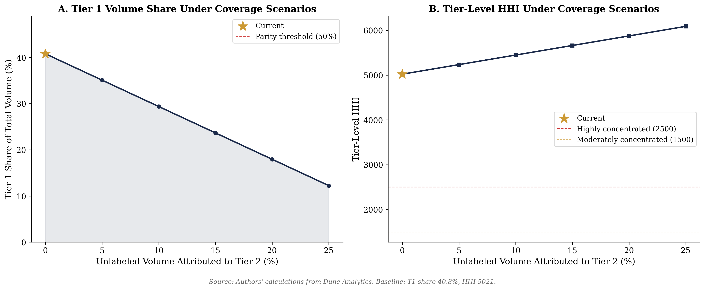{width="6.5in" height="4.0in"}

*Exhibit C1. Coverage sensitivity analysis (original 12-address registry). Tier 1 share under scenarios where 0–25 percent of unlabeled Ethereum volume is reclassified as Tier 2 gateway activity. Even at 25 percent reclassification, tier-level HHI remains above 7,000. Exhibit C12 replicates this analysis with the expanded 51-address registry. Source: Authors' calculations using Dune Analytics data.*

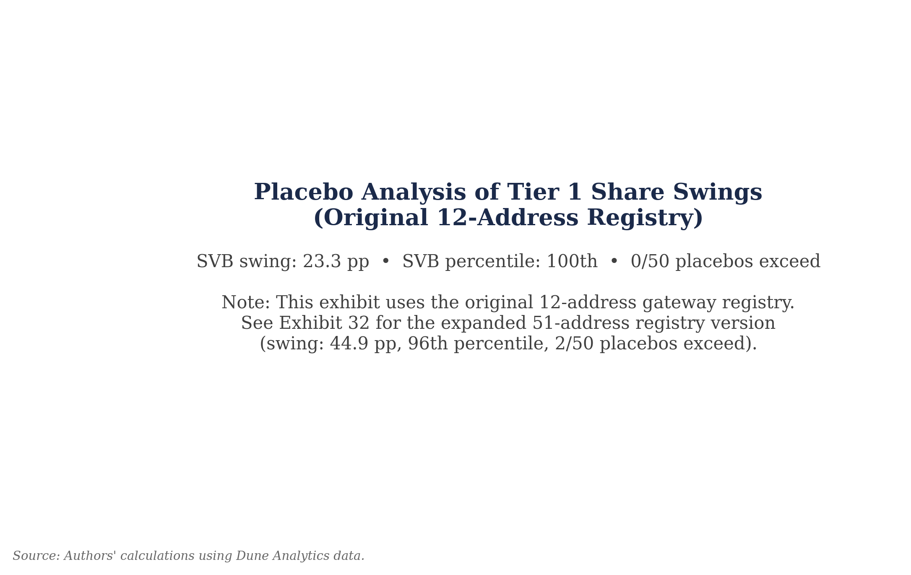{width="6.5in" height="4.0in"}

*Exhibit C2. Placebo analysis of Tier 1 share swings (original 12-address registry). The SVB-week swing (23.3 pp) exceeds all 50 randomly sampled non-event windows (max placebo: 21.9 pp; mean: 13.4 pp). Exhibit C10 replicates this analysis with the expanded 51-address registry. Source: Authors' calculations using Dune Analytics gateway share data.*

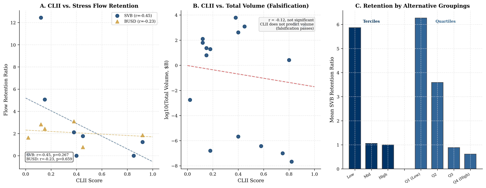{width="6.5in" height="4.0in"}

*Exhibit C4. CLII-retention gradient using continuous scores. Left: scatter of CLII score versus stress retention ratio (SVB and BUSD events pooled; r = −0.34). Right: quartile mean retention ratios showing monotonic decline from Q1 (6.27×) to Q4 (0.61×). Volume falsification (bottom): CLII is orthogonal to gateway volume (r = −0.12, p = 0.65). Source: Authors' calculations.*

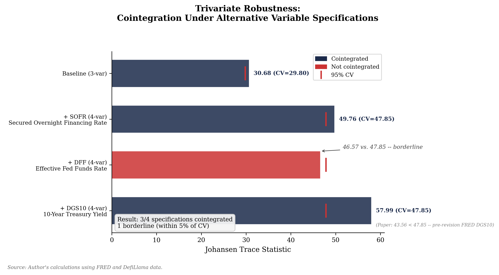{width="6.5in" height="4.0in"}

*Exhibit C5. Trivariate cointegration robustness. Baseline (Fed assets, ON RRP, stablecoin supply): trace = 30.68 > cv95 = 29.80, rank = 1. Adding SOFR preserves cointegration (trace = 49.76 > cv95 = 47.85). Adding DFF: borderline (trace = 46.57, cv95 = 47.85). Adding 10Y yield: fails (trace = 43.56). Source: Authors' calculations using FRED and DefiLlama data.*

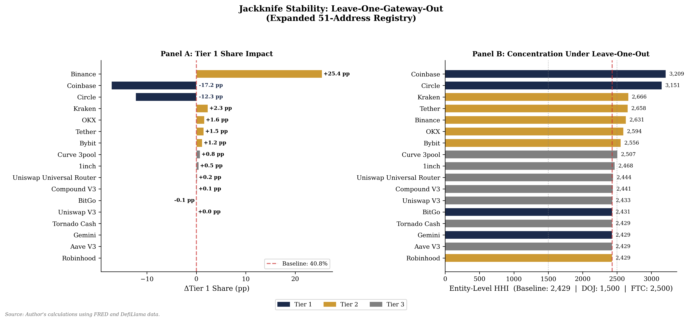{width="6.5in" height="4.0in"}

*Exhibit C6. Leave-one-gateway-out jackknife stability. Each bar shows the change in Tier 1 volume share when a single gateway entity is removed from the analysis. Baseline Tier 1 share: 40.8 percent. Binance (+25.4 pp) and Coinbase (−17.2 pp) are mechanically dominant, confirming the concentration finding rather than indicating analytical fragility. Circle removal shifts T1 share by −12.3 pp. All other entities shift Tier 1 share by less than 2.4 pp. Source: Authors' calculations using Dune Analytics data, expanded 51-address registry.*

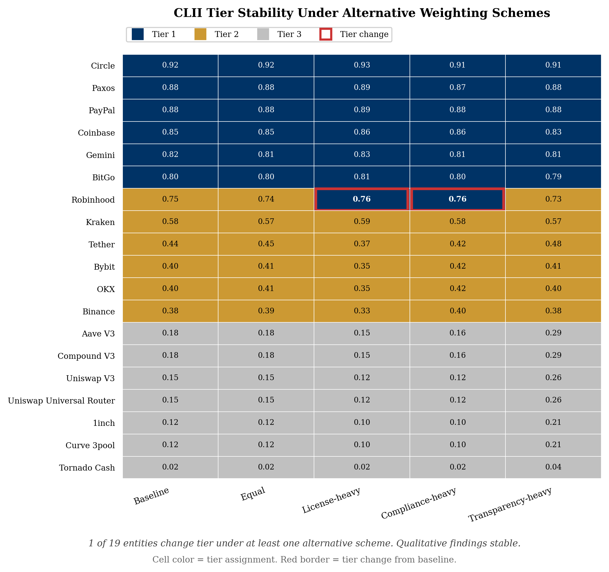{width="6.5in" height="4.0in"}

*Exhibit C7. CLII weight sensitivity grid. Heatmap of CLII scores under five weighting schemes (baseline, equal, license-heavy, compliance-heavy, transparency-heavy) for all 19 gateway entities. Tier boundaries (0.75, 0.30) marked as horizontal lines. Of 19 entities, 18 retain their baseline tier classification under all alternative schemes; the sole exception (Robinhood, processing \$50 total volume) moves from Tier 2 to Tier 1 under compliance-heavy and license-heavy weights. Source: Authors' calculations.*

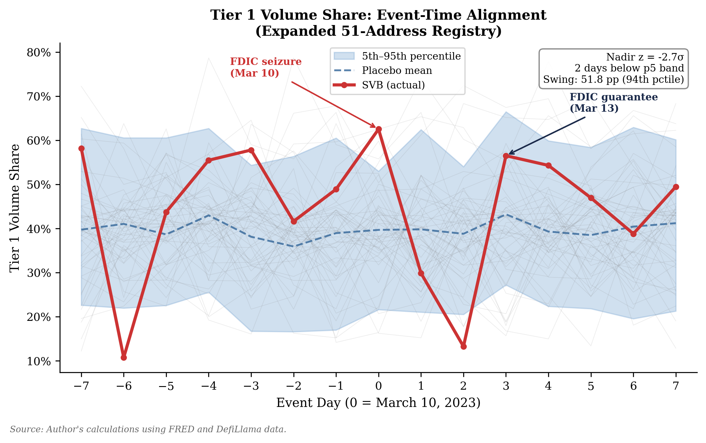{width="6.5in" height="4.0in"}

*Exhibit C2b. Event-time aligned stress placebo analysis (expanded 51-address registry). Panel A: Tier 1 share trajectories over a [−7, +7] day window centered on each event date: SVB (red), 50 randomly selected placebo windows (gray), placebo mean (dashed), and 5th/95th percentile bands (shaded). The SVB trajectory falls 2.7σ below the placebo mean at its nadir and remains below the 5th percentile band for 2 of 15 event-time days. SVB 15-day swing: 51.8 pp (94th percentile of placebo distribution; mean placebo swing: 34.9 pp). Panel B: Distribution of maximum T1 share swings across placebo windows, with SVB marked. Source: Authors' calculations using Dune Analytics gateway share data.*

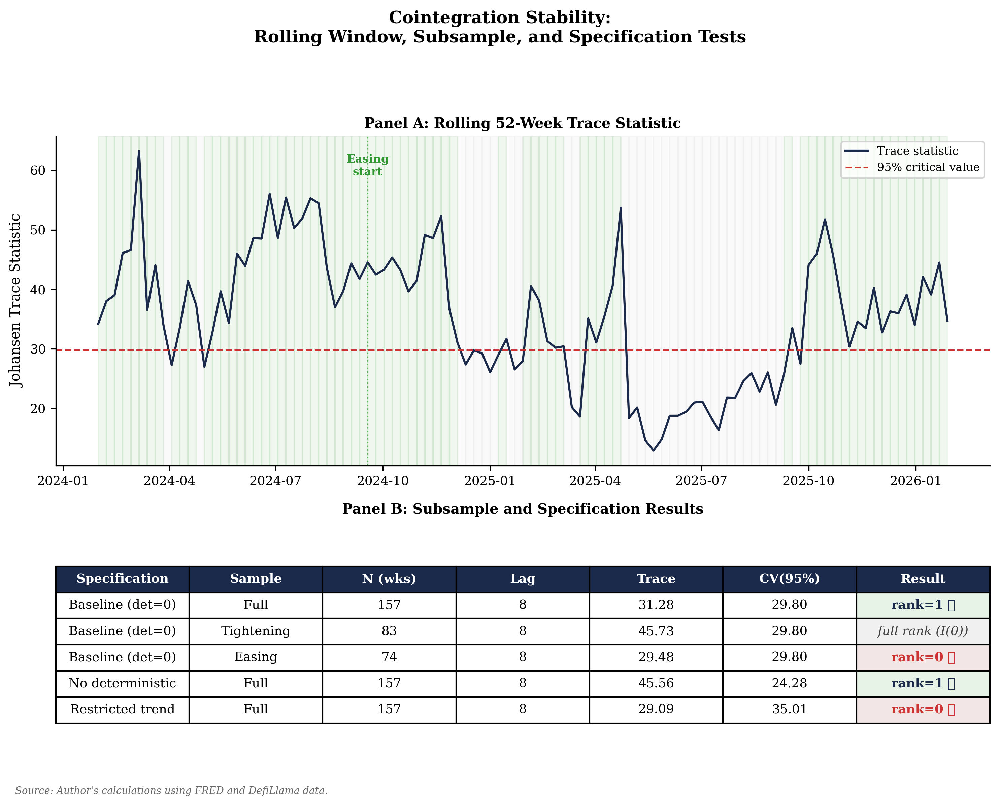{width="6.5in" height="4.0in"}

*Exhibit C3b. Cointegration regime stability. Panel A: Johansen trace statistics for full sample (30.68), tightening subsample (48.18), and easing subsample (17.71), with 5 percent critical value (29.80) as horizontal line. The relationship is strong during quantitative tightening and absent during easing. Panel B: Rolling 52-week Johansen trace statistic over time; 15 of 105 windows (14.3 percent) exceed the critical value, concentrated around the tightening-to-easing transition. Source: Authors' calculations using FRED and DefiLlama data.*

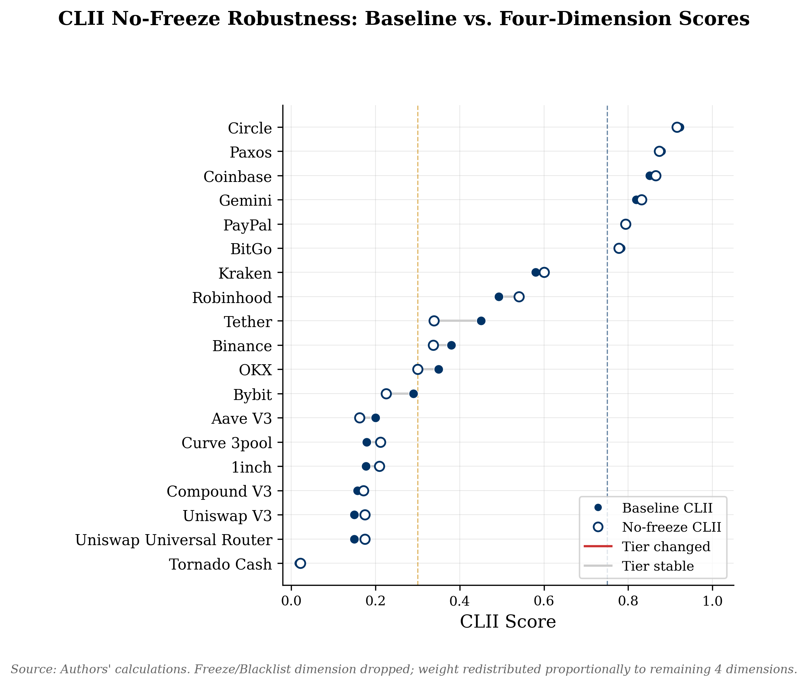{width="6.5in" height="4.0in"}

*Exhibit C8. CLII no-freeze robustness. Dumbbell chart showing baseline CLII score (left dot) and no-freeze CLII score (right dot) for all 19 entities, with tier boundaries (0.75, 0.30) as vertical lines. Dropping the freeze/blacklist dimension (20 percent weight) and redistributing proportionally produces zero tier changes. Maximum absolute shift: 0.11 (Tether). See Section III.B, "Centralization confound." Source: Authors' calculations.*

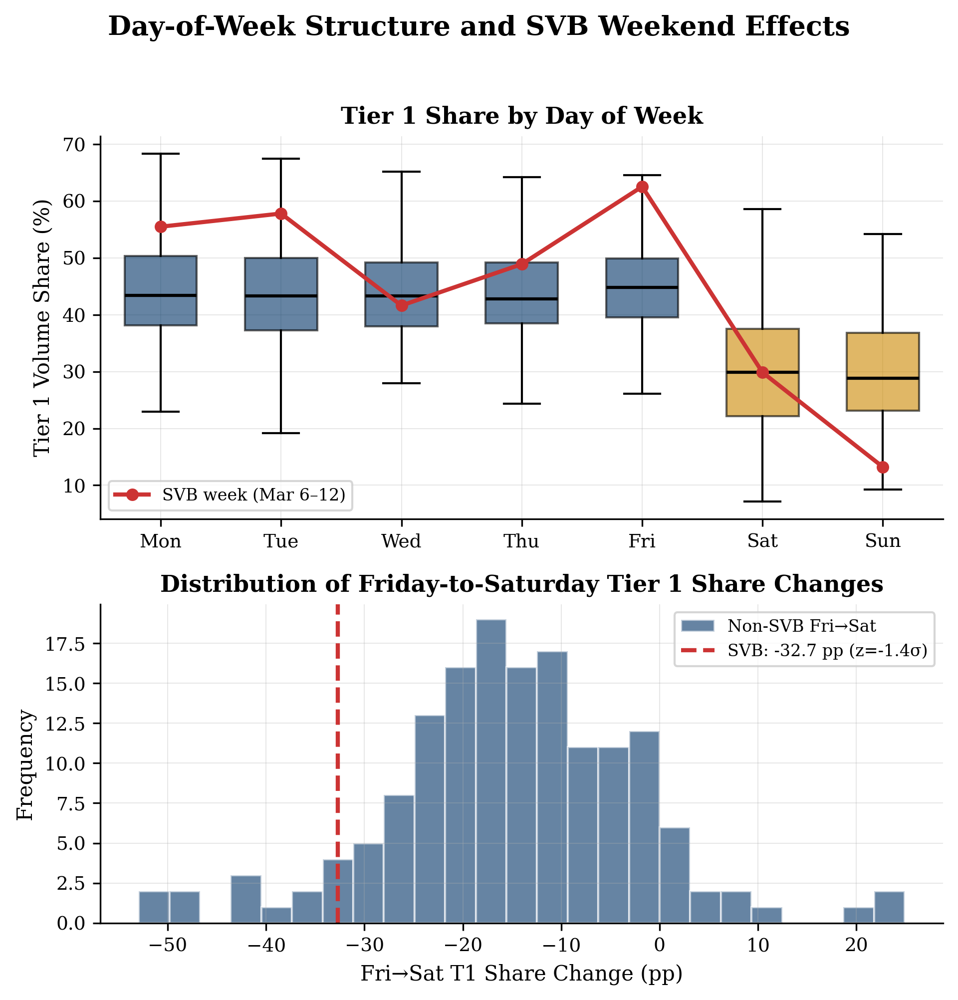{width="6.5in" height="6.0in"}

*Exhibit C9. Day-of-week structure and SVB weekend effects (expanded 51-address registry). Panel A: Box-whisker distribution of daily Tier 1 share by day of week, with SVB week (March 8–17, 2023) observations overlaid. The structural weekend dip (weekday mean 44.8 percent, weekend mean 30.9 percent, gap 13.9 pp) reflects Binance's 24/7 operations increasing Tier 2's weekend share. Panel B: Histogram of all Friday-to-Saturday Tier 1 share changes, with SVB (−32.7 pp, z = −1.4σ) marked. Source: Authors' calculations using Dune Analytics data.*

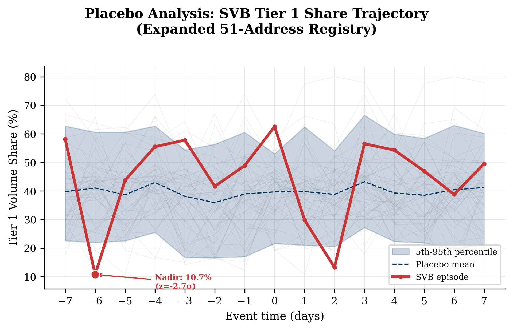{width="6.5in" height="4.0in"}

*Exhibit C10. Placebo analysis with expanded 51-address registry. Gray spaghetti: 50 randomly selected non-event windows; blue band: 5th–95th percentile; dashed blue: placebo mean; solid red: SVB trajectory. SVB 15-day swing: 51.8 pp (94th percentile; placebo mean: 34.9 pp). Nadir z-score: −2.7σ. Two days below 5th percentile band. Source: Authors' calculations using Dune Analytics data.*

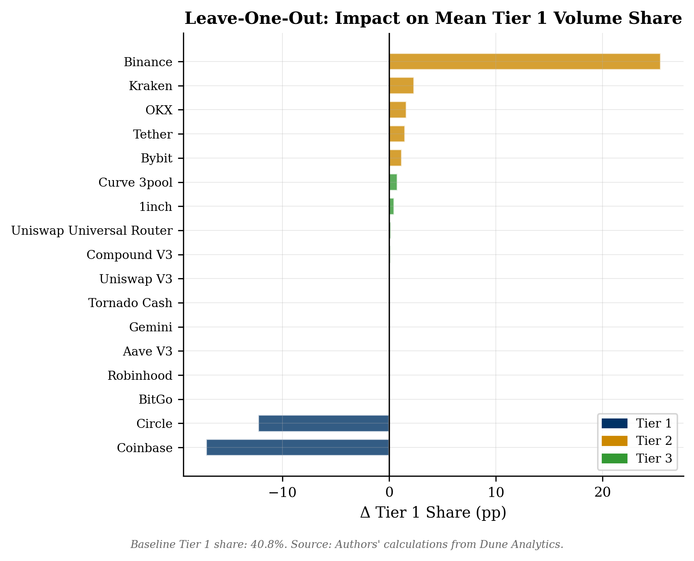{width="6.5in" height="4.0in"}

*Exhibit C11. Jackknife leave-one-out analysis (expanded 51-address registry). Tornado chart of Tier 1 share change when each entity is removed. Baseline: 40.8 percent. Top movers: Binance (+25.4 pp, Tier 2), Coinbase (−17.2 pp, Tier 1), Circle (−12.3 pp, Tier 1). Eight of ten non-dominant entities shift T1 by less than 2.4 pp. Colors indicate tier classification (navy: Tier 1, orange: Tier 2, green: Tier 3). Source: Authors' calculations using Dune Analytics data.*

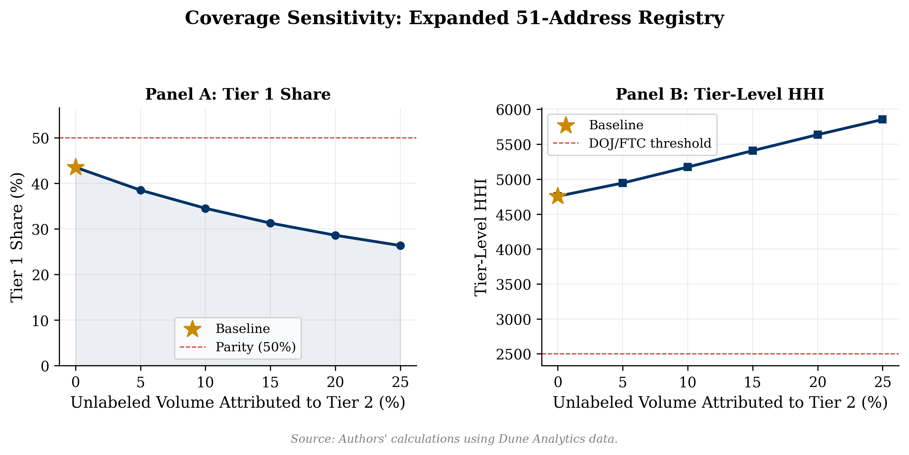{width="6.5in" height="4.0in"}

*Exhibit C12. Coverage sensitivity (expanded 51-address registry). T1 share under reclassification of 0–25 percent of unlabeled Ethereum volume as Tier 2. Baseline T1 share: 43.5 percent (volume-weighted); degrades to 26.3 percent at 25 percent reclassification. Tier-level HHI remains above the DOJ/FTC 2,500 threshold in all scenarios (range: 4,756–5,854). Source: Authors' calculations using Dune Analytics data.*

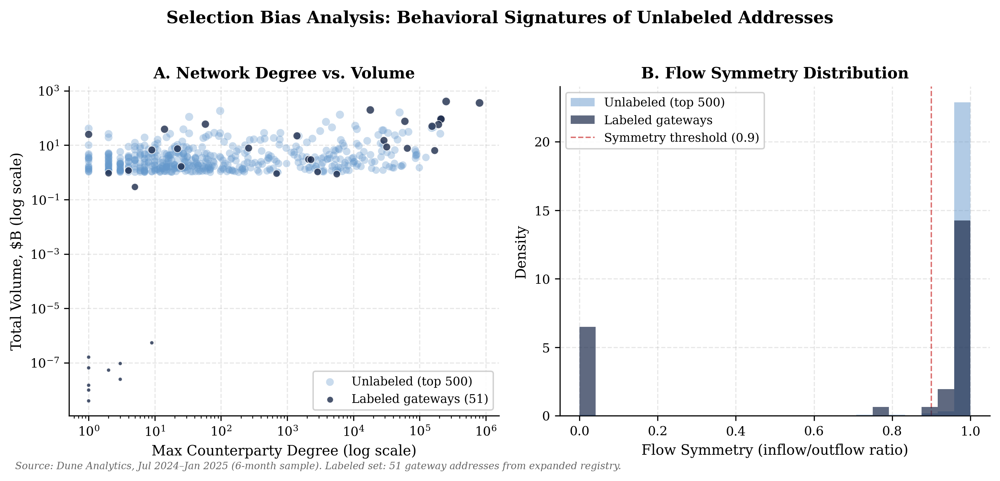{width="6.5in" height="3.0in"}

*Exhibit SB-1. Behavioral signatures of unlabeled addresses. Panel A: counterparty degree versus total volume for the top 500 unlabeled addresses by USDC/USDT volume (light) and 51 labeled gateway addresses (dark), Jul 2024–Jan 2025. Labeled gateways cluster at higher degree (median 261 versus 41 for unlabeled). Panel B: flow symmetry (min(inflow, outflow) / max(inflow, outflow)) density. Both populations are concentrated near 1.0, but unlabeled addresses include a tail of asymmetric (non-exchange) profiles. Source: Dune Analytics, 6-month sample.*

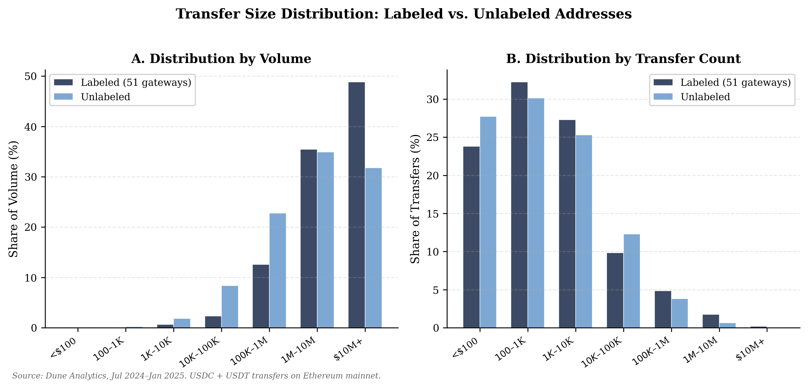{width="6.5in" height="3.0in"}

*Exhibit SB-2. Transfer size distribution, labeled versus unlabeled addresses. Panel A: share of volume by transfer size bucket. Labeled gateway volume is more concentrated in large transfers (\$1M+: 84.3 percent versus 66.7 percent for unlabeled, a 17.6 pp gap). Panel B: share of transfer count by size bucket. Distributions are similar at the count level, with unlabeled slightly more concentrated in smaller transfers. Source: Dune Analytics, Jul 2024–Jan 2025, Ethereum USDC + USDT.*

Appendix D: On-Chain Activity and DeFi Liquidation Details

DEX trading volumes grew from approximately \$3 billion per day in early 2023 to peaks exceeding \$25 billion per day in early 2025, with stablecoins serving as the primary settlement asset (Exhibit D1). This growth represents a direct expansion of the operational footprint of stablecoin infrastructure.

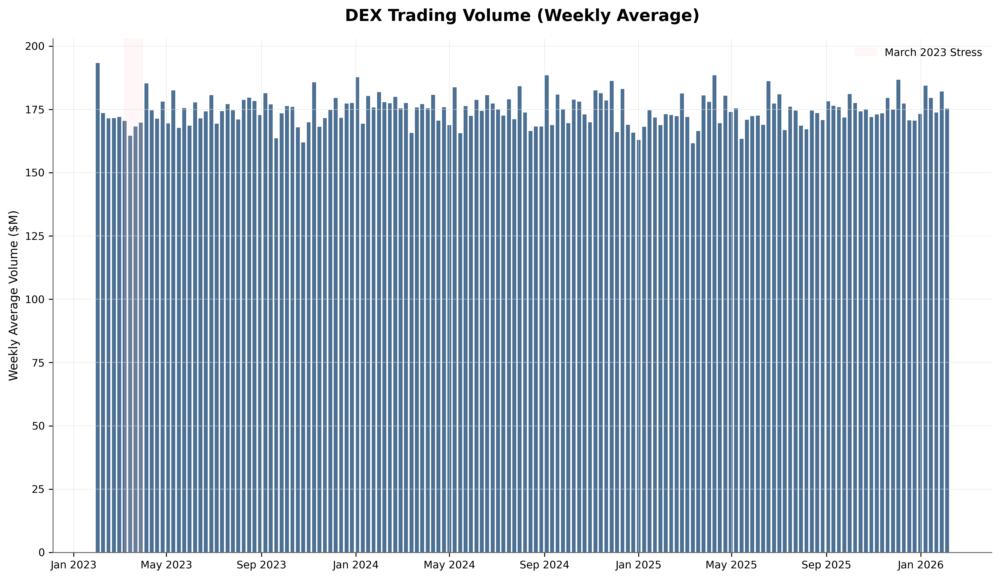{width="6.5in" height="3.5in"}

*Exhibit D1. Daily DEX trading volume and Curve-specific volume.*

DEX volume and stablecoin supply both exhibit strong growth, but DEX volume displays substantially higher volatility, with spikes corresponding to broader crypto market events rather than monetary policy shifts (Exhibit D2). The ratio of daily DEX volume to total supply (a rough proxy for stablecoin velocity) has increased over the sample period, suggesting that each dollar of stablecoin is being turned over more frequently as DeFi infrastructure matures.

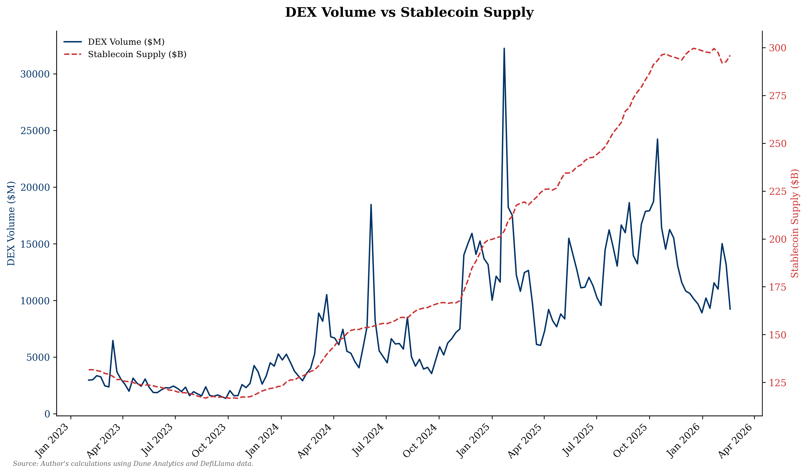{width="6.5in" height="3.5in"}

*Exhibit D2. DEX trading volume versus total stablecoin supply.*

DeFi Liquidation Cascades

The use of stablecoins as collateral in DeFi lending creates a leverage channel through which peg deviations can cascade (Gudgeon et al., 2020; Perez et al., 2021). Exhibit D3 presents Aave V3 liquidation data for positions collateralized by USDC, USDT, and DAI. Over our sample period, we observe \$35.5 million in total stablecoin-collateral liquidations across 466 events. USDT-collateralized positions account for the largest share (\$22.4 million), followed by USDC (\$9.9 million) and DAI (\$3.3 million).

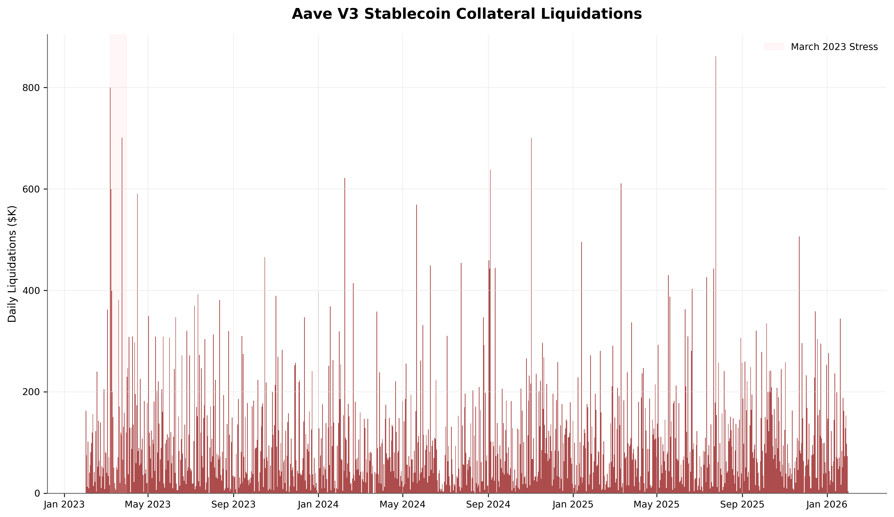{width="6.5in" height="4.5in"}

*Exhibit D3. Aave V3 stablecoin collateral liquidations by token (top) and event count (bottom).*

The liquidation pattern is episodic rather than continuous, with sharp spikes during market dislocations. The SVB window itself produced relatively modest liquidation volume (\$60,000), as the USDC peg recovered quickly once the FDIC announced deposit guarantees. The larger liquidation events in mid-2024 and late 2025 correspond to broader DeFi market volatility rather than stablecoin-specific stress, suggesting that stablecoin collateral liquidations are primarily driven by the value of borrowed assets (typically ETH or BTC) rather than by stablecoin peg deviations. Nonetheless, the mechanism exists: a sustained stablecoin depeg (particularly one affecting USDT, the largest collateral token on Aave) could trigger cascading liquidations of a magnitude substantially larger than those observed in our sample.

Appendix E: Summary of Econometric Results

  -------------------------------------------------------- --------------------------------------------------
  **Panel A: Cointegration**

  Johansen trace (rank ≤ 0)                                30.68 \[cv₉₅ = 29.80\]\*
  Johansen λ-max (rank ≤ 0)                                23.71 \[cv₉₅ = 21.13\]\*
  Cointegrating rank                                       1
  Engle-Granger (bivariate)                                −2.92 \[p = 0.13\]
  System                                                   Log Fed assets, log ON RRP, log stablecoin supply
  Sample                                                   Weekly, Feb 2023 to Jan 2026, T = 155, lag = 8 (AIC)

  **Panel B: VECM Adjustment Speeds (α)**
                                                           α / SE / t-stat / p-value
  Fed assets (WSHOMCB)                                     0.003 / 0.0004 / 6.256 / \<0.001\*\*\*
  ON RRP (RRPONTSYD)                                       −0.157 / 0.135 / −1.166 / 0.244
  Stablecoin supply                                        −0.004 / 0.002 / −1.589 / 0.112
  *Weak exogeneity LR tests (χ²(1)):*
  Fed assets                                               LR = 15.28, p \< 0.001 (reject)
  ON RRP                                                   LR = 14.00, p \< 0.001 (reject)
  Stablecoin supply                                        LR = 5.38, p = 0.020 (reject at 5%)

  **Panel C: FOMC Event Study (Raw / Abnormal)**
                                                           t+5 raw / t+5 abnormal / t+10 raw / t+10 abnormal
  Dovish (n = 5)                                           +0.63% \[p = 0.20\] / +0.13% \[p = 0.79\] / +1.66% \[p = 0.09\]† / +0.65% \[p = 0.50\]
  Neutral (n = 9)                                          +0.33% \[p = 0.008\]\*\* / −0.29% \[p = 0.098\]† / +0.93% \[p = 0.06\]† / −0.31% \[p = 0.36\]
  Hawkish (n = 5)                                          −0.07% \[p = 0.57\] / +0.19% \[p = 0.36\] / −0.48% \[p = 0.07\]† / +0.04% \[p = 0.85\]

  **Panel D: Deposit Displacement**
  Differenced r (weekly)                                   0.12 \[p = 0.024\]\*
  -------------------------------------------------------- --------------------------------------------------

\*p \< 0.05 \*\*p \< 0.01 †p \< 0.10

*Table E1. Consolidated econometric results. Panel B: only Fed assets α is individually significant; ON RRP and stablecoin supply carry error-correcting signs but are imprecisely estimated. Panel C: abnormal returns subtract the trailing 10-day average daily supply growth × horizon; no raw or abnormal result survives Bonferroni correction. See Sections IV.A.1 through IV.A.4 and IV.E for full discussion.*

**E.1 FOMC Event Study: Extended Analysis**

*Classification-level detail.* In the dovish case, the raw t+10 mean (+1.66%) is pulled substantially above the median (+1.14%) by the November 2024 rate cut, which coincided with a broader risk-on episode in crypto markets; the abnormal t+10 mean (+0.65%) is not significant (p = 0.50). The hawkish category shows the most notable abnormal result at the shortest horizon: hawkish announcements produce an abnormal t+1 supply decline of −0.039 percent (p = 0.027), suggesting that the immediate market reaction to tightening signals is the most cleanly identified policy effect in our sample, though the small sample (n = 5) warrants caution. With 12 hypothesis tests across three classifications and four horizons, neither the raw neutral t+5 result (p = 0.008) nor the hawkish abnormal t+1 result (p = 0.027) survives strict Bonferroni correction (adjusted α = 0.004); both survive at the 10 percent family-wise level.

*FOMC-day volume effects.* Daily stablecoin gateway transfer volume is 31 percent lower on FOMC announcement days relative to non-FOMC days (Welch's t = −3.83, p < 0.001), though the non-parametric Mann-Whitney test does not confirm this finding (U = 9,542, p = 0.614). The parametric/non-parametric disagreement warrants caution, but the directional result suggests stablecoin markets have become integrated enough with the traditional financial system that participants reduce activity around scheduled policy announcements.

  -------------------- -------------- --------------------------------
  Classification       Volume Ratio   Interpretation
  Hawkish              0.50×          Lowest activity; uncertainty peak
  Dovish               0.72×          Moderate suppression
  Neutral              0.77×          Closest to baseline
  -------------------- -------------- --------------------------------

*Table E3. Gateway volume on FOMC days relative to non-FOMC baseline.*

  -------------------------------------------------------- ---------------------------------------- -----------------
  **Test**                                                 **Statistic**                            **Result**

  Johansen trace (lag 8)                                   30.68 (cv₉₅ = 29.80)                    Reject: rank = 1
  Lag sensitivity                                          3/5 lags pass (8, 10, 12)                Robust
  KPSS (all variables)                                     I(1) confirmed                           Consistent
  ADF-KPSS supply (differenced)                            ADF p = 0.002; KPSS p = 0.040            Mild disagreement
  Placebo: BTC                                             0/5 lags cointegrate                     Clean falsification
  Placebo: ETH                                             0/5 lags cointegrate                     Clean falsification
  Cross-stablecoin: USDT                                   2/5 lags pass (10, 12)                   Supportive
  Cross-stablecoin: USDC                                   2/5 lags pass (4, 6)                     Supportive
  USDT α (error correction)                                −0.005 (p = 0.005)                       Individually significant
  β stability (Sep 2024 break)                             Bootstrap p \> 0.05 all elements         Stable
  Gregory-Hansen (C/S model)                               ADF\* = −4.28 (cv₅% = −5.96)            Not significant
  Yield spread Granger (lag 1)                             F = 11.30 (p = 0.001)                    Significant
  Supply → spread Granger (lag 2)                          F = 9.40 (p \< 0.001)                    Bidirectional
  ON RRP Granger (lag 1)                                   F = 4.83 (p = 0.028)                     Significant
  ON RRP Granger (lag 2)                                   F = 3.91 (p = 0.022)                     Significant
  Supply → ON RRP (lag 5)                                  F = 4.13 (p = 0.002)                     Bidirectional
  FEVD at 26 weeks                                         Fed + RRP: 13.9% of supply variance      Moderate policy share
  Persistence profile (Pesaran-Shin)                        Smoothed half-life: 5 weeks              Rapid equilibrium restoration
  FOMC volume ratio                                        0.69× (t = −3.83, p \< 0.001)           Significant (parametric)
  FOMC volume Mann-Whitney                                 U = 9,542 (p = 0.614)                    Not significant
  Flow retention vs CLII (SVB)                             r = −0.34 (p = 0.27; n = 12)                 Directionally consistent, not significant
  Flow retention vs CLII (BUSD)                            r = −0.47 (p = 0.13; n = 12)                 Directionally consistent, not significant
  Flow retention pooled (SVB + BUSD)                       r = −0.30 (p = 0.16; n = 24)                 Direction holds across both events

  **Panel E: Gateway Tier Correlations (Expanded Registry, Weekly, n = 158)**
  Tier 1 vs Fed Assets (levels)                            r = −0.56 (p < 0.001)                        Long-run co-trend; strongest institutional co-movement
  Tier 2 vs Fed Assets (levels)                            r = −0.45 (p < 0.001)                        Long-run co-trend; moderate institutional co-movement
  Tier 3 vs Fed Assets (levels)                            r = +0.37 (p < 0.001)                        Long-run co-trend; opposite direction (DeFi growth)
  Tier 1 vs Fed Assets (first diff.)                       r = +0.05 (p = 0.49)                         Not significant; no short-run co-movement
  Tier 2 vs Fed Assets (first diff.)                       r = +0.12 (p = 0.14)                         Not significant; no short-run co-movement
  Tier 3 vs Fed Assets (first diff.)                       r = +0.07 (p = 0.40)                         Not significant; no short-run co-movement

  **Panel F: SVB Counterparty Network (Nansen, 15 Gateways, 3 Windows)**

  Network density (pre / stress / post)                    0.085 / 0.085 / 0.086                       Topology stable; capacity fragmented
  Market-maker daily volume change (stress vs pre)         −29% aggregate                               Cumberland −79%, Wintermute +118%
  Wintermute gateway connections                           6 / 6 / 6                                    Maintained all connections; added Circle
  Cumberland gateway connections                           6 / 3 / 6                                    Lost Curve, Coinbase, Paxos during stress
  MEV bot share of Curve 3pool volume                      24% pre → 51% stress                         Replaced institutional intermediaries
  Core triangle share (Binance-Circle-Tether)              44% / 42% / 57%                              Post-crisis consolidation around Binance

  **Panel G: BUSD Wind-Down Counterparty Network (Nansen, 15 Gateways, 3 Windows)**

  Wintermute volume (pre / early / late)                   $4.7B / $12.0B / $24.4B                      5× surge; mediated BUSD→USDT migration
  Paxos as Binance counterparty                            $6.8B / $4.3B / $0.8B                        88% decline confirms flow cessation
  Tether Treasury counterparty count                       15 / 64 / 500                                Broadening USDT mint relationships
  Total network volume                                     $410B / $507B / $457B                         Volume rose then stabilized during wind-down

  **Panel H: Layer 2 Gateway Tier Composition (Nansen Counterparty Data)**

  Base tier composition                                    T1: 0% / T2: 0% / T3: 100%                  Morpho Blue dominates; Coinbase Deposit empty
  Arbitrum tier composition                                T1: 0% / T2: 46% / T3: 54%                  Binance + Hyperliquid/Aave/GMX
  Ethereum comparison                                      T1: 44% / T2: 53% / T3: 3%                  L2s do not inherit parent chain tier structure

  **Panel J: Solana Gateway Tier Composition (Dune Analytics, 14 Entities)**

  Tier 1 volume share (institutional transfers)            11.1% ($49.7B of $446.7B)                    Coinbase $25.0B + Circle $24.8B (estimated)
  Tier 2 volume share                                     88.9% ($396.9B)                               Binance $278B dominates; 8 additional exchanges
  Tier 3 DEX volume (not comparable)                      $4.2T synthetic                               Jupiter/Raydium/Orca; Artemis aggregate
  Solana vs Ethereum T1 share                             11% vs 41%                                    Solana ecosystem is exchange-dominated, DeFi-first

  **Panel I: Monthly Market-Maker Concentration (Nansen, 15 Gateways, 35 Months)**

  Wintermute monthly volume range                          $2.2B (Feb 2023) → $51.8B (Aug 2025)         24× growth; share 1.4% → 19.9%
  Cumberland monthly volume range                          $5.2B (Feb 2023) → $0.2B (Dec 2025)          96% decline over sample period
  Wintermute/Cumberland ratio                              0.4× (Feb 2023) → 42× (Dec 2025)            Market-maker layer concentrating
  Cross-gateway counterparties (spanning 2+ gateways)      5.8% (Feb 2023) → 2.6% (Dec 2025)           Shared counterparties declining
  -------------------------------------------------------- ---------------------------------------- -----------------

*Table E2. Comprehensive robustness and identification summary. See Section IV.A.1 for detailed discussion of cointegration robustness, yield spread Granger causality, and placebo falsification results.*

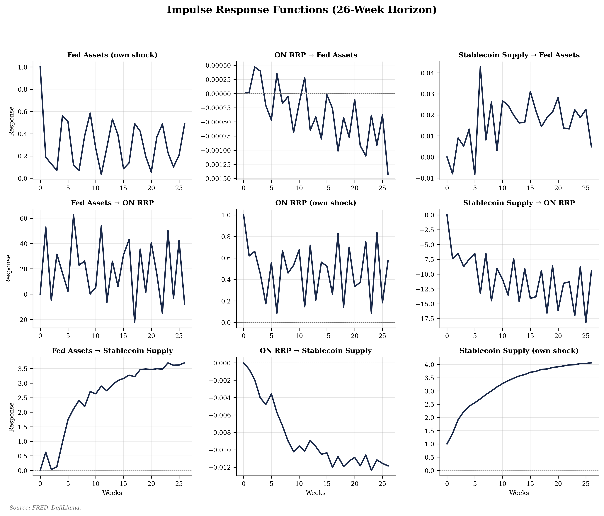{width="6.5in" height="5.0in"}

*Exhibit E1. VECM impulse response functions (point estimates), 26-week horizon. The 3×3 grid shows responses of each variable to shocks in each other variable. Source: Authors' VECM estimation using FRED and DefiLlama data.*

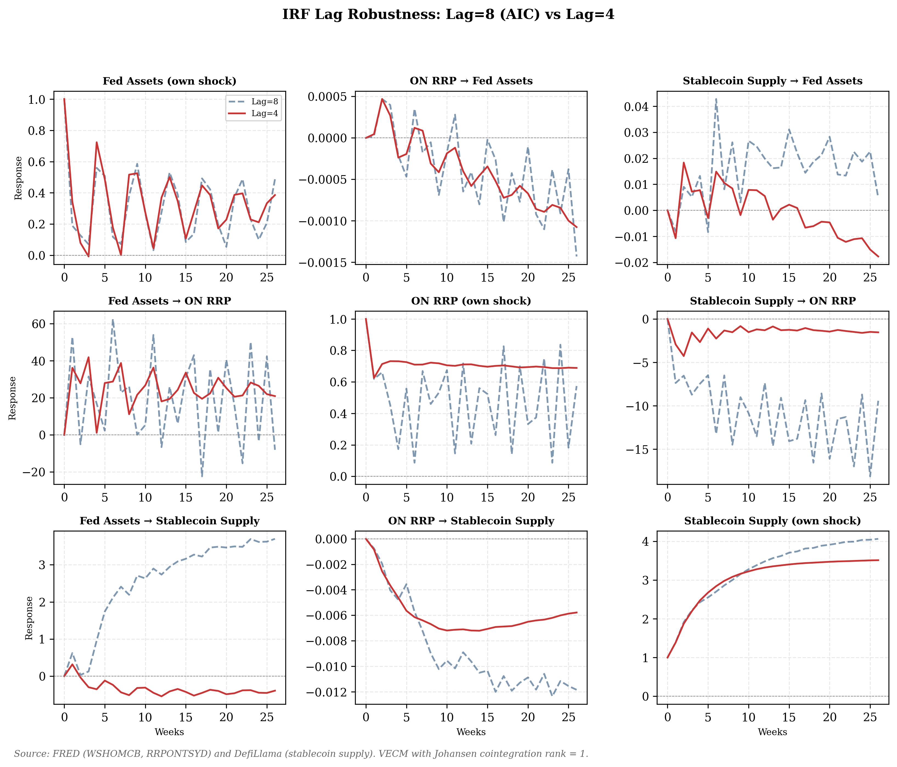{width="6.5in" height="5.0in"}

*Exhibit E2. IRF lag robustness: lag 8 (AIC-optimal) versus lag 4. Response shapes are qualitatively similar across specifications, with lag 8 producing marginally larger and more persistent cross-variable effects. Source: Authors' calculations.*

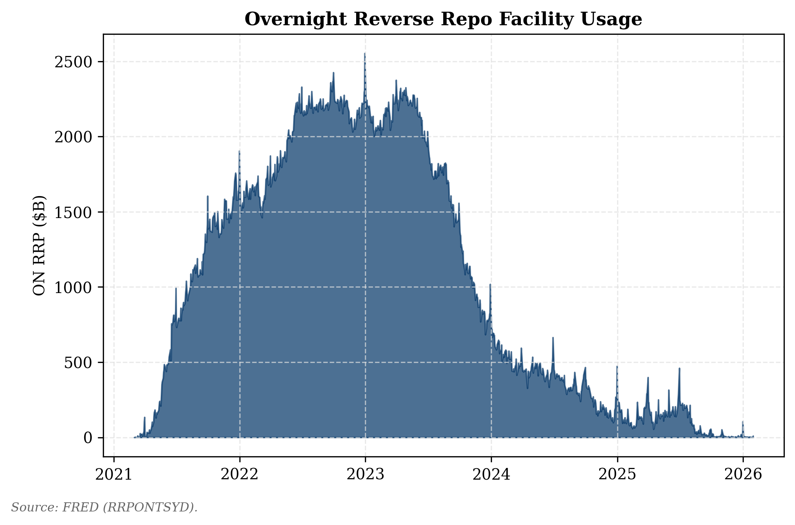{width="6.5in" height="4.0in"}

*Exhibit E3. ON RRP facility outstanding, 2021-2026. The drawdown from \$2.4 trillion to \$9.6 billion coincides with the expansion of stablecoin supply documented in the main text. Source: Federal Reserve Bank of New York.*

Appendix F: International CLII Mapping

The CLII framework developed in Section III reflects U.S. regulatory categories. To assess its portability, we map the five core CLII dimensions to corresponding requirements in five major stablecoin jurisdictions: the European Union (Markets in Crypto-Assets Regulation, MiCA), the United Arab Emirates (Virtual Assets Regulatory Authority, VARA), Singapore (Monetary Authority of Singapore, MAS), Japan (Financial Services Agency, JFSA), and the United Kingdom (Financial Conduct Authority, FCA, with Bank of England oversight for systemic tokens).

Table F1 summarizes the coverage matrix. "Full" indicates mandatory, stablecoin-specific provisions addressing the dimension. "Partial" indicates that general financial regulation applies but lacks stablecoin-specific requirements.

  ----------------------------- ---------- ---------- ---------- ---------- ----------
  **CLII Dimension**            **EU**     **UAE**    **SG**     **JP**     **UK**
                                **(MiCA)** **(VARA)** **(MAS)**  **(JFSA)** **(FCA)**

  Regulatory License (25%)      Full       Full       Full       Full       Full

  Reserve Transparency (20%)    Full       Full       Full       Full       Partial

  Freeze Capability (20%)       Full       Full       Full       Full       Partial

  Compliance Infra. (20%)       Full       Full       Full       Full       Full

  Geo./Sanctions (15%)          Full       Full       Full       Full       Full

  **Dimensions fully covered**  **5/5**    **5/5**    **5/5**    **5/5**    **3/5**
  ----------------------------- ---------- ---------- ---------- ---------- ----------

*Table F1. CLII dimension coverage across five international regulatory frameworks. All five jurisdictions address all five dimensions, but the UK regime (still under development as of January 2026) achieves full stablecoin-specific coverage on only three. Source: Authors' analysis of MiCA (2023), VARA Virtual Assets and Related Activities Regulations (2023), MAS Stablecoin Framework (2023), JFSA Payment Services Act amendments (2022), and UK Financial Services and Markets Act 2023 / FCA consultation papers.*[^intl_clii_caveat]

[^intl_clii_caveat]: International CLII scores in Table F1 are derived from legislative text analysis and published regulatory guidance rather than verified on-chain enforcement data. Scores for jurisdictions with enacted, stablecoin-specific legislation (EU/MiCA, Japan, Singapore) are more reliable than those based on proposed or evolving frameworks (UK, UAE). Observable gateway routing behavior in response to regulatory changes (e.g., whether flows migrate toward lower-CLII jurisdictions) would provide sharper validation but is beyond the scope of this paper's U.S.-centric data.

Three findings emerge from the mapping. First, all five jurisdictions address all five CLII dimensions, validating the index's construction as capturing universally recognized regulatory priorities for stablecoin infrastructure rather than U.S.-specific concerns. The FATF travel rule has been implemented in all five jurisdictions, making AML/sanctions screening the most globally harmonized dimension.

Second, the jurisdictions rank differently on monetary policy transmission strength through their stablecoin frameworks. Japan's bank-centric model, which requires stablecoin issuers to be banks or trust companies inherently subject to BOJ monetary policy, represents the theoretical maximum of transmission. MiCA's mandatory credit institution deposit requirements (30 to 60 percent of reserves) create an explicit, quantifiable transmission channel through which ECB rate changes affect reserve yields. The UK's proposed central bank reserve holding for systemic stablecoins would create the most direct channel possible but remains under development. Singapore and the UAE have moderate transmission for local-currency-referenced stablecoins but limited influence over USD-denominated tokens, which constitute the vast majority of global stablecoin activity.

Third, the convergence toward banking-adjacent regulation across jurisdictions reinforces a central implication: gateway oversight is a monetary policy concern, not merely a compliance exercise. Even jurisdictions competing aggressively for crypto-asset business (UAE, Singapore) impose the same core dimensional requirements that the CLII captures, suggesting these represent regulatory necessities rather than optional enhancements.

The practical test of these cross-jurisdictional differences lies in observable routing behavior: whether stablecoin flows migrate toward lower-CLII jurisdictions in response to regulatory tightening (a "race to the bottom" hypothesis) or consolidate in higher-CLII jurisdictions that offer greater institutional credibility (a "flight to quality" hypothesis). Our U.S.-centric data cannot distinguish these patterns; future work extending the gateway framework to corridors with cross-perimeter characteristics (e.g., GCC to South Asia, EU to West Africa) would generate sharper tests of whether the CLII gradient drives routing decisions across regulatory regimes.

Appendix G: Tokenized Fund Product Assessment

As tokenized Treasury fund products grow, a natural question is whether these products could enter the stablecoin reserve stack or serve as functional substitutes for traditional money market fund shares. We assess three leading products against nine categories of minimum viable economic parity (MVEP) with traditional money market instruments.

  ------------------------------ ------------ -------------- ------------ ----------
  **Category**                   **BUIDL**    **BENJI**      **OUSG**
                                 (BlackRock)  (Franklin T.)  (Ondo)

  Redemption guarantee           Pass         Pass           Ambiguous

  Regulatory licensing           Ambiguous    Pass           Ambiguous

  Segregation of assets          Pass         Pass           Pass

  Qualified custodian            Pass         Pass           Pass

  Daily NAV transparency         Pass         Pass           Pass

  AML/KYC gateway                Pass         Pass           Pass

  Smart contract audit           Ambiguous    Ambiguous      Pass

  Interoperability               Pass         Ambiguous      Pass

  Regulatory clarity             Pass         Pass           Ambiguous

  **Score**                      **7/9**      **7/9**        **6/9**
  ------------------------------ ------------ -------------- ------------ ----------

*Table G1. Minimum Viable Economic Parity (MVEP) assessment. "Pass" indicates the product meets or exceeds the standard set by traditional money market fund shares on that dimension. "Ambiguous" indicates partial coverage or emerging provisions. BlackRock BUIDL AUM approximately \$2.5 billion (November 2025); Franklin BENJI approximately \$844 million; Ondo OUSG approximately \$770 million. Source: Authors' analysis of product documentation, SEC filings, and audit reports as of January 2026.*

All three products pass on core institutional requirements: segregation of assets, qualified custodian, daily NAV transparency, and AML/KYC gateways. These four categories represent the baseline MVEP requirements on which institutional tokenized funds have converged. The residual ambiguity clusters in two areas. First, regulatory licensing: BUIDL operates as an unregistered private placement under Regulation D, while BENJI (Franklin Templeton's FOBXX) is the only product with full SEC registration as a mutual fund, giving it the clearest regulatory standing. OUSG, structured as a Delaware LP, occupies an intermediate position. Second, smart contract auditability: neither BUIDL nor BENJI has published comprehensive, publicly available independent smart contract audits, while OUSG has undergone multiple audits by Code4rena, Certik, and Zellic.

The gateway implications are significant. Tokenized fund products create a new class of potential Tier 1 gateway in which the fund administrator and transfer agent (Securitize for BUIDL, Franklin Templeton for BENJI, Ondo for OUSG) combines reserve management with token issuance, collapsing the issuer-gateway distinction that the CLII currently separates. If these products achieve sufficient scale to serve as stablecoin reserve assets or direct substitutes, the CLII framework would need to accommodate this hybrid category, potentially through a new dimension capturing fund-level regulatory registration alongside the existing gateway-level compliance dimensions.

Appendix H: The Credit Migration Channel

The deposit-displacement mechanism described in Section IV.E has a second-order consequence that connects stablecoin growth directly to the structure of credit intermediation. Stablecoin reserves are, by design, narrow: the GENIUS Act mandates one-to-one backing in cash, Treasury bills, and repo, none of which fund loans. Every dollar of deposits that migrates into stablecoin reserves is a dollar removed from the fractional-reserve lending channel.

The credit migration channel operates through four distinct mechanisms that should be monitored separately: (A) deposit displacement itself: the money object moves from bank liabilities to stablecoin reserves, reducing the deposit base available for lending; (B) credit supply relocation: the marginal loan shifts from bank to nonbank balance sheets (private credit, fintech originators, on-chain protocols); (C) funding fragility: replacement credit is funded by wholesale markets, warehouse lines, and securitization rather than insured deposits, increasing procyclicality and mark-to-market amplification during stress; and (D) backstop ambiguity: nonbank credit intermediaries may lack access to Fed lending facilities, creating uncertainty about crisis resolution and lender-of-last-resort coverage. The empirical evidence available to date addresses primarily mechanisms A and B; mechanisms C and D remain forward-looking risk channels.

The closest precedent for mechanisms A and B is the post-2008 restructuring of small-business credit documented by Gopal and Schnabl (2022), who show that regulatory constraints on banks drove a wholesale migration of lending activity to nonbank finance companies and fintech originators. Their identification strategy (comparing counties with high versus low pre-crisis bank market shares) demonstrates that the substitution was supply-driven, not demand-driven: where banks retrenched most, nonbanks expanded most, with no measurable effect on local employment, wages, or establishment growth.

Three features of their findings map onto the stablecoin context. First, the regulatory perimeter (not organizational form) predicted behavior under constraint: bank-owned finance companies retrenched alongside their parent banks, while independent nonbanks expanded. Second, replacement credit shifted systematically toward shorter maturities, smaller loan sizes, and heavier collateral requirements: a pattern that may repeat if on-chain lending protocols absorb displaced credit demand. Third, the speed of nonbank entry was striking: fintech lenders were "effectively nonexistent" before 2010 yet accounted for one-third of the total increase in nonbank loans by 2016. The replacement funding is also structurally more procyclical: nonbank lenders rely on warehouse lines, securitization, and mark-to-market collateral rather than insured deposits, creating an amplification channel during tightening cycles.

Congress's yield prohibition on payment stablecoins responds in part to this deposit-displacement concern: the Systemic Risk Council (2025) explicitly recommended that legislators "prohibit or significantly limit the payment of interest on stablecoins to protect the deposit base of banks." The prohibition echoes Regulation Q's mid-twentieth-century interest-rate ceilings, which were designed to prevent destabilizing competition for funds. When Reg Q caps became binding in the 1970s, money market mutual funds emerged as the disintermediation vehicle; the parallel concern is that yield-bearing stablecoins operating outside the GENIUS Act perimeter could serve an analogous function.

A parallel development, tokenized deposits, offers an inside-the-perimeter alternative: bank deposits represented as tokens that remain on the bank's balance sheet, inherit deposit insurance and resolution mechanics, and preserve the fractional-reserve lending channel. As Section IV.E details, the three coexisting dollar objects (payment stablecoins, tokenized deposits, and yield wrappers) have different monetary-transmission properties. The credit-migration channel activates only to the extent that deposits migrate to the first or third category; tokenized deposits, by design, keep balances inside the bank perimeter.

For monetary policy, the credit migration channel implies that the transmission externality operates on two margins simultaneously: the interest-rate channel is attenuated if displaced liquidity circulates in venues unconstrained by reserve requirements, and the credit channel is restructured if deposit displacement pushes credit supply toward more modular, wholesale-funded, and procyclical nonbank balance sheets. At current scale ($305 billion), these effects are negligible. At the $1 to 2 trillion range that current growth rates imply by the end of the decade, the deposit-displacement effect could rival the post-2008 bank lending contraction that triggered the nonbank credit migration Gopal and Schnabl document.

Appendix I: Legislative Framework and the Control Layer

The GENIUS Act (Guiding and Establishing National Innovation for U.S. Stablecoins Act of 2025, signed July 18, 2025) restricts payment stablecoin issuance to permitted entities (subsidiaries of insured depository institutions, OCC-supervised nonbanks, and qualifying state-chartered entities) and mandates one-to-one reserve backing, regular audits, and BSA/AML compliance. Foreign issuers must register with the OCC and maintain reserves in U.S. institutions. These provisions address the token-issuance layer but leave the routing layer untouched.

The Act creates a formal bifurcation between payment stablecoins (non-interest-bearing, regulated under banking law) and yield-bearing stablecoins (excluded from the Act's scope, presumptively subject to securities regulation). This distinction is issuer-facing, but its enforcement surface is the gateway: at the routing layer, payment and yield-bearing instruments intermingle, and automated conversion between categories could circumvent the legislative intent.

The companion CLARITY market-structure draft (Senate Banking Committee, 2025) attaches compliance obligations directly to the interface layer. CLARITY defines "distributed ledger application layers" (web-hosted software applications through which users submit transaction instructions) as explicit targets for Treasury sanctions and AML guidance, distinct from underlying protocols, validators, or wallet software. Treasury is directed to issue guidance within 360 days clarifying screening, blocking, and risk-based control expectations for these application layers. If enacted alongside GENIUS, the architecture would pair issuer-level reserve and licensing requirements with interface-level routing and enforcement controls, a two-layer supervisory framework that maps onto the CLII's distinction between token-level attributes and gateway-level compliance characteristics.

The CLARITY draft's temporary hold provisions (up to 30 days, extendable to 180) suggest that freeze/hold capability may become the most operationally consequential compliance dimension. Gateways that can implement holds with due-process safeguards (notice, appeal, audit trails, bounded duration) will bear higher compliance costs but command a reliability premium in regulated flows. The CLII's current binary scoring of freeze capability would benefit from a graduated measure capturing hold orchestration capacity as these requirements evolve.

Appendix J: The Eurodollar Analogy and Its Limits

The offshore USDT ecosystem shares three defining features with the eurodollar system that emerged in the 1960s: dollar instruments circulating outside U.S. regulatory infrastructure, different monetary transmission properties than their domestic counterparts, and a structural challenge to the Fed's ability to monitor and backstop dollar liquidity globally. As with eurodollars, the growth is demand-driven (emerging-market dollar demand) rather than policy-designed, and the regulatory response has lagged the market's development by years.

The analogy is imprecise in three important respects. First, eurodollars create money through fractional-reserve lending while stablecoins are fully reserved; the credit-creation multiplier that gave eurodollar markets their systemic significance is absent in stablecoin markets by design. Second, eurodollar banks retain access to lender-of-last-resort facilities through central bank swap lines while stablecoin issuers have no equivalent backstop; the Fed's swap-line architecture covers eurodollar stress but not stablecoin stress. Third, eurodollar deposit creation is driven by credit demand while stablecoin issuance is driven by fiat inflow from token purchasers, a distinction that affects the elasticity of supply to monetary conditions.

Despite these differences, the regulatory challenge is structurally parallel: monitoring dollar usage beyond the supervisory perimeter. The eurodollar experience suggests that once dollar instruments achieve sufficient offshore scale, they become self-reinforcing through network effects and difficult to repatriate within the regulatory perimeter without disrupting the economic functions they serve. The stablecoin routing infrastructure documented in this paper represents an early-stage version of this dynamic, with the additional complication that the "offshore" dimension is defined by blockchain and gateway choice rather than geographic jurisdiction.

Appendix K: Multi-Chain Gateway Detail

**Solana Gateway Estimation.** Solana gateway transfer data were collected for 14 entities using Nansen-sourced addresses on Dune Analytics. Tier 1 volume share is approximately 11 percent: Coinbase ($25.0 billion observed) and Circle ($24.8 billion estimated). Circle's Solana volume is a balance-weighted proxy calibrated to Coinbase's observed 23× annual turnover ratio; the Dune query for Circle's full monthly Solana transfer history did not complete within the query execution window. Tier 2 accounts for 89 percent, dominated by Binance ($278 billion), with OKX, Crypto.com, Kraken, Bybit, and Gate collectively adding $116 billion. We report Ethereum-only tier shares as the primary finding and treat the cross-chain HHI of approximately 2,538, still above the DOJ/FTC "highly concentrated" threshold but far below the Ethereum-only figure of 5,021, as indicative of the dilution that multi-chain expansion introduces. Solana Tier 3 DEX volumes (Jupiter, Raydium, Orca: $4.2 trillion aggregate) are Artemis synthetic estimates representing total swap volume, not stablecoin-specific gateway transfers, and are not directly comparable to Tier 1/Tier 2 transfer volumes.

**Layer 2 Counterparty Analysis.** Nansen counterparty data for Ethereum Layer 2 chains reinforce the finding that gateway tier structure does not inherit from the parent chain. On Base (Coinbase's own L2), the gateway ecosystem is 100 percent Tier 3, dominated by Morpho Blue lending protocol. On Arbitrum, the split is 46 percent Tier 2 (Binance wallets) and 54 percent Tier 3 (Hyperliquid, Aave, GMX) with zero Tier 1 presence. Coinbase Deposit on Base returned zero counterparties, indicating that even the chain's sponsor does not operate a materially active stablecoin gateway on its own L2. Both chains inherit Ethereum's smart contract architecture but not its gateway tier composition.

**Tron Address-Level Identification.** Of 30 high-value Tron addresses analyzed through Nansen labels, Tronscan transfer tags, and counterparty clustering, 16 addresses (59.6 percent of value, $1.37 billion) affiliate with nine entities: Binance ($583 million), Kraken ($156 million), BingX ($154 million), Coins.ph ($133 million), Gate.io ($100 million), and four others. All but one identified address are exchange-affiliated, confirming Tron's zero-Tier-1 structure and validating the Dune gateway roster against Nansen entity labels. The remaining 14 addresses ($930 million, 40.4 percent of value) are unidentifiable across all data sources. These addresses interact with three to six exchanges with no dominant counterparty, a pattern consistent with peer-to-peer remittance usage rather than gateway-intermediated flows. This structural opacity, absent on Ethereum where 98 percent of high-value addresses are labeled, is itself a finding about the dollar's parallel infrastructure.

**Coins.ph and Wholesale Dollar Distribution.** The Coins.ph discovery, a Philippine-licensed exchange operating through a shared OKX-funded address cluster, provides direct evidence of emerging-market remittance corridors in Tron's Tier 2 ecosystem. The OKX funding relationship suggests a wholesale distribution model: OKX provides dollar liquidity to regional exchanges, which distribute it to end users in local remittance corridors. This is a digital parallel to the correspondent banking relationships through which the dollar's traditional payment function operates, but routed entirely through infrastructure the Federal Reserve does not monitor. The pattern is likely representative of a broader class of emerging-market dollar distribution that operates below the visibility threshold of existing supervisory frameworks.
